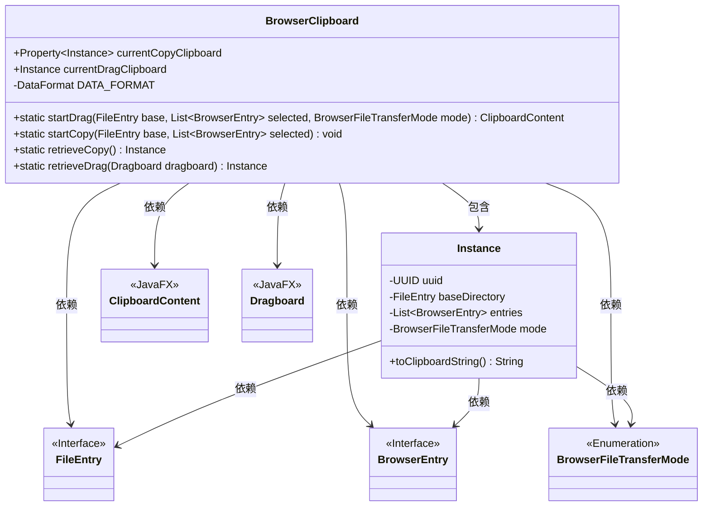
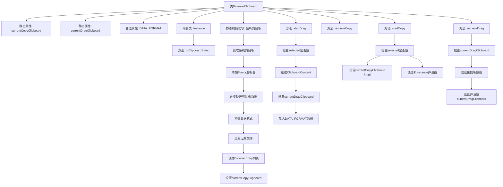
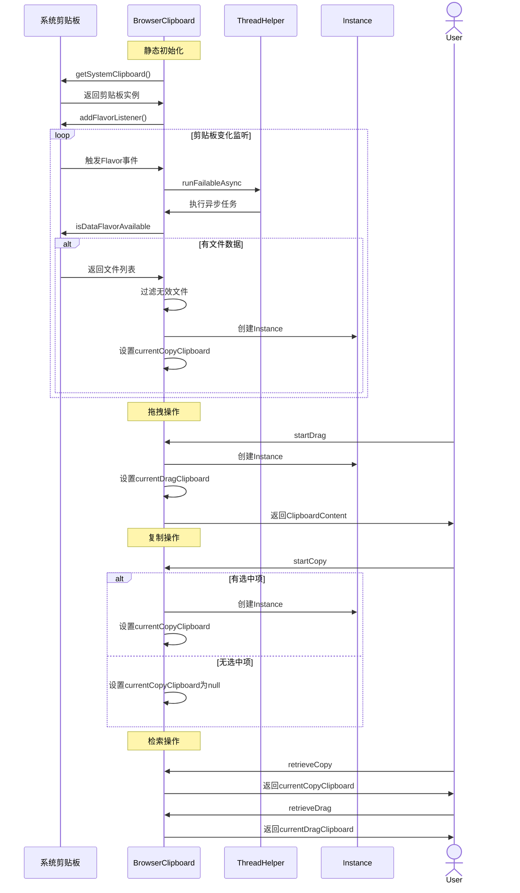

# 基础信息

|      |      |
|------|------|
| 名称 | BrowserClipboard |
| 编码语言 | .java |
| 代码路径 | xpipe/app/src/main/java/io/xpipe/app/browser/file/BrowserClipboard.java |
| 包名 | io.xpipe.app.browser.file |
| 依赖项 | ['io.xpipe.app.ext.ProcessControlProvider', 'io.xpipe.app.issue.ErrorEvent', 'io.xpipe.app.util.ThreadHelper', 'io.xpipe.core.store.FileEntry', 'io.xpipe.core.util.FailableRunnable', 'javafx.beans.property.Property', 'javafx.beans.property.SimpleObjectProperty', 'javafx.scene.input.ClipboardContent', 'javafx.scene.input.DataFormat', 'javafx.scene.input.Dragboard', 'lombok.SneakyThrows', 'lombok.Value', 'java.awt', 'java.awt.datatransfer.Clipboard', 'java.awt.datatransfer.DataFlavor', 'java.io.File', 'java.nio.file.Path', 'java.util.ArrayList', 'java.util.List', 'java.util.UUID', 'java.util.stream.Collectors'] |
| 概述说明 | BrowserClipboard类处理剪贴板和拖放操作，管理文件列表和传输模式。包含复制、拖放功能及数据检索方法。 |

# 说明

BrowserClipboard类管理剪贴板和拖放操作的文件传输。它包含静态属性currentCopyClipboard和currentDragClipboard，分别跟踪复制和拖放操作的文件实例。类初始化时注册剪贴板监听器，当剪贴板数据可用时，过滤无效字符并创建BrowserEntry列表，更新currentCopyClipboard。提供startDrag和startCopy方法分别处理拖放和复制操作，生成唯一ID并存储文件列表及传输模式。retrieveCopy和retrieveDrag方法用于检索存储的实例。内部类Instance封装文件传输数据，包含UUID、基础目录、文件条目列表和传输模式，并提供将文件路径转换为剪贴板字符串的方法。

# 类列表 Class Summary

| 名称   | 类型  | 说明 |
|-------|------|-------------|
| BrowserClipboard | class | BrowserClipboard类处理系统剪贴板和拖放操作，管理文件列表和传输模式。 |

## 类 BrowserClipboard

|      |      |
|------|------|
| 访问范围 | public |
| 类型 | class |
| 名称 | BrowserClipboard |
| 说明 | BrowserClipboard类处理系统剪贴板和拖放操作，管理文件列表和传输模式。 |

### UML类图

类图描述：
BrowserClipboard 是一个处理剪贴板和拖放操作的实用类，包含静态属性和方法。它维护两个剪贴板状态：currentCopyClipboard（复制操作）和 currentDragClipboard（拖拽操作）。核心嵌套类 Instance 存储操作元数据（UUID、基础目录、文件条目列表和传输模式）。该类与多个接口/枚举交互，包括 FileEntry、BrowserEntry、BrowserFileTransferMode 等，并通过 JavaFX 的 ClipboardContent 和 Dragboard 实现数据传输功能。所有方法都包含空值检查和异常处理，确保健壮性。

### 内部方法调用关系图

这段代码实现了一个浏览器剪贴板管理系统，主要功能包括：通过静态初始化块监听系统剪贴板变化，处理文件复制操作；提供startDrag方法处理文件拖拽操作；通过startCopy方法设置复制内容；通过retrieve方法获取当前剪贴板内容。内部类Instance用于封装剪贴板数据，包含UUID、基础目录、文件条目列表和传输模式等属性。代码通过异步处理和数据类型验证确保了剪贴板操作的可靠性和线程安全性。

### 字段列表 Field List

| 名称  | 类型  | 说明 |
|-------|-------|------|
| currentDragClipboard | Instance | 静态实例currentDragClipboard用于当前拖拽剪贴板。 |
| currentCopyClipboard = new SimpleObjectProperty<>() | Property<Instance> | 静态属性currentCopyClipboard，类型为Property<Instance>，使用SimpleObjectProperty初始化。 |
| DATA_FORMAT = new DataFormat("application/xpipe-file-list") | DataFormat | 私有静态常量DATA_FORMAT，类型为DataFormat，值为"application/xpipe-file-list"。 |

### 方法列表 Method List

| 名称  | 类型  | 说明 |
|-------|-------|------|
| startCopy | void | 方法startCopy处理文件复制：若无选中项则清空剪贴板，否则生成UUID并设置复制模式。 |
| startDrag | ClipboardContent | 启动拖拽操作，处理选中的文件条目，生成剪贴板内容并返回。 |
| retrieveCopy | Instance | 静态方法返回当前剪贴板的值。 |
| retrieveDrag | Instance | 检查拖拽板内容，匹配则返回实例否则空。 |

