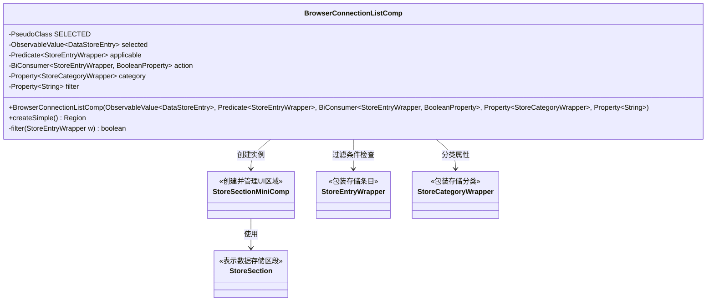
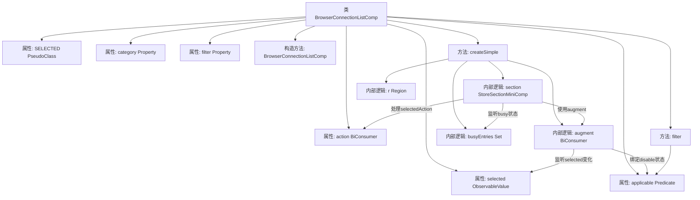

# 基础信息

|      |      |
|------|------|
| 名称 | BrowserConnectionListComp |
| 编码语言 | .java |
| 代码路径 | xpipe/app/src/main/java/io/xpipe/app/browser/file/BrowserConnectionListComp.java |
| 包名 | io.xpipe.app.browser.file |
| 依赖项 | ['io.xpipe.app.comp.Comp', 'io.xpipe.app.comp.CompStructure', 'io.xpipe.app.comp.SimpleComp', 'io.xpipe.app.comp.store', 'io.xpipe.app.storage.DataStoreEntry', 'io.xpipe.app.util.PlatformThread', 'javafx.beans.binding.Bindings', 'javafx.beans.property', 'javafx.beans.value.ObservableValue', 'javafx.collections.FXCollections', 'javafx.css.PseudoClass', 'javafx.scene.control.Button', 'javafx.scene.layout.Region', 'java.util.HashSet', 'java.util.Set', 'java.util.function.BiConsumer', 'java.util.function.Predicate'] |
| 概述说明 | 浏览器连接列表组件类，含选择、过滤和操作功能。 |

# 说明

BrowserConnectionListComp是一个继承自SimpleComp的JavaFX组件类，用于管理浏览器连接列表的显示和交互。该类包含五个关键属性：selected表示当前选中的条目，applicable用于过滤条目，action定义条目点击行为，category和filter用于分类和筛选。createSimple方法创建并配置列表界面，使用StoreSectionMiniComp构建可滚动的条目区域，支持禁用状态、选中状态样式和异步操作处理。通过监听器实现选中状态同步和忙状态管理，所有条目均经过applicable谓词过滤。最终生成的区域添加了CSS类名以便样式控制。

# 类列表 Class Summary

| 名称   | 类型  | 说明 |
|-------|------|-------------|
| BrowserConnectionListComp | class | 浏览器连接列表组件，处理选中项、过滤和类别属性，包含状态管理和UI交互逻辑。 |

## 类 BrowserConnectionListComp

|      |      |
|------|------|
| 访问范围 | public final |
| 类型 | class |
| 名称 | BrowserConnectionListComp |
| 说明 | 浏览器连接列表组件，处理选中项、过滤和类别属性，包含状态管理和UI交互逻辑。 |

### UML类图

BrowserConnectionListComp是一个用于管理浏览器连接列表的复杂UI组件，继承自SimpleComp。它通过selected属性跟踪当前选中项，applicable谓词判断条目是否可用，action处理用户操作，category和filter控制数据分类和过滤。核心功能在createSimple()中实现，创建包含动态禁用状态和选中样式的列表区域，使用StoreSectionMiniComp构建UI，并通过busyEntries集合管理忙碌状态条目。组件与StoreViewState交互获取数据，支持实时过滤和分类功能。

### 内部方法调用关系图

流程图描述了BrowserConnectionListComp类的结构和主要逻辑流程。该类继承自SimpleComp，包含多个属性和一个构造方法。核心方法是createSimple()，该方法创建了一个包含交互逻辑的UI区域。流程展示了如何通过augment函数绑定禁用状态和选择状态监听，以及如何通过StoreSectionMiniComp处理用户操作和忙碌状态跟踪。filter方法作为辅助函数，用于验证条目是否适用。整个过程体现了数据绑定、事件监听和UI组件创建的完整链路。

### 字段列表 Field List

| 名称  | 类型  | 说明 |
|-------|-------|------|
| category | Property<StoreCategoryWrapper> | 私有属性：StoreCategoryWrapper类型的category。 |
| action | BiConsumer<StoreEntryWrapper, BooleanProperty> | 私有成员action，类型为BiConsumer，处理StoreEntryWrapper和BooleanProperty。 |
| SELECTED = PseudoClass.getPseudoClass("selected") | PseudoClass | 定义静态常量SELECTED，表示伪类"selected"。 |
| selected | ObservableValue<DataStoreEntry> | 私有观察值变量selected，类型为DataStoreEntry。 |
| applicable | Predicate<StoreEntryWrapper> | 私有谓词判断StoreEntryWrapper适用性 |
| filter | Property<String> | 私有字符串属性过滤器 |

### 方法列表 Method List

| 名称  | 类型  | 说明 |
|-------|-------|------|
| createSimple | Region | 创建可观察的商店区域，包含禁用状态、选中动作和样式类。 |
| filter | boolean | 方法filter检查StoreEntryWrapper是否通过applicable测试。 |

