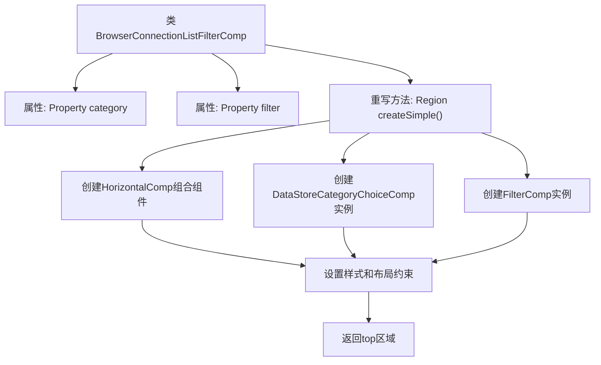

# 基础信息

|      |      |
|------|------|
| 名称 | BrowserConnectionListFilterComp |
| 编码语言 | .java |
| 代码路径 | xpipe/app/src/main/java/io/xpipe/app/browser/file/BrowserConnectionListFilterComp.java |
| 包名 | io.xpipe.app.browser.file |
| 依赖项 | ['io.xpipe.app.comp.SimpleComp', 'io.xpipe.app.comp.base.FilterComp', 'io.xpipe.app.comp.base.HorizontalComp', 'io.xpipe.app.comp.store.StoreCategoryWrapper', 'io.xpipe.app.comp.store.StoreViewState', 'io.xpipe.app.core.AppFontSizes', 'io.xpipe.app.util.DataStoreCategoryChoiceComp', 'javafx.beans.property.Property', 'javafx.scene.layout.Region', 'atlantafx.base.theme.Styles', 'lombok.AllArgsConstructor', 'lombok.Getter', 'java.util.List'] |
| 概述说明 | 浏览器连接列表过滤组件，包含分类和过滤功能，使用水平布局。 |

# 说明

BrowserConnectionListFilterComp是一个继承自SimpleComp的不可变类，包含category和filter两个属性。其核心方法createSimple创建了一个水平布局区域，左侧是DataStoreCategoryChoiceComp组件，用于显示连接分类；右侧是FilterComp组件，用于过滤操作。两个组件分别应用了左圆角和右圆角样式，并设置了基础字体大小。水平布局确保两个组件高度同步，整体应用了xl字体大小和特定样式类。

# 类列表 Class Summary

| 名称   | 类型  | 说明 |
|-------|------|-------------|
| BrowserConnectionListFilterComp | class | 浏览器连接列表过滤组件，包含分类和过滤功能，使用水平布局。 |


## 类 BrowserConnectionListFilterComp

|      |      |
|------|------|
| 访问范围 | @Getter;@AllArgsConstructor;public final |
| 类型 | class |
| 名称 | BrowserConnectionListFilterComp |
| 说明 | 浏览器连接列表过滤组件，包含分类和过滤功能，使用水平布局。 |


### UML类图

```mermaid
classDiagram
    class BrowserConnectionListFilterComp {
        -Property~StoreCategoryWrapper~ category
        -Property~String~ filter
        +createSimple() Region
    }
    <<interface>> Property~T~
    
    class SimpleComp {
        <<abstract>>
        +createSimple() Region
    }
    
    class StoreCategoryWrapper
    class DataStoreCategoryChoiceComp
    class FilterComp
    class HorizontalComp
    class StoreViewState {
        +getAllConnectionsCategory() StoreCategoryWrapper
        +getActiveCategory() StoreCategoryWrapper
    }
    class AppFontSizes {
        +base(Region) void
        +xl(Region) void
    }
    class Styles {
        <<enum>>
        LEFT_PILL
        RIGHT_PILL
    }
    
    BrowserConnectionListFilterComp --> SimpleComp : 继承
    BrowserConnectionListFilterComp --> Property : 依赖
    BrowserConnectionListFilterComp --> StoreCategoryWrapper : 依赖
    BrowserConnectionListFilterComp --> DataStoreCategoryChoiceComp : 创建实例
    BrowserConnectionListFilterComp --> FilterComp : 创建实例
    BrowserConnectionListFilterComp --> HorizontalComp : 创建实例
    DataStoreCategoryChoiceComp --> StoreViewState : 调用方法
    DataStoreCategoryChoiceComp --> Styles : 使用枚举
    FilterComp --> Styles : 使用枚举
    HorizontalComp --> AppFontSizes : 调用方法
```

类图描述：
BrowserConnectionListFilterComp是一个继承自SimpleComp的最终类，用于创建浏览器连接列表的过滤组件。它包含两个Property类型的私有成员（category和filter），并重写了createSimple()方法来构建UI界面。该类依赖于DataStoreCategoryChoiceComp、FilterComp和HorizontalComp来构建界面元素，同时使用StoreViewState获取数据、Styles枚举设置样式、AppFontSizes调整字体大小。整个类展示了GUI组件的组合式构建模式，通过属性绑定和样式应用实现响应式布局。


### 内部方法调用关系图



这段代码展示了一个BrowserConnectionListFilterComp类，继承自SimpleComp，主要用于创建浏览器连接列表的过滤组件。核心方法是createSimple()，该方法构建了一个水平布局容器，包含左侧的分类选择组件(DataStoreCategoryChoiceComp)和右侧的过滤输入组件(FilterComp)。通过链式调用设置样式、字体大小和布局约束，最终返回一个具有动态高度绑定和统一字体样式的顶部区域组件。整个流程体现了GUI组件的组合式构建模式，通过属性绑定实现组件间的动态响应。

### 字段列表 Field List

| 名称  | 类型  | 说明 |
|-------|-------|------|
| filter | Property<String> | 私有字符串属性过滤器 |
| category | Property<StoreCategoryWrapper> | 私有属性：StoreCategoryWrapper类型的category。 |

### 方法列表 Method List

| 名称  | 类型  | 说明 |
|-------|-------|------|
| createSimple | Region | 创建包含分类选择器和过滤器的水平布局区域，设置样式和高度绑定。 |


