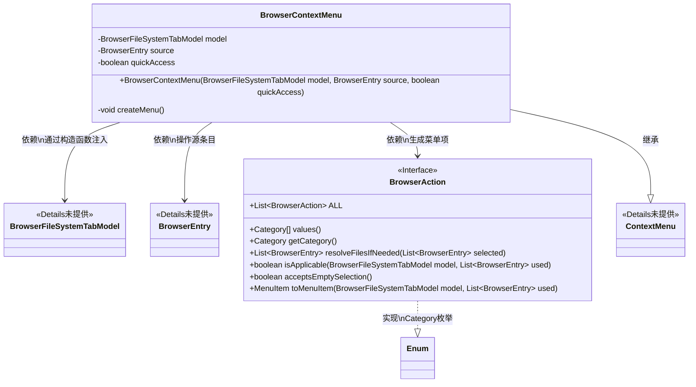
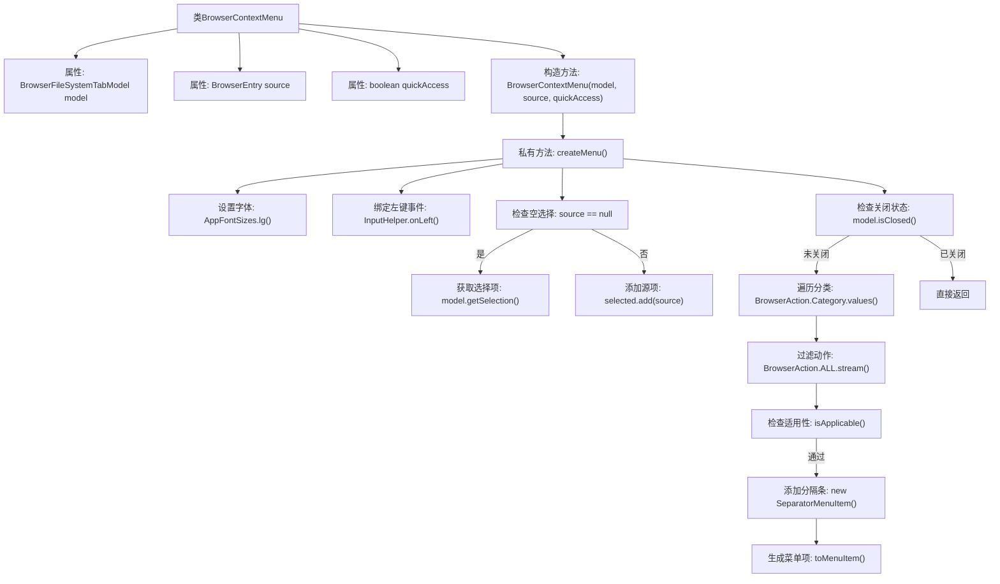

# 基础信息

|      |      |
|------|------|
| 名称 | BrowserContextMenu |
| 编码语言 | .java |
| 代码路径 | xpipe/app/src/main/java/io/xpipe/app/browser/file/BrowserContextMenu.java |
| 包名 | io.xpipe.app.browser.file |
| 依赖项 | ['io.xpipe.app.browser.action.BrowserAction', 'io.xpipe.app.core.AppFontSizes', 'io.xpipe.app.util.InputHelper', 'javafx.scene.control.ContextMenu', 'javafx.scene.control.SeparatorMenuItem', 'java.util.ArrayList', 'java.util.List'] |
| 概述说明 | 浏览器上下文菜单类，根据模型、源和快速访问标志创建动态菜单项。 |

# 说明

BrowserContextMenu是一个继承自ContextMenu的公共最终类，用于创建浏览器文件系统的上下文菜单。它包含三个主要成员变量：BrowserFileSystemTabModel模型、BrowserEntry源条目和quickAccess布尔标志。构造函数初始化这些变量并调用createMenu方法创建菜单。createMenu方法首先设置菜单字体大小，并处理左键点击事件以隐藏菜单。根据源条目是否为空及quickAccess状态，确定选中的条目列表。若模型未关闭，则遍历BrowserAction的所有类别，筛选适用的动作并添加到菜单项中，不同类别间用分隔符隔开。整个过程确保模型未关闭且动作适用时才添加菜单项。

# 类列表 Class Summary

| 名称   | 类型  | 说明 |
|-------|------|-------------|
| BrowserContextMenu | class | 浏览器上下文菜单类，根据模型、源和快速访问标志创建菜单项，过滤并添加适用的浏览器操作。 |

## 类 BrowserContextMenu

|      |      |
|------|------|
| 访问范围 | public final |
| 类型 | class |
| 名称 | BrowserContextMenu |
| 说明 | 浏览器上下文菜单类，根据模型、源和快速访问标志创建菜单项，过滤并添加适用的浏览器操作。 |

### UML类图

这段代码展示了一个浏览器上下文菜单的实现类BrowserContextMenu，它继承自ContextMenu。该类通过BrowserFileSystemTabModel和BrowserEntry来构建动态菜单项，并支持快速访问模式。核心逻辑在createMenu()方法中，该方法会根据BrowserAction的分类和条件过滤生成菜单项，处理空选择/快速访问等边缘情况，并在模型关闭时提前终止操作。BrowserAction作为接口定义了菜单项的行为规范，包含文件解析、适用性判断和菜单项生成等方法。

### 内部方法调用关系图

流程图描述：该流程图展示了BrowserContextMenu类的核心逻辑，从构造函数初始化开始，通过createMenu方法构建上下文菜单。主要流程包括：初始化样式和事件监听、处理文件选择状态、检查浏览器标签是否关闭、按分类过滤可用的浏览器动作、动态生成菜单项。特别注意对空选择和关闭状态的边界处理，以及通过流式操作筛选符合条件的动作项。

### 字段列表 Field List

| 名称  | 类型  | 说明 |
|-------|-------|------|
| model | BrowserFileSystemTabModel | 私有浏览器文件系统标签模型。 |
| source | BrowserEntry | 私有浏览器入口源对象 |
| quickAccess | boolean | 私有布尔变量quickAccess |

### 方法列表 Method List

| 名称  | 类型  | 说明 |
|-------|-------|------|
| createMenu | void | 创建菜单方法：设置字体，处理输入，筛选可用操作并生成菜单项。 |

