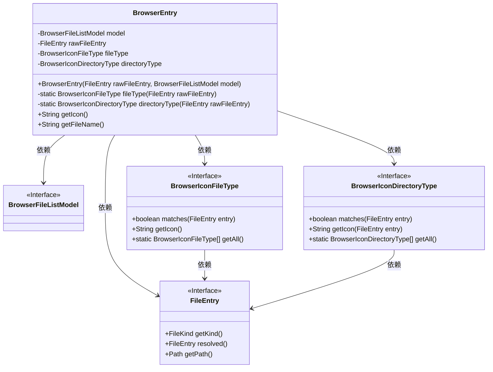

# 基础信息

|      |      |
|------|------|
| 名称 | BrowserEntry |
| 编码语言 | .java |
| 代码路径 | xpipe/app/src/main/java/io/xpipe/app/browser/file/BrowserEntry.java |
| 包名 | io.xpipe.app.browser.file |
| 依赖项 | ['io.xpipe.app.browser.icon.BrowserIconDirectoryType', 'io.xpipe.app.browser.icon.BrowserIconFileType', 'io.xpipe.core.store.FileEntry', 'io.xpipe.core.store.FileKind', 'lombok.Getter'] |
| 概述说明 | BrowserEntry类封装文件条目，根据类型返回图标和文件名。 |

# 说明

BrowserEntry类是一个用于浏览器文件列表的模型类，包含文件条目、模型引用及图标类型信息。通过构造函数接收原始文件条目和模型对象，自动确定文件或目录的图标类型。提供获取图标路径和文件名的方法，根据文件类型返回相应图标，默认返回预设的文件夹或文件图标。文件类型和目录类型通过匹配方法动态确定，未匹配时返回空值。

# 类列表 Class Summary

| 名称   | 类型  | 说明 |
|-------|------|-------------|
| BrowserEntry | class | BrowserEntry类封装文件条目，根据类型返回图标和文件名。 |

## 类 BrowserEntry

|      |      |
|------|------|
| 访问范围 | @Getter;public |
| 类型 | class |
| 名称 | BrowserEntry |
| 说明 | BrowserEntry类封装文件条目，根据类型返回图标和文件名。 |

### UML类图

该代码实现了一个浏览器文件条目类BrowserEntry，用于封装文件条目信息并获取对应的图标和文件名。它依赖BrowserFileListModel接口管理文件列表，通过FileEntry接口获取文件类型和路径，并使用BrowserIconFileType/BrowserIconDirectoryType接口匹配文件/目录图标。类通过静态方法动态解析文件类型，提供默认图标回退机制，整体设计符合开闭原则，便于扩展新的文件类型图标匹配逻辑。

### 内部方法调用关系图

该流程图展示了BrowserEntry类的结构和主要方法调用关系。类包含4个私有属性和5个核心方法，其中构造方法会初始化fileType和directoryType属性，这两个属性分别通过静态方法fileType()和directoryType()确定。getIcon()方法根据文件类型返回相应图标路径，getFileName()则获取文件名。所有方法都围绕FileEntry对象展开操作，涉及类型判断、路径解析和图标匹配等逻辑。

### 字段列表 Field List

| 名称  | 类型  | 说明 |
|-------|-------|------|
| directoryType | BrowserIconDirectoryType | 私有浏览器图标目录类型变量。 |
| fileType | BrowserIconFileType | 私有浏览器图标文件类型变量fileType。 |
| rawFileEntry | FileEntry | 私有文件条目rawFileEntry。 |
| model | BrowserFileListModel | 私有浏览器文件列表模型实例。 |

### 方法列表 Method List

| 名称  | 类型  | 说明 |
|-------|-------|------|
| directoryType | BrowserIconDirectoryType | 检查文件类型并返回匹配的目录图标类型，不匹配则返回空。 |
| getIcon | String | 方法根据文件类型返回图标，无类型则检查目录类型，否则返回默认文件夹或文件图标。 |
| getFileName | String | 获取文件路径中的文件名。 |
| fileType | BrowserIconFileType | 静态方法根据文件类型返回对应图标，无匹配则返回空。 |

