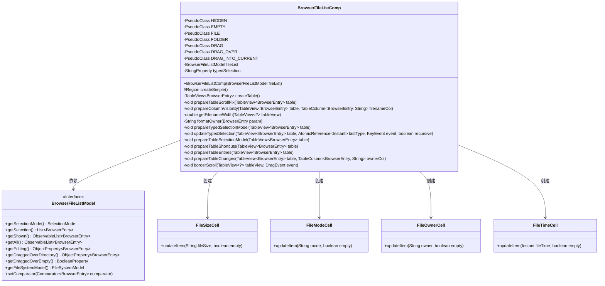
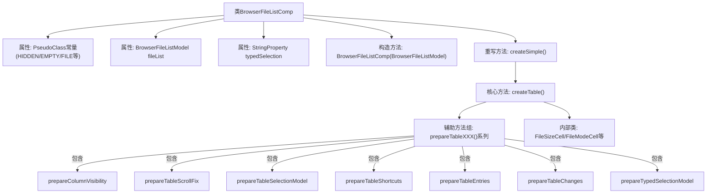
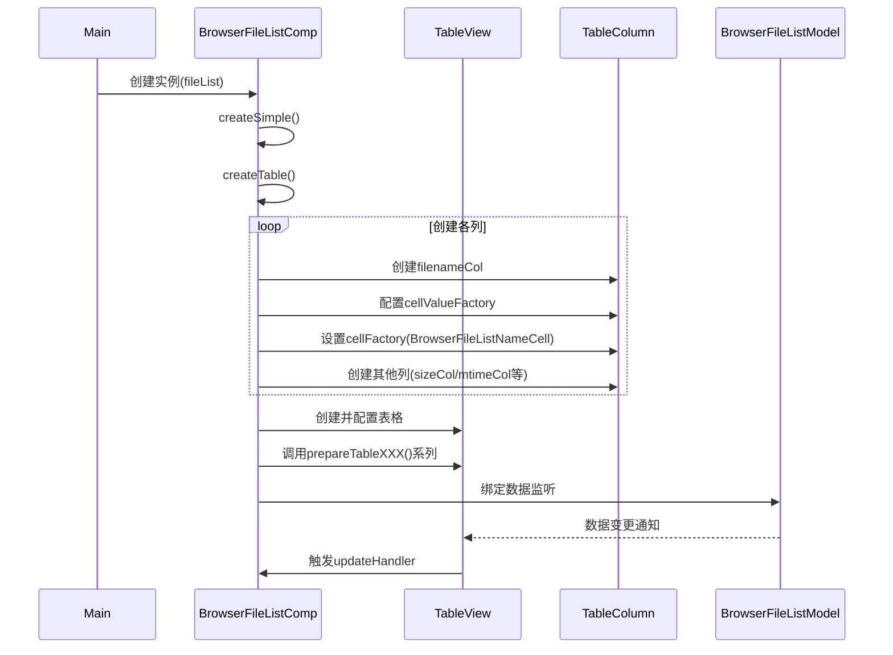

# 基础信息

|      |      |
|------|------|
| 名称 | BrowserFileListComp |
| 编码语言 | .java |
| 代码路径 | xpipe/app/src/main/java/io/xpipe/app/browser/file/BrowserFileListComp.java |
| 包名 | io.xpipe.app.browser.file |
| 依赖项 | ['io.xpipe.app.browser.action.BrowserAction', 'io.xpipe.app.comp.SimpleComp', 'io.xpipe.app.core.AppI18n', 'io.xpipe.app.util', 'io.xpipe.core.process.OsType', 'io.xpipe.core.store.FileEntry', 'io.xpipe.core.store.FileInfo', 'io.xpipe.core.store.FileKind', 'javafx.application.Platform', 'javafx.beans.binding.Bindings', 'javafx.beans.property', 'javafx.collections.FXCollections', 'javafx.collections.ListChangeListener', 'javafx.css.PseudoClass', 'javafx.geometry.Bounds', 'javafx.scene.control', 'javafx.scene.control.skin.TableViewSkin', 'javafx.scene.control.skin.VirtualFlow', 'javafx.scene.input', 'javafx.scene.layout.Region', 'atlantafx.base.theme.Styles', 'java.time.Duration', 'java.time.Instant', 'java.time.ZoneId', 'java.util', 'java.util.concurrent.atomic.AtomicReference', 'io.xpipe.app.util.HumanReadableFormat.byteCount', 'javafx.scene.control.TableColumn.SortType.ASCENDING'] |
| 概述说明 | 浏览器文件列表组件，包含表格视图、排序、拖放和选择功能。 |

# 说明

BrowserFileListComp是一个用于展示文件列表的JavaFX组件，继承自SimpleComp。它包含一个TableView，用于显示文件名、大小、修改时间、属性和所有者等列。组件支持文件排序、拖放操作、键盘输入快速选择、多选模式等功能。通过PseudoClass管理不同状态（如隐藏、空、文件、文件夹等）。表格列根据操作系统类型动态调整可见性，并处理文件所有者信息的格式化显示。组件还实现了滚动条修复、选择模型同步、快捷键操作等细节功能，确保与底层文件系统模型的交互流畅。

# 类列表 Class Summary

| 名称   | 类型  | 说明 |
|-------|------|-------------|
| BrowserFileListComp | class | 浏览器文件列表组件，含表格视图、排序、拖放和类型选择功能。 |

## 类 BrowserFileListComp

|      |      |
|------|------|
| 访问范围 | public final |
| 类型 | class |
| 名称 | BrowserFileListComp |
| 说明 | 浏览器文件列表组件，含表格视图、排序、拖放和类型选择功能。 |

### UML类图

这段代码实现了一个浏览器文件列表组件，继承自SimpleComp，主要功能是创建和管理一个TableView来显示文件列表。组件包含多个内部单元格类(FileSizeCell、FileModeCell等)来处理不同类型数据的显示，并通过BrowserFileListModel获取文件数据。代码实现了丰富的交互功能包括：键盘输入快速选择、拖拽操作、列宽动态调整、排序支持等，同时处理了多种文件系统特性如权限显示、所有者信息等。组件通过大量事件监听器和属性绑定实现与用户交互的实时响应。

### 内部方法调用关系图

这段代码实现了一个浏览器文件列表组件，继承自SimpleComp，主要功能是通过TableView展示文件系统内容。核心是createTable()方法，它创建了包含文件名、大小、修改时间等列的可排序表格，并通过7个prepareTableXXX()方法处理列可见性、滚动条修复、选择模型、快捷键、条目渲染等细节。组件支持拖放操作、键盘快速选择、多平台适配等功能，内部包含4个自定义TableCell实现类处理不同类型数据的显示。整体设计采用响应式编程风格，与BrowserFileListModel深度绑定实现数据同步。

### 字段列表 Field List

| 名称  | 类型  | 说明 |
|-------|-------|------|
| typedSelection = new SimpleStringProperty("") | StringProperty | 私有字符串属性typedSelection初始化为空字符串。 |
| DRAG = PseudoClass.getPseudoClass("drag") | PseudoClass | 定义静态常量DRAG，值为伪类"drag"。 |
| FOLDER = PseudoClass.getPseudoClass("folder") | PseudoClass | 定义私有静态常量FOLDER，值为伪类"folder"。 |
| FILE = PseudoClass.getPseudoClass("file") | PseudoClass | 私有静态常量FILE，通过PseudoClass.getPseudoClass("file")获取伪类实例。 |
| DRAG_INTO_CURRENT = PseudoClass.getPseudoClass("drag-into-current") | PseudoClass | 私有静态常量DRAG_INTO_CURRENT，使用PseudoClass.getPseudoClass方法初始化。 |
| HIDDEN = PseudoClass.getPseudoClass("hidden") | PseudoClass | 定义隐藏伪类的静态常量HIDDEN。 |
| fileList | BrowserFileListModel | 私有浏览器文件列表模型fileList。 |
| EMPTY = PseudoClass.getPseudoClass("empty") | PseudoClass | 定义静态常量EMPTY，表示空伪类状态。 |
| DRAG_OVER = PseudoClass.getPseudoClass("drag-over") | PseudoClass | 私有常量DRAG_OVER定义拖拽悬停伪类。 |

### 方法列表 Method List

| 名称  | 类型  | 说明 |
|-------|-------|------|
| prepareTableSelectionModel | void | 设置表格选择模式，同步文件列表与表格的选择状态。 |
| getFilenameWidth | double | 计算表格视图文件名列宽度：总宽减其他可见列宽和7像素。 |
| prepareColumnVisibility | void | 根据表格宽度调整列可见性和宽度，非Windows/Mac系统下宽度超1000显示owner列，动态设置filename列宽度。 |
| prepareTableEntries | void | 表格视图设置拖拽和点击事件处理，绑定行属性和状态变化。 |
| updateTypedSelection | void | 更新表格选择项，基于输入字符匹配文件名，超时重置。 |
| formatOwner | String | 格式化Unix文件所有者信息，显示用户和组及其ID。 |
| prepareTableScrollFix | void | 修复表格水平滚动条高度问题，设为0。 |
| createSimple | Region | 重写方法createSimple，返回createTable结果。 |
| createTable | TableView<BrowserEntry> | 创建表格视图，包含文件名、大小、修改时间、属性和所有者列，设置排序、样式和交互功能。 |
| prepareTableShortcuts | void | 为表格视图添加快捷键处理，执行选中项操作或清除选择。 |
| prepareTypedSelectionModel | void | 为表格添加键盘和鼠标事件处理，更新选择状态并重置失败记录。 |
| prepareTableChanges | void | 更新表格列可见性和宽度，处理文件列表变化，优化性能。 |
| borderScroll | void | Java方法：根据拖拽位置自动滚动表格视图的垂直滚动条。 |

