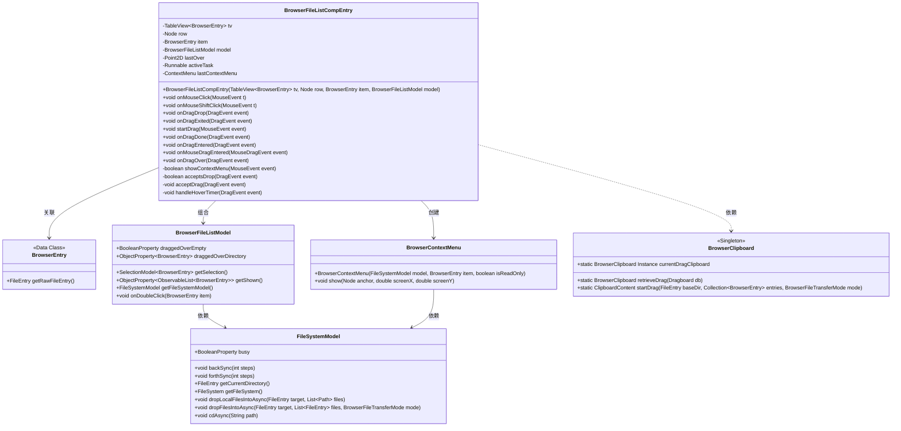

# 基础信息

|      |      |
|------|------|
| 名称 | BrowserFileListCompEntry |
| 编码语言 | .java |
| 代码路径 | xpipe/app/src/main/java/io/xpipe/app/browser/file/BrowserFileListCompEntry.java |
| 包名 | io.xpipe.app.browser.file |
| 依赖项 | ['io.xpipe.app.browser.BrowserFullSessionModel', 'io.xpipe.app.prefs.AppPrefs', 'io.xpipe.app.util.BooleanScope', 'io.xpipe.app.util.GlobalTimer', 'io.xpipe.app.util.ThreadHelper', 'io.xpipe.core.store.FileKind', 'javafx.geometry.Point2D', 'javafx.scene.Node', 'javafx.scene.control.ContextMenu', 'javafx.scene.control.TableView', 'javafx.scene.image.Image', 'javafx.scene.input', 'lombok.Getter', 'java.io.File', 'java.time.Duration', 'java.util.ArrayList', 'java.util.Objects'] |
| 概述说明 | 处理文件列表的鼠标点击、拖放事件及上下文菜单。 |

# 说明

BrowserFileListCompEntry类是一个用于处理文件浏览器界面交互的组件，主要管理鼠标点击、拖放操作及相关事件处理。它包含TableView、Node、BrowserEntry和BrowserFileListModel等关键属性，用于展示和操作文件列表。类中实现了鼠标点击事件处理，包括上下文菜单显示、前进/后退导航、双击打开文件等功能。拖放操作支持文件从外部或内部拖入，并处理拖放目标的验证及目录悬停自动导航。此外，还处理了鼠标拖动选择、拖放完成等事件，确保界面交互的流畅性和正确性。

# 类列表 Class Summary

| 名称   | 类型  | 说明 |
|-------|------|-------------|
| BrowserFileListCompEntry | class | BrowserFileListCompEntry类处理文件列表的鼠标点击、拖放事件，支持上下文菜单、双击操作及文件拖放管理。 |

## 类 BrowserFileListCompEntry

|      |      |
|------|------|
| 访问范围 | @Getter;public |
| 类型 | class |
| 名称 | BrowserFileListCompEntry |
| 说明 | BrowserFileListCompEntry类处理文件列表的鼠标点击、拖放事件，支持上下文菜单、双击操作及文件拖放管理。 |

### UML类图

这段代码实现了一个浏览器文件列表组件条目类，主要处理鼠标点击、拖放等交互逻辑。类图展示了核心类及其关系：BrowserFileListCompEntry作为核心控制器，与BrowserEntry数据模型、BrowserFileListModel视图模型交互，通过FileSystemModel操作文件系统，并利用BrowserContextMenu实现右键菜单，BrowserClipboard处理拖放剪贴板操作。该设计采用分层架构，将UI交互、业务逻辑和文件操作分离，支持复杂的文件管理功能如多选、拖放、导航等。

### 内部方法调用关系图

```mermaid
graph TD
    A["类BrowserFileListCompEntry"]
    B["属性: TableView<BrowserEntry> tv"]
    C["属性: Node row"]
    D["属性: BrowserEntry item"]
    E["属性: BrowserFileListModel model"]
    F["属性: Point2D lastOver"]
    G["属性: Runnable activeTask"]
    H["属性: ContextMenu lastContextMenu"]
    I["构造方法: BrowserFileListCompEntry"]
    J["方法: onMouseClick(MouseEvent t)"]
    K["方法: showContextMenu(MouseEvent event)"]
    L["方法: onMouseShiftClick(MouseEvent t)"]
    M["方法: acceptsDrop(DragEvent event)"]
    N["方法: onDragDrop(DragEvent event)"]
    O["方法: onDragExited(DragEvent event)"]
    P["方法: startDrag(MouseEvent event)"]
    Q["方法: onDragDone(DragEvent event)"]
    R["方法: acceptDrag(DragEvent event)"]
    S["方法: handleHoverTimer(DragEvent event)"]
    T["方法: onDragEntered(DragEvent event)"]
    U["方法: onMouseDragEntered(MouseDragEvent event)"]
    V["方法: onDragOver(DragEvent event)"]

    A --> B
    A --> C
    A --> D
    A --> E
    A --> F
    A --> G
    A --> H
    A --> I
    A --> J
    J --> K
    A --> L
    A --> M
    A --> N
    A --> O
    A --> P
    A --> Q
    A --> R
    R --> S
    A --> T
    A --> U
    A --> V
```

该流程图展示了BrowserFileListCompEntry类的完整结构，包含8个属性和12个主要方法。核心逻辑围绕鼠标事件处理（单击/Shift单击/拖拽）和文件操作（上下文菜单显示/文件拖放/目录导航）展开。其中onMouseClick方法通过showContextMenu判断是否显示右键菜单，而拖拽相关方法（onDragDrop/onDragOver等）实现了文件拖放功能的核心验证和状态管理流程。所有方法都通过event.consume()确保事件传播控制。

### 字段列表 Field List

| 名称  | 类型  | 说明 |
|-------|-------|------|
| activeTask | Runnable | 私有可运行任务实例 |
| lastOver = new Point2D(-1, -1) | Point2D | 记录上次鼠标悬停坐标，初始值为(-1,-1)。 |
| tv | TableView<BrowserEntry> | 私有表格视图组件tv，用于展示BrowserEntry类型数据。 |
| lastContextMenu | ContextMenu | 私有上下文菜单变量lastContextMenu |
| item | BrowserEntry | 私有浏览器条目项 |
| row | Node | 私有行节点对象 |
| model | BrowserFileListModel | 私有浏览器文件列表模型实例。 |

### 方法列表 Method List

| 名称  | 类型  | 说明 |
|-------|-------|------|
| onDragEntered | void | 拖入事件处理：检查接受后执行。 |
| onDragExited | void | 拖拽离开时，重置目录或空区域状态。 |
| acceptsDrop | boolean | 检查拖放事件是否可接受，包括外部来源、剪贴板状态、目录匹配及自身拖放限制。 |
| acceptDrag | void | 处理拖拽事件，设置空目录或文件状态，接受复制或移动操作。 |
| onDragOver | void | 拖放事件处理：检查接受条件，执行拖放和悬停计时操作。 |
| onMouseDragEntered | void | 鼠标拖拽进入时选择表格项，前提是目录和项非空。 |
| showContextMenu | boolean | 检查鼠标事件是否触发右键菜单：空项或目录需右键；文件需右键或关闭双击编辑时的左键双击。 |
| onDragDrop | void | 处理拖放事件：重置状态，支持外部文件拖入和内部条目移动，异步操作目标目录。 |
| onMouseShiftClick | void | 鼠标左键点击时，选中列表中最小到最大索引间的未选条目。 |
| handleHoverTimer | void | 处理悬停计时器：检查目录项，更新坐标，延迟执行异步切换目录操作。 |
| onMouseClick | void | 鼠标点击处理：隐藏菜单、显示新菜单、前进后退、双击操作、焦点控制。 |
| onDragDone | void | 拖拽完成后，若模型为全会话模型，则停止拖拽状态并消耗事件。 |
| startDrag | void | Java方法：处理鼠标拖拽事件，检查条件后设置拖拽数据并触发拖拽操作。 |

