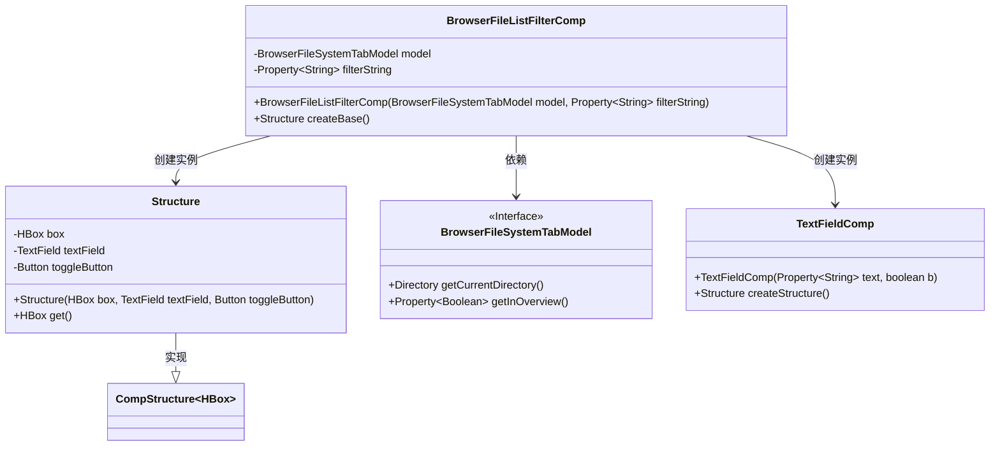
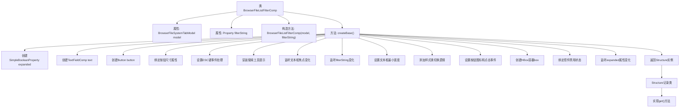

# 基础信息

|      |      |
|------|------|
| 名称 | BrowserFileListFilterComp |
| 编码语言 | .java |
| 代码路径 | xpipe/app/src/main/java/io/xpipe/app/browser/file/BrowserFileListFilterComp.java |
| 包名 | io.xpipe.app.browser.file |
| 依赖项 | ['io.xpipe.app.comp.Comp', 'io.xpipe.app.comp.CompStructure', 'io.xpipe.app.comp.base.TextFieldComp', 'io.xpipe.app.comp.base.TooltipHelper', 'io.xpipe.app.core.AppI18n', 'io.xpipe.app.util.InputHelper', 'javafx.beans.property.Property', 'javafx.beans.property.SimpleBooleanProperty', 'javafx.geometry.Pos', 'javafx.scene.control.Button', 'javafx.scene.control.TextField', 'javafx.scene.control.Tooltip', 'javafx.scene.input.KeyCode', 'javafx.scene.input.KeyCodeCombination', 'javafx.scene.input.KeyCombination', 'javafx.scene.layout.HBox', 'atlantafx.base.theme.Styles', 'org.kordamp.ikonli.javafx.FontIcon'] |
| 概述说明 | 浏览器文件列表过滤组件，包含文本框和按钮，支持展开/收起和快捷键操作。 |

# 说明

BrowserFileListFilterComp是一个用于文件浏览器过滤的组件类，继承自Comp类。它包含一个文本框和一个搜索按钮，通过HBox布局组合。组件会根据filterString属性动态调整样式和状态，支持快捷键操作和焦点控制。文本框宽度可伸缩，按钮样式随展开状态变化。组件绑定了模型禁用状态，并处理了键盘事件和焦点切换逻辑。最终返回包含HBox、文本框和按钮的结构体。

# 类列表 Class Summary

| 名称   | 类型  | 说明 |
|-------|------|-------------|
| BrowserFileListFilterComp | class | 浏览器文件列表过滤组件，包含文本框和按钮，支持快捷键搜索和样式切换。 |

## 类 BrowserFileListFilterComp

|      |      |
|------|------|
| 访问范围 | public |
| 类型 | class |
| 名称 | BrowserFileListFilterComp |
| 说明 | 浏览器文件列表过滤组件，包含文本框和按钮，支持快捷键搜索和样式切换。 |

### UML类图

这段代码展示了一个文件浏览器过滤器组件的实现。BrowserFileListFilterComp类继承自泛型Comp类，包含一个内部记录类Structure用于管理UI结构。主要功能包括：通过TextFieldComp实现文本过滤输入，结合Button控制展开/折叠状态，并与BrowserFileSystemTabModel交互获取当前目录状态。组件具有动态宽度调整、快捷键支持（Ctrl+F）、样式切换等特性，通过属性绑定实现数据与UI的同步。

### 内部方法调用关系图

这段代码实现了一个浏览器文件列表过滤器组件，主要包含文本框和搜索按钮的交互逻辑。流程图展示了从类结构到createBase()方法的详细执行流程，包括属性初始化、UI组件创建、事件监听绑定、样式管理以及最终的结构体返回过程。组件支持展开/折叠状态切换、快捷键操作、输入过滤和样式动态调整等功能，所有交互逻辑都集中在createBase()方法中实现。

### 字段列表 Field List

| 名称  | 类型  | 说明 |
|-------|-------|------|
| model | BrowserFileSystemTabModel | 私有浏览器文件系统标签模型实例。 |
| filterString | Property<String> | 私有属性filterString，类型为Property<String>。 |

### 方法列表 Method List

| 名称  | 类型  | 说明 |
|-------|-------|------|
| createBase | Structure | 创建搜索框组件，包含文本框和按钮，支持展开/收起、快捷键和样式切换。 |

