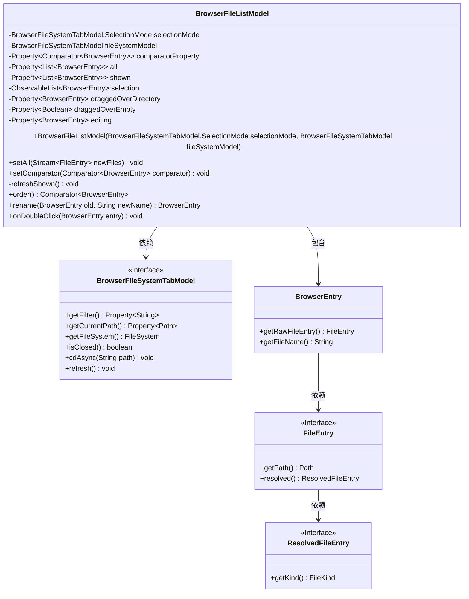
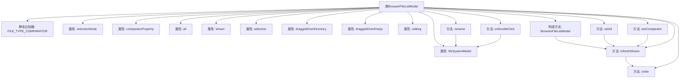
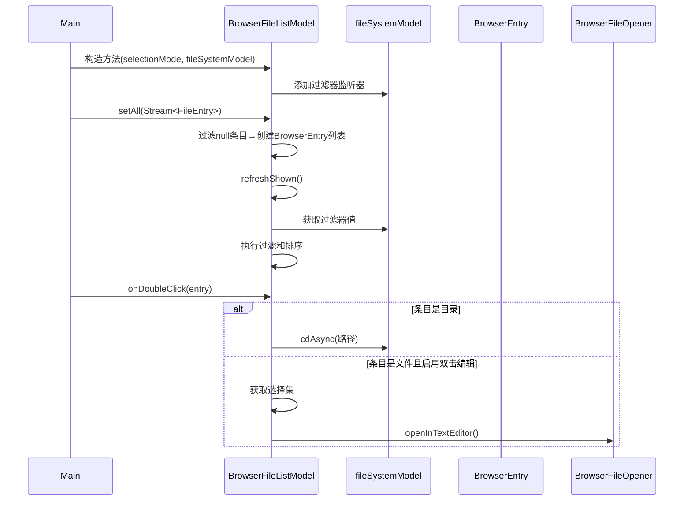

# 基础信息

|      |      |
|------|------|
| 名称 | BrowserFileListModel |
| 编码语言 | .java |
| 代码路径 | xpipe/app/src/main/java/io/xpipe/app/browser/file/BrowserFileListModel.java |
| 包名 | io.xpipe.app.browser.file |
| 依赖项 | ['io.xpipe.app.issue.ErrorEvent', 'io.xpipe.app.prefs.AppPrefs', 'io.xpipe.core.process.OsType', 'io.xpipe.core.store.FileEntry', 'io.xpipe.core.store.FileKind', 'javafx.beans.property.Property', 'javafx.beans.property.SimpleBooleanProperty', 'javafx.beans.property.SimpleObjectProperty', 'javafx.collections.FXCollections', 'javafx.collections.ObservableList', 'lombok.Getter', 'java.util', 'java.util.stream.Stream'] |
| 概述说明 | BrowserFileListModel类管理文件列表，支持排序、过滤、重命名和双击操作。 |

# 说明

BrowserFileListModel是一个用于管理浏览器文件列表的最终类，包含文件排序、过滤、选择和编辑功能。它使用Comparator对文件类型进行排序，支持目录优先显示。类中包含多个属性，如选择模式、文件系统模型、排序比较器、文件列表和选中项等。提供了设置文件列表、排序规则和刷新显示的方法。支持文件重命名操作，包括路径检查和错误处理。双击文件或目录时，可进入目录或通过文本编辑器打开文件。该类与BrowserFileSystemTabModel紧密集成，处理文件系统操作和界面更新。

# 类列表 Class Summary

| 名称   | 类型  | 说明 |
|-------|------|-------------|
| BrowserFileListModel | class | 浏览器文件列表模型类，管理文件排序、过滤、选择和重命名操作。 |

## 类 BrowserFileListModel

|      |      |
|------|------|
| 访问范围 | @Getter;public final |
| 类型 | class |
| 名称 | BrowserFileListModel |
| 说明 | 浏览器文件列表模型类，管理文件排序、过滤、选择和重命名操作。 |

### UML类图

这段代码描述了一个浏览器文件列表模型`BrowserFileListModel`，它负责管理文件系统中的文件列表、排序、过滤和用户交互操作。该类通过`BrowserFileSystemTabModel`与底层文件系统交互，维护了文件列表状态（全部文件、显示文件、选中文件等），提供了文件重命名、双击打开等功能。核心功能包括：通过`setAll`设置文件列表，`setComparator`设置排序规则，`refreshShown`实现过滤和排序逻辑，`rename`处理文件重命名，`onDoubleClick`响应双击事件。该类与多个接口协作，包括文件系统模型、文件条目等，构成了一个完整的文件浏览器业务逻辑层。

### 内部方法调用关系图

该流程图展示了BrowserFileListModel类的核心结构和数据流向。类主要负责管理浏览器文件列表的展示逻辑，包含文件排序、过滤、重命名和双击操作等功能。通过属性绑定和监听器机制实现动态更新，其中refreshShown()是核心方法，协调过滤器和排序器的联动。时序图则演示了从初始化到用户交互的完整过程，突出显示了文件列表更新和用户双击操作的分支逻辑。

### 字段列表 Field List

| 名称  | 类型  | 说明 |
|-------|-------|------|
| editing = new SimpleObjectProperty<>() | Property<BrowserEntry> | 私有属性editing，类型为Property<BrowserEntry>，初始化为SimpleObjectProperty。 |
| all = new SimpleObjectProperty<>(new ArrayList<>()) | Property<List<BrowserEntry>> | 私有属性all，类型为Property<List<BrowserEntry>>，初始化为空ArrayList。 |
| draggedOverEmpty = new SimpleBooleanProperty() | Property<Boolean> | 私有布尔属性draggedOverEmpty，使用SimpleBooleanProperty初始化。 |
| comparatorProperty =            new SimpleObjectProperty<>(FILE_TYPE_COMPARATOR) | Property<Comparator<BrowserEntry>> | 私有属性comparatorProperty，类型为Property<Comparator<BrowserEntry>>，初始值为FILE_TYPE_COMPARATOR。 |
| draggedOverDirectory = new SimpleObjectProperty<>() | Property<BrowserEntry> | 私有属性draggedOverDirectory，类型为Property<BrowserEntry>，使用SimpleObjectProperty初始化。 |
| fileSystemModel | BrowserFileSystemTabModel | 私有浏览器文件系统标签模型。 |
| FILE_TYPE_COMPARATOR =            Comparator.comparing(path -> path.getRawFileEntry().resolved().getKind() != FileKind.DIRECTORY) | Comparator<BrowserEntry> | 比较器按文件类型排序，目录在后。 |
| shown = new SimpleObjectProperty<>(new ArrayList<>()) | Property<List<BrowserEntry>> | 私有属性shown，类型为Property<List<BrowserEntry>>，初始化为空ArrayList。 |
| selectionMode | BrowserFileSystemTabModel.SelectionMode | 私有变量selectionMode，类型为BrowserFileSystemTabModel.SelectionMode。 |
| selection = FXCollections.observableArrayList() | ObservableList<BrowserEntry> | 私有可观察列表，存储BrowserEntry类型的选择项。 |

### 方法列表 Method List

| 名称  | 类型  | 说明 |
|-------|-------|------|
| order | Comparator<BrowserEntry> | Java方法：按目录优先和自定义比较器排序浏览器条目。 |
| setComparator | void | 设置比较器并刷新显示。 |
| setAll | void | 设置文件流并过滤非空项，转换为浏览器条目后更新显示。 |
| refreshShown | void | 私有方法refreshShown根据过滤条件筛选并排序文件列表，更新显示内容。 |
| rename | BrowserEntry | 重命名文件前检查路径有效性，存在性及系统类型，成功则更新路径并刷新。 |
| onDoubleClick | void | 双击处理：目录则进入，文件则根据偏好用文本编辑器打开。 |

