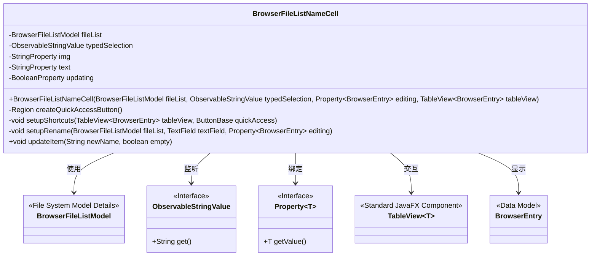
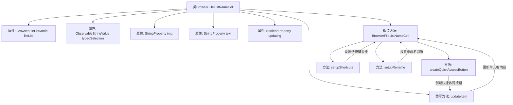

# 基础信息

|      |      |
|------|------|
| 名称 | BrowserFileListNameCell |
| 编码语言 | .java |
| 代码路径 | xpipe/app/src/main/java/io/xpipe/app/browser/file/BrowserFileListNameCell.java |
| 包名 | io.xpipe.app.browser.file |
| 依赖项 | ['io.xpipe.app.comp.base.LazyTextFieldComp', 'io.xpipe.app.comp.base.PrettyImageHelper', 'io.xpipe.app.util.BooleanScope', 'io.xpipe.app.util.ContextMenuHelper', 'io.xpipe.app.util.InputHelper', 'io.xpipe.app.util.PlatformThread', 'io.xpipe.app.util.ThreadHelper', 'io.xpipe.core.store.FileKind', 'javafx.application.Platform', 'javafx.beans.binding.Bindings', 'javafx.beans.property', 'javafx.beans.value.ChangeListener', 'javafx.beans.value.ObservableStringValue', 'javafx.css.PseudoClass', 'javafx.geometry.Pos', 'javafx.geometry.Side', 'javafx.scene.AccessibleRole', 'javafx.scene.Node', 'javafx.scene.control.ButtonBase', 'javafx.scene.control.TableCell', 'javafx.scene.control.TableView', 'javafx.scene.control.TextField', 'javafx.scene.input.KeyCode', 'javafx.scene.layout.HBox', 'javafx.scene.layout.Priority', 'javafx.scene.layout.Region', 'atlantafx.base.controls.Spacer'] |
| 概述说明 | 文件列表单元格类，处理显示、重命名和快捷操作。 |

# 说明

BrowserFileListNameCell是继承TableCell的自定义表格单元格类，用于显示浏览器文件列表中的文件名。它包含图标、文本字段和快速访问按钮，支持文件重命名、快捷键操作和上下文菜单。通过绑定属性和监听器实现动态更新，处理文件类型、隐藏状态和链接文件显示。组件包含懒加载文本字段、图像视图和布局优化，确保交互流畅性和可访问性。

# 类列表 Class Summary

| 名称   | 类型  | 说明 |
|-------|------|-------------|
| BrowserFileListNameCell | class | 文件列表单元格类，处理文件名显示、快捷访问按钮、重命名及快捷键操作。 |

## 类 BrowserFileListNameCell

|      |      |
|------|------|
| 访问范围 | None |
| 类型 | class |
| 名称 | BrowserFileListNameCell |
| 说明 | 文件列表单元格类，处理文件名显示、快捷访问按钮、重命名及快捷键操作。 |

### UML类图

这段代码实现了一个JavaFX的表格单元格组件`BrowserFileListNameCell`，用于显示文件浏览器中的条目名称。该类继承自`TableCell`，主要功能包括：1) 显示文件图标和名称；2) 支持快速访问按钮；3) 处理键盘快捷键；4) 实现文件重命名功能。通过绑定多个属性（如图片路径、文本内容）和监听外部状态（如编辑状态、输入焦点），该组件能动态响应数据变化。核心逻辑集中在`updateItem`方法中处理单元格内容更新，同时通过`setupRename`和`setupShortcuts`方法实现交互功能。

### 内部方法调用关系图

这段代码实现了一个自定义表格单元格BrowserFileListNameCell，主要用于文件浏览器界面中显示文件名和图标。核心功能包括：1) 构造时初始化文本字段和快捷访问按钮；2) 处理右键和空格键的快捷键事件；3) 设置文件重命名逻辑；4) 动态更新单元格内容（文件名、图标、隐藏状态等）。通过属性绑定和事件监听机制实现数据与UI的同步，特别处理了目录/链接文件的显示差异和隐藏文件的特殊样式。

### 字段列表 Field List

| 名称  | 类型  | 说明 |
|-------|-------|------|
| text = new SimpleStringProperty() | StringProperty | 私有字符串属性text初始化为SimpleStringProperty实例。 |
| typedSelection | ObservableStringValue | 私有不可变字符串可观察值typedSelection。 |
| img = new SimpleStringProperty() | StringProperty | 私有字符串属性img初始化为SimpleStringProperty实例。 |
| updating = new SimpleBooleanProperty() | BooleanProperty | 私有布尔属性updating初始化为SimpleBooleanProperty实例。 |
| fileList | BrowserFileListModel | 私有浏览器文件列表模型fileList。 |

### 方法列表 Method List

| 名称  | 类型  | 说明 |
|-------|-------|------|
| updateItem | void | 更新表格项内容，处理空值、图标、文件夹和链接状态，设置文件名和隐藏属性。 |
| setupRename | void | 方法setupRename设置文件重命名监听器，处理异步重命名操作并更新UI。 |
| createQuickAccessButton | Region | 创建快速访问按钮，根据条件隐藏非目录或父链接项，不可聚焦。 |
| setupShortcuts | void | 设置表格快捷键：右箭头触发快速访问，空格键匹配文件名或显示菜单。 |

