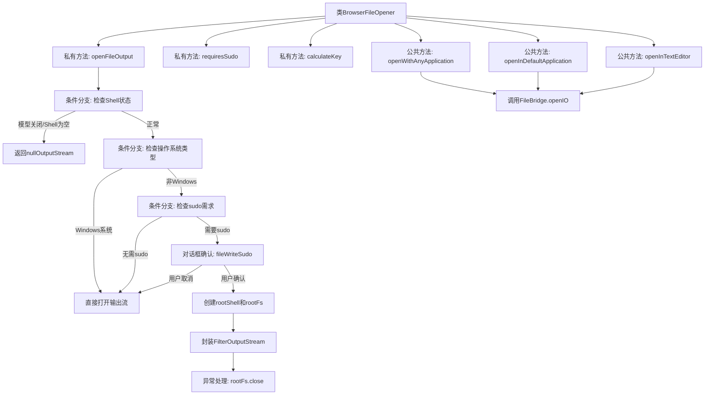

# 基础信息

|      |      |
|------|------|
| 名称 | BrowserFileOpener |
| 编码语言 | .java |
| 代码路径 | xpipe/app/src/main/java/io/xpipe/app/browser/file/BrowserFileOpener.java |
| 包名 | io.xpipe.app.browser.file |
| 依赖项 | ['io.xpipe.app.core.window.AppDialog', 'io.xpipe.app.ext.ConnectionFileSystem', 'io.xpipe.app.prefs.AppPrefs', 'io.xpipe.app.util.BooleanScope', 'io.xpipe.app.util.FileBridge', 'io.xpipe.app.util.FileOpener', 'io.xpipe.core.process.CommandBuilder', 'io.xpipe.core.process.ElevationFunction', 'io.xpipe.core.process.OsType', 'io.xpipe.core.store.FileEntry', 'io.xpipe.core.store.FileInfo', 'io.xpipe.core.store.FilePath', 'lombok.SneakyThrows', 'java.io.FilterOutputStream', 'java.io.IOException', 'java.io.OutputStream', 'java.util.Objects'] |
| 概述说明 | 类BrowserFileOpener提供文件操作功能，支持不同系统权限处理及多种打开方式。 |

# 说明

BrowserFileOpener类提供了文件操作功能，包括打开文件输出流、检查是否需要sudo权限、计算文件唯一键值以及通过不同应用程序打开文件。主要方法包括openFileOutput处理文件输出流，根据操作系统和权限决定是否提升权限；requiresSudo检查文件写入权限；calculateKey生成文件唯一标识；openWithAnyApplication、openInDefaultApplication和openInTextEditor分别用任意应用、默认应用或文本编辑器打开文件。类中涉及文件系统操作、权限验证和外部应用集成。

# 类列表 Class Summary

| 名称   | 类型  | 说明 |
|-------|------|-------------|
| BrowserFileOpener | class | 类BrowserFileOpener提供文件操作功能，包括打开、编辑及权限检查，支持不同系统和提权处理。 |


## 类 BrowserFileOpener

|      |      |
|------|------|
| 访问范围 | public |
| 类型 | class |
| 名称 | BrowserFileOpener |
| 说明 | 类BrowserFileOpener提供文件操作功能，包括打开、编辑及权限检查，支持不同系统和提权处理。 |


### UML类图

```mermaid
classDiagram
    class BrowserFileSystemTabModel {
        -FileSystemCache cache
        -boolean busy
        -boolean closed
        +getFileSystem() FileSystem
        +getCache() FileSystemCache
        +isClosed() boolean
        +getBusy() boolean
    }

    class FileSystem {
        -Shell shell
        +getShell() Optional~Shell~
        +openInput(FilePath) InputStream
        +openOutput(FilePath, long) OutputStream
        +getFileSize(FilePath) long
    }

    class FileSystemCache {
        -String username
        +getUidForUser(String) Integer
        +getUsername() String
        +isRoot() boolean
    }

    class Shell {
        -OsType osType
        +getOsType() OsType
        +identicalDialectSubShell() ShellBuilder
        +command(CommandBuilder) Command
    }

    class FileEntry {
        -FilePath path
        -FileSystem fileSystem
        -FileKind kind
        -FileInfo info
        +getPath() FilePath
        +getFileSystem() FileSystem
        +getKind() FileKind
        +getInfo() FileInfo
    }

    class FileInfo {
        <<Interface>>
    }
    
    class "FileInfo.Unix" {
        -String permissions
        -Integer uid
        -String user
        +getPermissions() String
        +getUid() Integer
        +getUser() String
    }

    class FileBridge {
        +get() FileBridge
        +openIO(String, int, BooleanScope, Supplier~InputStream~, Function~Long, OutputStream~, Consumer~String~) void
    }

    class FileOpener {
        +openWithAnyApplication(String) void
        +openInDefaultApplication(String) void
        +openInTextEditor(String) void
    }

    BrowserFileSystemTabModel --> FileSystem : 使用
    BrowserFileSystemTabModel --> FileSystemCache : 使用
    FileSystem --> Shell : 包含
    FileEntry --> FileSystem : 关联
    FileEntry --> FileInfo : 关联
    FileInfo <|-- "FileInfo.Unix" : 实现
    BrowserFileOpener --> BrowserFileSystemTabModel : 依赖
    BrowserFileOpener --> FileBridge : 调用
    FileBridge --> FileOpener : 调用
```

该代码展示了一个浏览器文件操作系统的核心结构，主要涉及文件打开、权限检查和不同操作系统处理逻辑。BrowserFileOpener类通过BrowserFileSystemTabModel获取文件系统信息，根据Unix权限或Windows系统类型决定是否需sudo权限，并通过FileBridge与FileOpener协作实现文件在不同应用程序中打开的功能。系统包含完整的文件信息模型、权限检查机制和跨平台处理能力，通过Shell类抽象不同操作系统的命令执行。


### 内部方法调用关系图



这段代码流程图展示了BrowserFileOpener类的核心逻辑结构，主要包含7个方法和多个条件分支。流程图清晰地描述了文件打开操作的处理流程，包括权限检查、系统类型判断、sudo权限申请等关键步骤。特别值得注意的是openFileOutput方法的复杂处理逻辑，涉及多级条件判断和异常处理，而三个公共方法最终都通过FileBridge.openIO实现核心功能。整个设计体现了对文件系统操作的安全性和平台兼容性的充分考虑。

### 字段列表 Field List

| 名称  | 类型  | 说明 |
|-------|-------|------|

### 方法列表 Method List

| 名称  | 类型  | 说明 |
|-------|-------|------|
| openInTextEditor | void | 静态方法打开文本编辑器，检查外部编辑器设置，通过文件桥接器处理文件输入输出操作。 |
| openInDefaultApplication | void | 静态方法打开默认应用处理文件，涉及路径、键计算及输入输出流操作。 |
| calculateKey | int | 计算文件唯一键：路径、文件系统、类型、信息和是否为空。 |
| openFileOutput | OutputStream | 打开文件输出流，处理权限和系统差异。 |
| openWithAnyApplication | void | 静态方法通过文件系统模型和条目打开任意应用，处理输入输出流并确保线程安全。 |
| requiresSudo | boolean | 检查文件是否需要sudo权限：非根目录、无其他写入权限且非用户拥有或用户无写入权限时返回真。 |


