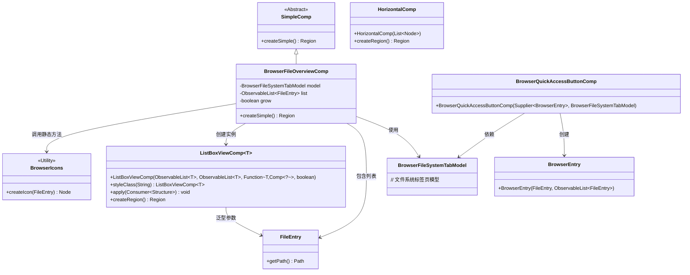
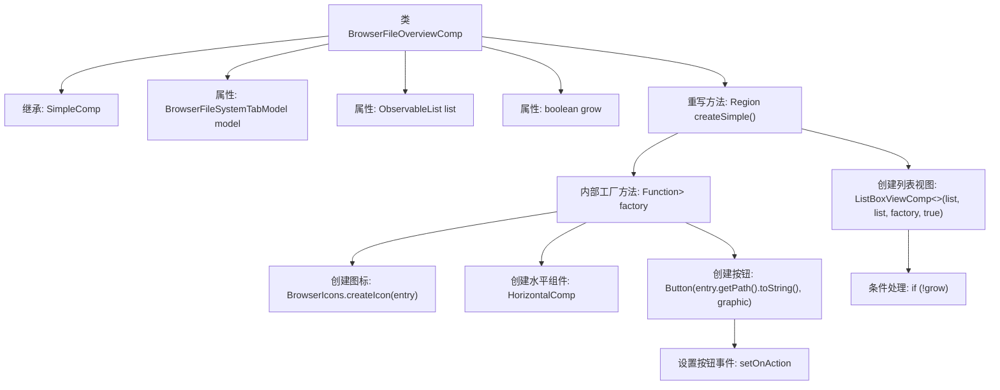

# 基础信息

|      |      |
|------|------|
| 名称 | BrowserFileOverviewComp |
| 编码语言 | .java |
| 代码路径 | xpipe/app/src/main/java/io/xpipe/app/browser/file/BrowserFileOverviewComp.java |
| 包名 | io.xpipe.app.browser.file |
| 依赖项 | ['io.xpipe.app.browser.icon.BrowserIcons', 'io.xpipe.app.comp.Comp', 'io.xpipe.app.comp.SimpleComp', 'io.xpipe.app.comp.augment.GrowAugment', 'io.xpipe.app.comp.base.HorizontalComp', 'io.xpipe.app.comp.base.ListBoxViewComp', 'io.xpipe.core.store.FileEntry', 'javafx.collections.ObservableList', 'javafx.geometry.Pos', 'javafx.scene.control.Button', 'javafx.scene.layout.Region', 'lombok.EqualsAndHashCode', 'lombok.Value', 'java.util.List', 'java.util.function.Function'] |
| 概述说明 | BrowserFileOverviewComp类继承SimpleComp，使用ListBoxViewComp展示文件列表，支持点击导航和动态布局。 |

# 说明

这是一个名为BrowserFileOverviewComp的Java类，继承自SimpleComp，用于创建浏览器文件概览组件。类中包含BrowserFileSystemTabModel模型和ObservableList<FileEntry>列表数据，以及控制组件是否扩展的grow布尔值。核心方法createSimple()构建了一个列表视图，每个文件条目显示为带图标的按钮，点击可导航至对应路径。列表视图支持自适应高度，并根据grow值决定是否扩展填充空间。组件样式类为overview-file-list。

# 类列表 Class Summary

| 名称   | 类型  | 说明 |
|-------|------|-------------|
| BrowserFileOverviewComp | class | BrowserFileOverviewComp类继承SimpleComp，使用ListBoxViewComp展示文件列表，支持点击导航和动态布局。 |

## 类 BrowserFileOverviewComp

|      |      |
|------|------|
| 访问范围 | @Value;@EqualsAndHashCode(callSuper = true);public |
| 类型 | class |
| 名称 | BrowserFileOverviewComp |
| 说明 | BrowserFileOverviewComp类继承SimpleComp，使用ListBoxViewComp展示文件列表，支持点击导航和动态布局。 |

### UML类图

类图描述：该图展示了BrowserFileOverviewComp继承自SimpleComp，并依赖BrowserFileSystemTabModel和FileEntry类。核心功能是通过ListBoxViewComp显示文件列表，使用BrowserIcons创建图标，HorizontalComp布局按钮组件。BrowserQuickAccessButtonComp用于创建快速访问按钮，整个结构体现了文件浏览器界面的组件协作关系。

### 内部方法调用关系图

流程图描述了BrowserFileOverviewComp类的结构和主要方法调用关系。该类继承自SimpleComp，重写了createSimple()方法用于创建文件浏览器界面组件。核心流程包括：通过工厂方法创建每个文件条目的按钮组件（含图标和交互事件），最终将所有条目组装成可滚动的列表视图。条件分支处理容器高度自适应逻辑，整体设计采用组合模式实现界面构建。

### 字段列表 Field List

| 名称  | 类型  | 说明 |
|-------|-------|------|
| model | BrowserFileSystemTabModel | 浏览器文件系统标签模型 |
| list | ObservableList<FileEntry> | 可观察文件条目列表。 |
| grow | boolean | 声明布尔变量grow |

### 方法列表 Method List

| 名称  | 类型  | 说明 |
|-------|-------|------|
| createSimple | Region | 创建文件列表组件，含图标和按钮，点击跳转路径，支持高度自适应。 |

