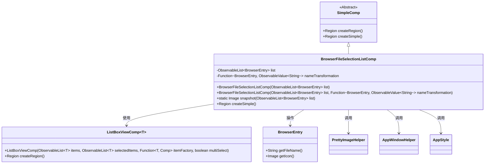
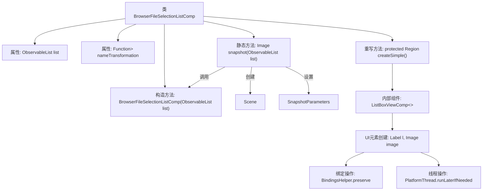

# 基础信息

|      |      |
|------|------|
| 名称 | BrowserFileSelectionListComp |
| 编码语言 | .java |
| 代码路径 | xpipe/app/src/main/java/io/xpipe/app/browser/file/BrowserFileSelectionListComp.java |
| 包名 | io.xpipe.app.browser.file |
| 依赖项 | ['io.xpipe.app.comp.Comp', 'io.xpipe.app.comp.SimpleComp', 'io.xpipe.app.comp.base.ListBoxViewComp', 'io.xpipe.app.comp.base.PrettyImageHelper', 'io.xpipe.app.core.AppStyle', 'io.xpipe.app.core.window.AppWindowHelper', 'io.xpipe.app.util.BindingsHelper', 'io.xpipe.app.util.PlatformThread', 'javafx.beans.binding.Bindings', 'javafx.beans.property.SimpleStringProperty', 'javafx.beans.value.ObservableValue', 'javafx.collections.ObservableList', 'javafx.scene.Scene', 'javafx.scene.SnapshotParameters', 'javafx.scene.control.Label', 'javafx.scene.control.OverrunStyle', 'javafx.scene.image.Image', 'javafx.scene.layout.Region', 'javafx.scene.paint.Color', 'lombok.AllArgsConstructor', 'lombok.EqualsAndHashCode', 'lombok.Value', 'java.util.function.Function'] |
| 概述说明 | BrowserFileSelectionListComp类继承SimpleComp，包含文件列表和名称转换功能，支持快照和列表显示。 |

# 说明

BrowserFileSelectionListComp是一个继承自SimpleComp的Java类，用于管理浏览器文件选择列表。核心功能包括：通过ObservableList存储BrowserEntry对象列表，支持自定义文件名转换函数。构造函数提供默认文件名转换逻辑。snapshot方法可生成列表组件的透明背景快照。createSimple方法创建包含图标和文本标签的列表项，支持动态更新文本内容。组件具有选中状态样式，当列表为空时自动隐藏。整体设计注重响应式数据绑定和UI动态更新。

# 类列表 Class Summary

| 名称   | 类型  | 说明 |
|-------|------|-------------|
| BrowserFileSelectionListComp | class | BrowserFileSelectionListComp类继承SimpleComp，用于显示可观察文件列表，支持名称转换和快照功能。 |

## 类 BrowserFileSelectionListComp

|      |      |
|------|------|
| 访问范围 | @Value;@EqualsAndHashCode(callSuper = true);@AllArgsConstructor;public |
| 类型 | class |
| 名称 | BrowserFileSelectionListComp |
| 说明 | BrowserFileSelectionListComp类继承SimpleComp，用于显示可观察文件列表，支持名称转换和快照功能。 |

### UML类图

类图描述：BrowserFileSelectionListComp继承自SimpleComp，用于展示浏览器文件选择列表。它包含两个主要成员：BrowserEntry对象列表和名称转换函数。通过ListBoxViewComp实现列表渲染，支持文件图标和动态文本更新。提供snapshot方法生成列表快照，并依赖多个工具类（PrettyImageHelper、AppWindowHelper等）完成样式处理和图像操作。整体设计采用观察者模式响应数据变化，具有高度可定制性。

### 内部方法调用关系图

流程图描述了BrowserFileSelectionListComp类的结构和关键方法调用关系。该类继承自SimpleComp，包含两个主要属性和三个核心方法：构造函数用于初始化文件列表，snapshot方法生成UI快照，createSimple方法创建包含图标和文本标签的可交互列表组件。流程展示了从属性定义到UI渲染的完整链路，包括数据绑定、线程安全操作和样式设置等关键细节，反映了JavaFX组件开发的典型模式。

### 字段列表 Field List

| 名称  | 类型  | 说明 |
|-------|-------|------|
| list | ObservableList<BrowserEntry> | 可观察的浏览器条目列表。 |
| nameTransformation | Function<BrowserEntry, ObservableValue<String>> | 函数将BrowserEntry转为ObservableValue<String>，名为nameTransformation。 |

### 方法列表 Method List

| 名称  | 类型  | 说明 |
|-------|-------|------|
| snapshot | Image | 静态方法生成浏览器文件列表透明快照。 |
| createSimple | Region | 创建列表组件，显示带图标和文本的条目，支持动态更新和样式控制。 |

