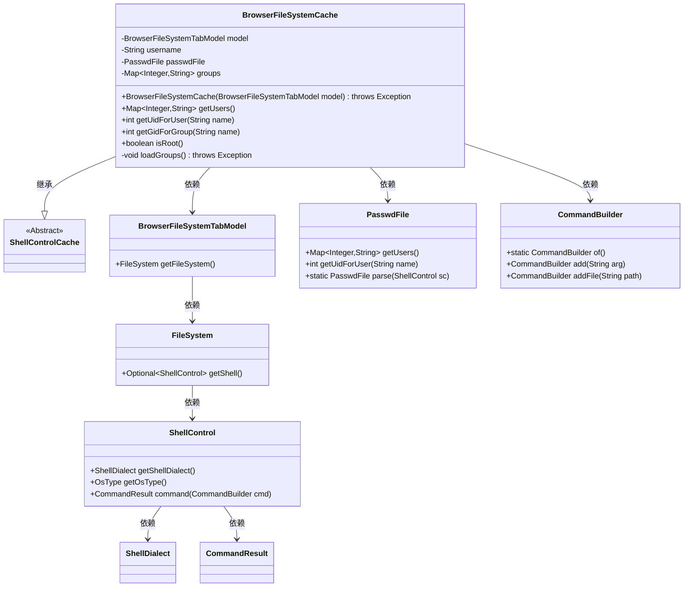
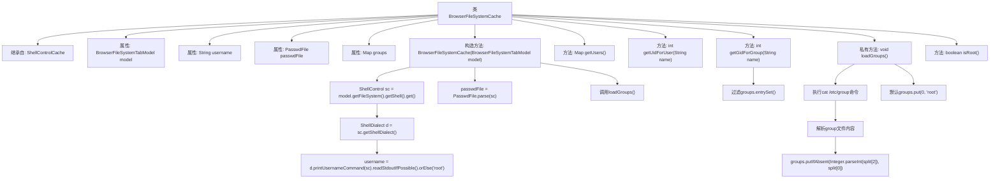

# 基础信息

|      |      |
|------|------|
| 名称 | BrowserFileSystemCache |
| 编码语言 | .java |
| 代码路径 | xpipe/app/src/main/java/io/xpipe/app/browser/file/BrowserFileSystemCache.java |
| 包名 | io.xpipe.app.browser.file |
| 依赖项 | ['io.xpipe.app.util.PasswdFile', 'io.xpipe.app.util.ShellControlCache', 'io.xpipe.core.process.CommandBuilder', 'io.xpipe.core.process.OsType', 'io.xpipe.core.process.ShellControl', 'io.xpipe.core.process.ShellDialect', 'lombok.Getter', 'java.util.LinkedHashMap', 'java.util.Map'] |
| 概述说明 | BrowserFileSystemCache类继承ShellControlCache，管理用户和组信息，支持获取UID和GID。 |

# 说明

BrowserFileSystemCache类继承自ShellControlCache，用于管理浏览器文件系统的用户和组信息。它包含BrowserFileSystemTabModel模型、用户名、PasswdFile对象和组映射表。构造函数初始化模型并加载用户和组信息。提供获取用户映射、用户UID、组GID的方法，以及判断当前用户是否为root的功能。loadGroups方法从/etc/group文件加载组信息，兼容Windows和MacOS系统。

# 类列表 Class Summary

| 名称   | 类型  | 说明 |
|-------|------|-------------|
| BrowserFileSystemCache | class | BrowserFileSystemCache类继承ShellControlCache，管理用户、组信息，支持获取UID和GID，加载/etc/group数据。 |

## 类 BrowserFileSystemCache

|      |      |
|------|------|
| 访问范围 | @Getter;public |
| 类型 | class |
| 名称 | BrowserFileSystemCache |
| 说明 | BrowserFileSystemCache类继承ShellControlCache，管理用户、组信息，支持获取UID和GID，加载/etc/group数据。 |

### UML类图

该类图展示了BrowserFileSystemCache及其相关类的结构关系。BrowserFileSystemCache继承自ShellControlCache，主要处理文件系统缓存逻辑，包含用户/组信息管理功能。它依赖BrowserFileSystemTabModel获取文件系统访问能力，通过ShellControl执行底层命令，使用PasswdFile解析用户数据，并借助CommandBuilder构建命令。图中清晰呈现了类之间的继承、组合和依赖关系，特别是ShellControl作为核心桥梁连接了操作系统交互层与业务逻辑层。

### 内部方法调用关系图

该流程图展示了BrowserFileSystemCache类的完整结构，包括继承关系、属性定义、构造方法逻辑和主要方法调用链。重点描述了构造方法中初始化username/passwdFile的流程，以及loadGroups()方法通过ShellControl执行系统命令并解析/etc/group文件的完整过程。箭头清晰显示了从类定义到方法实现，再到内部调用的层级关系，特别突出了涉及系统命令执行和文件解析的关键路径。

### 字段列表 Field List

| 名称  | 类型  | 说明 |
|-------|-------|------|
| username | String | 私有字符串类型变量username |
| model | BrowserFileSystemTabModel | 私有浏览器文件系统标签模型实例。 |
| passwdFile | PasswdFile | 私有PasswdFile对象passwdFile |
| groups = new LinkedHashMap<>() | Map<Integer, String> | 私有映射表groups，键为整数，值为字符串，保持插入顺序。 |

### 方法列表 Method List

| 名称  | 类型  | 说明 |
|-------|-------|------|
| getGidForGroup | int | 通过流操作查找组名对应的ID，未找到返回0。 |
| isRoot | boolean | 检查用户名是否为root。 |
| loadGroups | void | 加载系统用户组信息，非Windows/Mac系统时读取/etc/group文件，默认添加root组。 |
| getUsers | Map<Integer, String> | 获取用户ID与名称的映射表。 |
| getUidForUser | int | 获取用户UID的方法，调用passwdFile的getUidForUser实现。 |

