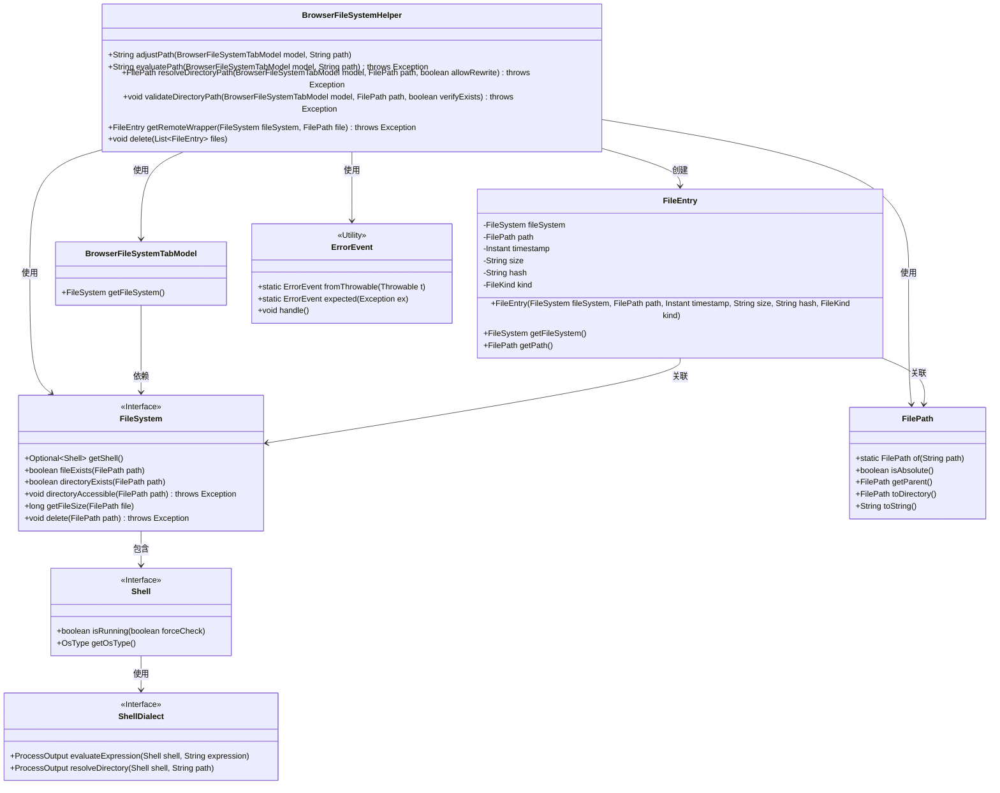

# 基础信息

|      |      |
|------|------|
| 名称 | BrowserFileSystemHelper |
| 编码语言 | .java |
| 代码路径 | xpipe/app/src/main/java/io/xpipe/app/browser/file/BrowserFileSystemHelper.java |
| 包名 | io.xpipe.app.browser.file |
| 依赖项 | ['io.xpipe.app.issue.ErrorEvent', 'io.xpipe.core.process.OsType', 'io.xpipe.core.store', 'java.time.Instant', 'java.util.List'] |
| 概述说明 | BrowserFileSystemHelper类提供路径处理、验证、解析及文件操作功能。 |

# 说明

BrowserFileSystemHelper类提供处理浏览器文件系统路径的实用方法。adjustPath方法调整路径字符串，去除引号并处理Windows驱动器特殊情况。evaluatePath方法评估路径表达式并返回结果。resolveDirectoryPath解析目录路径，验证绝对路径并处理重写情况。validateDirectoryPath验证目录路径是否存在和可访问。getRemoteWrapper创建文件条目对象，包含文件系统信息。delete方法删除指定文件列表，处理异常情况。所有方法均处理空值和文件系统未初始化情况。

# 类列表 Class Summary

| 名称   | 类型  | 说明 |
|-------|------|-------------|
| BrowserFileSystemHelper | class | BrowserFileSystemHelper类提供路径处理、验证、解析及文件操作功能。 |

## 类 BrowserFileSystemHelper

|      |      |
|------|------|
| 访问范围 | public |
| 类型 | class |
| 名称 | BrowserFileSystemHelper |
| 说明 | BrowserFileSystemHelper类提供路径处理、验证、解析及文件操作功能。 |

### UML类图

这段代码展示了一个浏览器文件系统助手类(BrowserFileSystemHelper)，它提供了路径处理、目录解析、验证和文件操作等功能。该类与BrowserFileSystemTabModel、FileSystem、Shell等核心组件交互，通过ShellDialect执行具体命令，使用FilePath处理路径，并通过FileEntry封装文件信息。ErrorEvent用于统一处理异常情况。整个设计体现了对文件系统操作的封装和异常安全处理，支持跨平台路径处理（特别是Windows特殊处理）和异步命令执行。

### 内部方法调用关系图

```mermaid
graph TD
    A["类BrowserFileSystemHelper"]
    B["方法: adjustPath(BrowserFileSystemTabModel model, String path)"]
    C["方法: evaluatePath(BrowserFileSystemTabModel model, String path)"]
    D["方法: resolveDirectoryPath(BrowserFileSystemTabModel model, FilePath path, boolean allowRewrite)"]
    E["方法: validateDirectoryPath(BrowserFileSystemTabModel model, FilePath path, boolean verifyExists)"]
    F["方法: getRemoteWrapper(FileSystem fileSystem, FilePath file)"]
    G["方法: delete(List<FileEntry> files)"]

    A --> B
    A --> C
    A --> D
    A --> E
    A --> F
    A --> G

    B --> B1["检查path为null → 返回null"]
    B --> B2["trim处理path → 检查空值 → 返回null"]
    B --> B3["去除path首尾引号"]
    B --> B4["检查model.getFileSystem()为null → 返回path"]
    B --> B5["检查shell.isEmpty() → 返回path"]
    B --> B6["处理Windows盘符特殊格式 → 返回path + '\\'"]
    B --> B7["返回最终path"]

    C --> C1["检查path为null → 返回null"]
    C --> C2["检查shell未运行 → 返回path"]
    C --> C3["调用shell.evaluateExpression → 读取stdout"]
    C --> C4["处理异常 → ErrorEvent.expected(ex)"]

    D --> D1["检查path为null → 返回null"]
    D --> D2["检查model.getFileSystem()为null → 返回path"]
    D --> D3["检查shell.isEmpty() → 返回path"]
    D --> D4["调用shell.resolveDirectory → 创建FilePath"]
    D --> D5["检查路径非绝对 → 抛出异常"]
    D --> D6["检查allowRewrite和文件存在 → 返回父目录"]
    D --> D7["返回目录对象"]

    E --> E1["检查path为null → 直接返回"]
    E --> E2["检查model.getFileSystem()为null → 直接返回"]
    E --> E3["检查shell.isEmpty() → 直接返回"]
    E --> E4["检查verifyExists和目录不存在 → 抛出异常"]
    E --> E5["检查目录可访问性 → 处理异常"]

    F --> F1["创建FileEntry对象"]
    F --> F2["设置文件属性: 大小/类型等"]

    G --> G1["检查files为空 → 直接返回"]
    G --> G2["遍历files → 调用delete()"]
    G --> G3["捕获异常 → ErrorEvent处理"]
```

这段代码流程图展示了BrowserFileSystemHelper类的完整功能结构，包含6个核心方法及其内部处理逻辑。主要功能包括路径处理(adjustPath)、路径解析(evaluatePath)、目录解析(resolveDirectoryPath)、目录验证(validateDirectoryPath)、远程文件包装(getRemoteWrapper)和批量删除(delete)。每个方法都包含完整的异常处理和边界条件检查，特别是对空值、shell状态和操作系统类型的特殊处理，体现了健壮的文件系统操作辅助功能。

### 字段列表 Field List

| 名称  | 类型  | 说明 |
|-------|-------|------|

### 方法列表 Method List

| 名称  | 类型  | 说明 |
|-------|-------|------|
| validateDirectoryPath | void | 验证目录路径有效性，检查存在性及可访问性。 |
| adjustPath | String | 调整路径：处理空值、修剪、引号及Windows特殊情况。 |
| evaluatePath | String | 检查路径有效性，若为空或Shell未运行返回原路径，否则评估表达式并返回结果，异常时抛出。 |
| getRemoteWrapper | FileEntry | 静态方法获取远程文件信息，返回包含路径、大小、类型等属性的文件条目对象。 |
| resolveDirectoryPath | FilePath | 解析目录路径，检查空值、文件系统状态，处理绝对路径及重写条件。 |
| delete | void | 静态方法删除文件列表，非空时遍历删除，异常处理。 |

