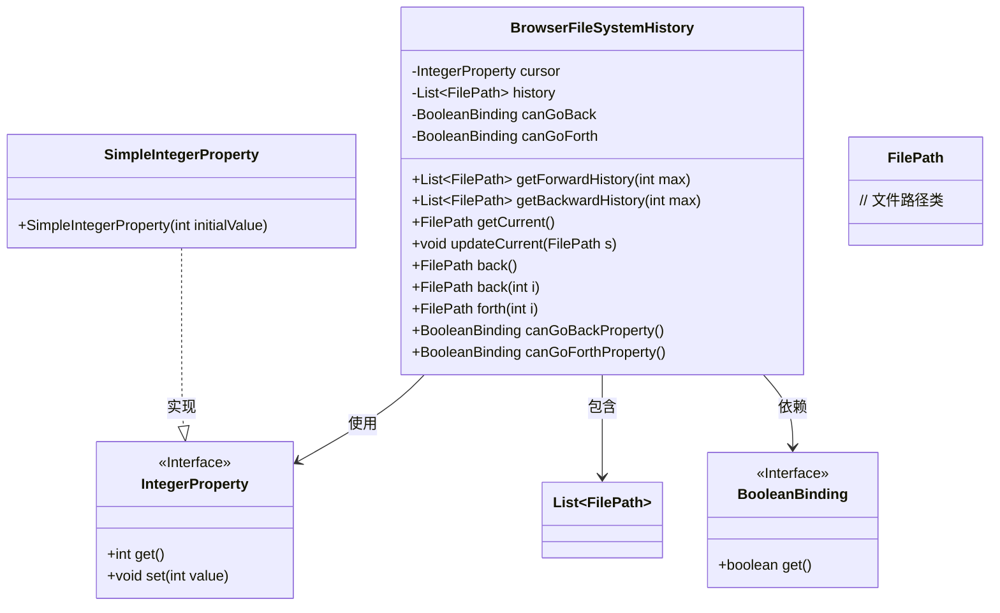
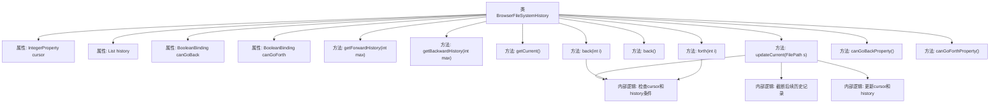

# 基础信息

|      |      |
|------|------|
| 名称 | BrowserFileSystemHistory |
| 编码语言 | .java |
| 代码路径 | xpipe/app/src/main/java/io/xpipe/app/browser/file/BrowserFileSystemHistory.java |
| 包名 | io.xpipe.app.browser.file |
| 依赖项 | ['io.xpipe.core.store.FilePath', 'javafx.beans.binding.Bindings', 'javafx.beans.binding.BooleanBinding', 'javafx.beans.property.IntegerProperty', 'javafx.beans.property.SimpleIntegerProperty', 'java.util.ArrayList', 'java.util.List', 'java.util.Objects'] |
| 概述说明 | 浏览器文件系统历史记录类，管理前进后退操作及当前路径状态。 |

# 说明

BrowserFileSystemHistory类管理文件路径历史记录，支持前进后退操作。它维护一个历史列表和当前光标位置，提供canGoBack和canGoForth布尔绑定判断移动条件。方法包括获取前后历史记录、更新当前路径、执行单步或多步前进后退操作。更新当前路径时会自动清除后续历史，确保操作连贯性。该类通过属性绑定实现状态监听，适合在文件浏览器中管理导航历史。

# 类列表 Class Summary

| 名称   | 类型  | 说明 |
|-------|------|-------------|
| BrowserFileSystemHistory | class | 浏览器文件系统历史记录类，管理前进后退功能及当前路径状态。 |

## 类 BrowserFileSystemHistory

|      |      |
|------|------|
| 访问范围 | public final |
| 类型 | class |
| 名称 | BrowserFileSystemHistory |
| 说明 | 浏览器文件系统历史记录类，管理前进后退功能及当前路径状态。 |

### UML类图

这段代码定义了一个浏览器文件系统历史记录管理类`BrowserFileSystemHistory`，主要用于维护文件路径的导航历史。该类通过`cursor`记录当前位置，`history`列表存储所有访问路径，并提供前进/后退导航功能。关键特性包括：通过`BooleanBinding`动态计算导航可用性，支持获取指定范围内的历史记录，以及自动清理无效历史记录。该类封装了完整的历史记录管理逻辑，适合在文件浏览器等需要导航历史的场景中使用。

### 内部方法调用关系图

该流程图展示了BrowserFileSystemHistory类的完整结构，包含4个核心属性和8个主要方法。关键逻辑体现在updateCurrent方法中，该方法会检查当前路径是否重复，根据cursor位置决定是否截断后续历史记录，最后更新cursor和history列表。back和forth方法都依赖canGoBack/canGoForth的绑定条件来判断导航可行性，体现了浏览器历史记录管理的典型行为模式。

### 字段列表 Field List

| 名称  | 类型  | 说明 |
|-------|-------|------|
| cursor = new SimpleIntegerProperty(-1) | IntegerProperty | 私有整型属性cursor初始值为-1。 |
| history = new ArrayList<>() | List<FilePath> | 私有文件路径历史列表 |
| canGoForth =            Bindings.createBooleanBinding(() -> cursor.get() < history.size() - 1, cursor) | BooleanBinding | 创建布尔绑定，检查游标是否小于历史记录最大索引。 |
| canGoBack =            Bindings.createBooleanBinding(() -> cursor.get() > 0 && history.size() > 1, cursor) | BooleanBinding | 创建布尔绑定，检查游标大于0且历史记录大于1。 |

### 方法列表 Method List

| 名称  | 类型  | 说明 |
|-------|-------|------|
| back | FilePath | 方法返回上一级文件路径，默认回退1级。 |
| updateCurrent | void | 更新文件路径历史记录，非空且不同时添加，并重置指针。 |
| getCurrent | FilePath | 获取当前文件路径，若历史记录非空则返回光标位置对应的路径，否则返回空。 |
| back | FilePath | 检查后退条件并返回历史记录文件路径。 |
| getBackwardHistory | List<FilePath> | 获取历史记录中光标前的文件路径列表，最多返回max个。 |
| getForwardHistory | List<FilePath> | 获取历史记录中当前光标后的最多max个文件路径。 |
| forth | FilePath | 方法前进i步，不能前进则返回历史末项，否则移动游标并返回对应项。 |
| canGoBackProperty | BooleanBinding | 方法返回布尔绑定属性canGoBack。 |
| canGoForthProperty | BooleanBinding | 方法返回布尔绑定属性canGoForth。 |

