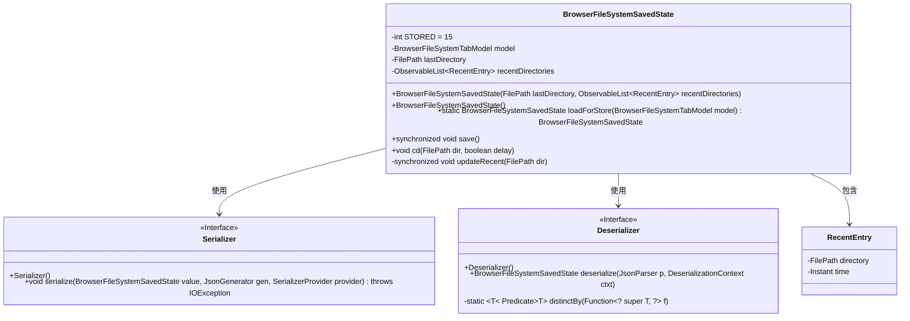
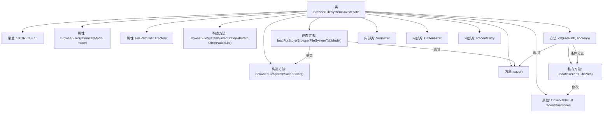
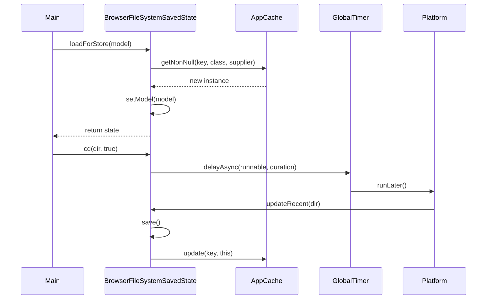

# 基础信息

|      |      |
|------|------|
| 名称 | BrowserFileSystemSavedState |
| 编码语言 | .java |
| 代码路径 | xpipe/app/src/main/java/io/xpipe/app/browser/file/BrowserFileSystemSavedState.java |
| 包名 | io.xpipe.app.browser.file |
| 依赖项 | ['io.xpipe.app.core.AppCache', 'io.xpipe.app.util.GlobalTimer', 'io.xpipe.core.store.FilePath', 'io.xpipe.core.util.JacksonMapper', 'javafx.application.Platform', 'javafx.collections.FXCollections', 'javafx.collections.ObservableList', 'com.fasterxml.jackson.core.JsonGenerator', 'com.fasterxml.jackson.core.JsonParser', 'com.fasterxml.jackson.databind.DeserializationContext', 'com.fasterxml.jackson.databind.JavaType', 'com.fasterxml.jackson.databind.SerializerProvider', 'com.fasterxml.jackson.databind.annotation.JsonDeserialize', 'com.fasterxml.jackson.databind.annotation.JsonSerialize', 'com.fasterxml.jackson.databind.deser.std.StdDeserializer', 'com.fasterxml.jackson.databind.node.JsonNodeFactory', 'com.fasterxml.jackson.databind.node.ObjectNode', 'com.fasterxml.jackson.databind.ser.std.StdSerializer', None, 'lombok.extern.jackson.Jacksonized', 'java.io.IOException', 'java.time.Duration', 'java.time.Instant', 'java.util', 'java.util.concurrent.CopyOnWriteArrayList', 'java.util.function.Function', 'java.util.function.Predicate', 'java.util.stream.Collectors'] |
| 概述说明 | 浏览器文件系统状态类，含最近目录列表和序列化功能。 |

# 说明

BrowserFileSystemSavedState类用于保存浏览器文件系统的状态信息，包含最近访问目录列表和最后访问目录路径。该类使用Lombok注解生成构造方法和getter，支持JSON序列化和反序列化。主要功能包括加载保存状态、更新最近访问目录列表、延迟保存状态等。RecentEntry内部类记录目录路径和访问时间。通过AppCache实现状态持久化，确保数据一致性。

# 类列表 Class Summary

| 名称   | 类型  | 说明 |
|-------|------|-------------|
| BrowserFileSystemSavedState | class | BrowserFileSystemSavedState类存储文件系统状态，包含最近目录列表和序列化功能。 |

## 类 BrowserFileSystemSavedState

|      |      |
|------|------|
| 访问范围 | @AllArgsConstructor;@Getter;@JsonSerialize(using = BrowserFileSystemSavedState.Serializer.class);@JsonDeserialize(using = BrowserFileSystemSavedState.Deserializer.class);public |
| 类型 | class |
| 名称 | BrowserFileSystemSavedState |
| 说明 | BrowserFileSystemSavedState类存储文件系统状态，包含最近目录列表和序列化功能。 |

### UML类图

这段代码描述了一个浏览器文件系统保存状态的类结构。BrowserFileSystemSavedState类负责管理最近访问目录的状态，包含序列化/反序列化功能(通过内部类Serializer/Deserializer实现)，以及RecentEntry值对象。核心功能包括：延迟保存目录变更、维护最近访问目录列表(最多15条)、与AppCache交互实现持久化。类之间通过组合和依赖关系协作，整体设计符合单一职责原则，通过同步机制保证线程安全。

### 内部方法调用关系图

该流程图展示了BrowserFileSystemSavedState类的核心结构和调用关系。类包含状态存储、目录操作和序列化功能，通过loadForStore方法初始化状态，cd方法处理目录变更并触发异步保存。时序图重点描述了延迟保存目录状态的完整过程，涉及定时器和平台线程的跨线程协作。Serializer/Deserializer内部类实现JSON序列化，RecentEntry则封装最近访问目录信息。整个设计实现了浏览器文件系统状态的持久化管理和最近访问记录维护。

### 字段列表 Field List

| 名称  | 类型  | 说明 |
|-------|-------|------|
| recentDirectories | ObservableList<RecentEntry> | 非空私有变量recentDirectories，类型为ObservableList<RecentEntry>。 |
| lastDirectory | FilePath | 最后访问的目录路径变量。 |
| STORED = 15 | int | 私有静态常量STORED值为15。 |
| model | BrowserFileSystemTabModel | 设置私有BrowserFileSystemTabModel模型变量。 |

### 方法列表 Method List

| 名称  | 类型  | 说明 |
|-------|-------|------|
| loadForStore | BrowserFileSystemSavedState | 加载浏览器文件系统状态，若不存在则创建新实例并关联模型。 |
| save | void | 同步方法保存模型状态至缓存，若模型为空则不处理。 |
| cd | void | 方法cd切换目录，支持延迟更新。若延迟，10秒后检查并更新最近目录；否则立即更新。 |
| updateRecent | void | 同步更新最近目录列表，移除重复项并添加新条目，保持列表长度不超过限制。 |

