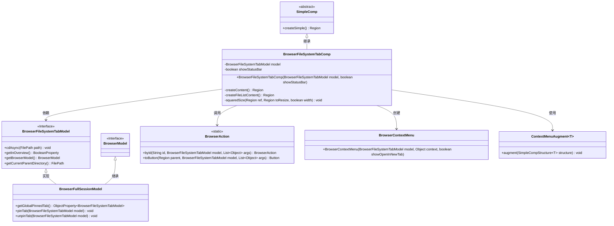
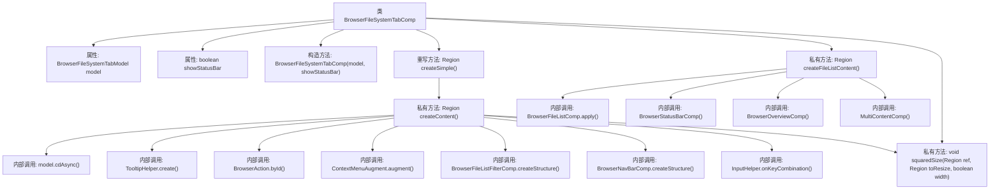

# 基础信息

|      |      |
|------|------|
| 名称 | BrowserFileSystemTabComp |
| 编码语言 | .java |
| 代码路径 | xpipe/app/src/main/java/io/xpipe/app/browser/file/BrowserFileSystemTabComp.java |
| 包名 | io.xpipe.app.browser.file |
| 依赖项 | ['io.xpipe.app.browser.BrowserFullSessionModel', 'io.xpipe.app.browser.action.BrowserAction', 'io.xpipe.app.comp.Comp', 'io.xpipe.app.comp.SimpleComp', 'io.xpipe.app.comp.SimpleCompStructure', 'io.xpipe.app.comp.augment.ContextMenuAugment', 'io.xpipe.app.comp.base', 'io.xpipe.app.core.AppFontSizes', 'io.xpipe.app.core.AppI18n', 'io.xpipe.app.util.InputHelper', 'io.xpipe.app.util.PlatformThread', 'io.xpipe.core.store.FilePath', 'javafx.beans.binding.Bindings', 'javafx.geometry.Pos', 'javafx.scene.control.Button', 'javafx.scene.control.MenuButton', 'javafx.scene.control.Tooltip', 'javafx.scene.input.KeyCode', 'javafx.scene.input.KeyCodeCombination', 'javafx.scene.input.KeyCombination', 'javafx.scene.input.MouseButton', 'javafx.scene.layout.HBox', 'javafx.scene.layout.Priority', 'javafx.scene.layout.Region', 'javafx.scene.layout.VBox', 'atlantafx.base.controls.Spacer', 'org.kordamp.ikonli.javafx.FontIcon', 'java.util.ArrayList', 'java.util.List', 'java.util.Map'] |
| 概述说明 | 文件浏览器组件，包含导航栏、操作按钮和文件列表，支持快捷键操作和状态栏显示。 |

# 说明

BrowserFileSystemTabComp是一个基于SimpleComp的组件，用于构建文件浏览器界面。它包含顶部导航栏（含返回、前进、刷新、终端按钮和目录菜单）、文件列表区域和可选状态栏。组件支持快捷键操作（如Alt+HOME返回根目录、Ctrl+F搜索、Ctrl+L聚焦地址栏），并可根据模型状态动态切换概览和文件列表视图。顶部导航栏还支持标签页固定功能，按钮尺寸统一绑定到导航栏高度。文件列表区域自动处理焦点切换，并支持通过Alt+UP或Backspace返回上级目录。

# 类列表 Class Summary

| 名称   | 类型  | 说明 |
|-------|------|-------------|
| BrowserFileSystemTabComp | class | 文件浏览器组件，包含导航栏、操作按钮和文件列表，支持快捷键操作和状态栏显示。 |

## 类 BrowserFileSystemTabComp

|      |      |
|------|------|
| 访问范围 | public |
| 类型 | class |
| 名称 | BrowserFileSystemTabComp |
| 说明 | 文件浏览器组件，包含导航栏、操作按钮和文件列表，支持快捷键操作和状态栏显示。 |

### UML类图

这段代码展示了一个浏览器文件系统标签页组件(BrowserFileSystemTabComp)的实现，它继承自SimpleComp抽象类。该组件通过BrowserFileSystemTabModel与数据层交互，包含导航按钮、过滤器和上下文菜单等功能。核心功能包括创建顶部工具栏、文件列表内容和状态栏，并处理各种键盘快捷键操作。类图中清晰地展示了组件与模型、辅助类之间的依赖关系，以及接口实现和类继承的层级结构。

### 内部方法调用关系图

这段代码实现了一个浏览器文件系统标签页组件，主要包含顶部导航栏和文件内容区域两部分。流程图展示了类结构、属性、构造方法以及关键方法调用关系，包括创建UI内容、处理按钮事件、绑定快捷键等核心功能。组件通过多个子模块（如导航栏、过滤器、状态栏）协同工作，支持目录导航、文件操作和视图切换等功能。

### 字段列表 Field List

| 名称  | 类型  | 说明 |
|-------|-------|------|
| showStatusBar | boolean | 私有布尔变量showStatusBar，控制状态栏显示。 |
| model | BrowserFileSystemTabModel | 私有浏览器文件系统标签模型 |

### 方法列表 Method List

| 名称  | 类型  | 说明 |
|-------|-------|------|
| createSimple | Region | 覆盖方法createSimple，返回createContent结果。 |
| createContent | Region | 创建浏览器界面，包含导航按钮、搜索栏、菜单和快捷键功能。 |
| squaredSize | void | 私有方法squaredSize绑定区域尺寸，根据宽度参数调整最小最大宽高属性。 |
| createFileListContent | Region | 创建文件列表区域，包含目录视图和状态栏，根据路径显示不同内容，处理焦点切换。 |

