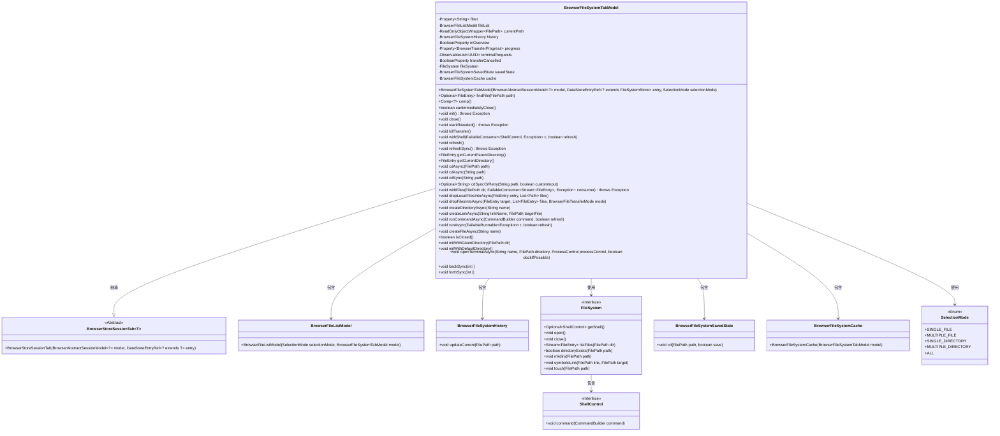

# 基础信息

|      |      |
|------|------|
| 名称 | BrowserFileSystemTabModel |
| 编码语言 | .java |
| 代码路径 | xpipe/app/src/main/java/io/xpipe/app/browser/file/BrowserFileSystemTabModel.java |
| 包名 | io.xpipe.app.browser.file |
| 依赖项 | ['io.xpipe.app.browser.BrowserAbstractSessionModel', 'io.xpipe.app.browser.BrowserFullSessionModel', 'io.xpipe.app.browser.BrowserStoreSessionTab', 'io.xpipe.app.browser.action.BrowserAction', 'io.xpipe.app.comp.Comp', 'io.xpipe.app.core.window.AppMainWindow', 'io.xpipe.app.ext.ProcessControlProvider', 'io.xpipe.app.ext.ShellStore', 'io.xpipe.app.issue.ErrorEvent', 'io.xpipe.app.prefs.AppPrefs', 'io.xpipe.app.storage.DataStoreEntryRef', 'io.xpipe.app.terminal', 'io.xpipe.app.util.BooleanScope', 'io.xpipe.app.util.ThreadHelper', 'io.xpipe.core.process', 'io.xpipe.core.store', 'io.xpipe.core.util.FailableConsumer', 'io.xpipe.core.util.FailableRunnable', 'javafx.beans.binding.Bindings', 'javafx.beans.property', 'javafx.collections.FXCollections', 'javafx.collections.ObservableList', 'lombok.Getter', 'lombok.NonNull', 'lombok.SneakyThrows', 'java.io.IOException', 'java.nio.file.Path', 'java.util.List', 'java.util.Objects', 'java.util.Optional', 'java.util.UUID', 'java.util.stream.Stream'] |
| 概述说明 | 文件系统浏览器标签模型，管理文件列表、路径历史、传输进度及终端请求。 |

# 说明

BrowserFileSystemTabModel是一个用于管理文件系统浏览器标签页的类，继承自BrowserStoreSessionTab。它包含多个属性如过滤器、文件列表模型、当前路径、历史记录等，支持文件操作如刷新、导航、创建目录/文件、运行命令等。类中实现了同步和异步方法处理文件系统交互，包括路径解析、终端请求管理、文件传输控制等。还提供了历史记录导航、终端启动逻辑及多种选择模式（单文件、多文件、单目录等）。初始化时会创建文件系统实例并加载保存的状态，关闭时保存当前状态并清理资源。

# 类列表 Class Summary

| 名称   | 类型  | 说明 |
|-------|------|-------------|
| BrowserFileSystemTabModel | class | BrowserFileSystemTabModel类管理文件系统浏览器标签页，包含文件列表、路径导航、历史记录、终端请求等功能，支持文件操作和目录切换。 |

## 类 BrowserFileSystemTabModel

|      |      |
|------|------|
| 访问范围 | @Getter;public final |
| 类型 | class |
| 名称 | BrowserFileSystemTabModel |
| 说明 | BrowserFileSystemTabModel类管理文件系统浏览器标签页，包含文件列表、路径导航、历史记录、终端请求等功能，支持文件操作和目录切换。 |

### UML类图

这段类图展示了BrowserFileSystemTabModel的核心结构和关系。该类继承自BrowserStoreSessionTab<FileSystemStore>，主要负责文件系统浏览器的标签页模型管理，包含文件列表、历史记录、状态保存等核心功能。它与FileSystem接口交互实现底层文件操作，通过ShellControl接口执行命令，并使用BrowserFileListModel管理文件列表显示。类图中清晰地展示了各组件间的依赖关系和层级结构，体现了模块化设计和职责分离原则。

### 内部方法调用关系图

这段代码定义了一个`BrowserFileSystemTabModel`类，用于管理文件系统浏览器标签页的模型。该类包含多个属性和方法，用于处理文件系统操作、路径导航、文件传输、终端交互等功能。主要功能包括初始化文件系统、刷新文件列表、切换目录、创建文件/目录、运行命令、管理终端会话等。通过属性绑定和异步操作实现高效的UI交互，同时支持历史记录、缓存和状态保存。枚举`SelectionMode`定义了不同的文件选择模式。整体设计注重线程安全和异常处理，适合在图形界面应用中管理复杂的文件系统操作。

### 字段列表 Field List

| 名称  | 类型  | 说明 |
|-------|-------|------|
| transferCancelled = new SimpleBooleanProperty() | BooleanProperty | 私有布尔属性transferCancelled初始化为SimpleBooleanProperty实例。 |
| filter = new SimpleStringProperty() | Property<String> | 私有字符串属性filter，使用SimpleStringProperty初始化。 |
| cache | BrowserFileSystemCache | 私有浏览器文件系统缓存实例。 |
| inOverview = new SimpleBooleanProperty() | BooleanProperty | 私有布尔属性inOverview初始化为SimpleBooleanProperty实例。 |
| progress = new SimpleObjectProperty<>() | Property<BrowserTransferProgress> | 私有属性progress，类型为Property<BrowserTransferProgress>，初始化为SimpleObjectProperty。 |
| savedState | BrowserFileSystemSavedState | 私有浏览器文件系统保存状态变量savedState。 |
| history = new BrowserFileSystemHistory() | BrowserFileSystemHistory | 私有成员history，类型为BrowserFileSystemHistory，初始化为新实例。 |
| fileList | BrowserFileListModel | 私有浏览器文件列表模型fileList |
| terminalRequests = FXCollections.observableArrayList() | ObservableList<UUID> | 私有终端的UUID请求列表，使用FX可观察集合。 |
| currentPath = new ReadOnlyObjectWrapper<>() | ReadOnlyObjectWrapper<FilePath> | 私有只读对象包装器currentPath，类型为FilePath。 |
| fileSystem | FileSystem | 私有文件系统变量fileSystem。 |

### 方法列表 Method List

| 名称  | 类型  | 说明 |
|-------|-------|------|
| runAsync | void | 异步执行可失败任务，完成后可选刷新。 |
| isClosed | boolean | 检查文件系统是否关闭，若为null则返回true。 |
| dropLocalFilesIntoAsync | void | 异步将本地文件放入指定条目，执行拷贝操作并刷新同步。 |
| refresh | void | 异步刷新当前路径数据，避免重复操作。 |
| comp | Comp<?> | 重写comp方法，返回BrowserFileSystemTabComp实例。 |
| withShell | void | 异步执行Shell操作，检查文件系统，确保独占执行，支持刷新。 |
| initWithGivenDirectory | void | 初始化方法，根据给定目录路径切换工作目录。 |
| openTerminalAsync | void | 异步打开终端，检查文件系统和Shell，支持分屏停靠，启动终端并预连接。 |
| loadFilesSync | boolean | 同步加载文件到列表，成功返回true，失败返回false并处理异常。 |
| killTransfer | void | 终止文件传输操作，若文件系统存在则取消传输。 |
| cdSyncOrRetry | Optional<String> | 方法处理路径同步或重试，检查路径有效性，调整路径格式，执行命令或打开终端，返回调整后路径或空。 |
| backSync | void | 方法backSync接收整数i，回退历史记录i步，若成功则同步cd到该记录。 |
| init | void | 初始化文件系统，设置脚本和终止监听，创建缓存并加载状态。 |
| startIfNeeded | void | 检查文件系统存在后启动shell。 |
| canImmediatelyClose | boolean | 检查文件系统状态和进度，满足条件时可立即关闭。 |
| forthSync | void | 方法`forthSync`接收整数`i`，从`history`获取第`i`项并调用`cdSync`处理其字符串形式。 |
| createDirectoryAsync | void | 异步创建目录，检查非空名称和当前目录，避免重复并刷新。 |
| cdSync | void | 同步切换目录路径，失败则重试一次。 |
| initWithDefaultDirectory | void | 初始化默认目录，清空当前和历史状态。 |
| createLinkAsync | void | 异步创建符号链接，检查参数后执行，确保目录和文件系统有效。 |
| findFile | Optional<FileEntry> | 查找指定路径的文件，返回匹配的第一个文件条目。 |
| shouldLaunchSplitTerminal | boolean | 检查条件决定是否启动分屏终端：需启用终端停靠、系统为Windows、窗口宽度足够、终端类型支持分屏、当前为全会话模型且右侧未被占用。 |
| getCurrentDirectory | FileEntry | 获取当前目录文件对象，路径或系统为空时返回空。 |
| createFileAsync | void | 异步创建文件，非空校验后在新线程中执行，确保文件系统和目录存在后生成文件并刷新。 |
| refreshSync | void | 刷新同步当前路径，不检查异常。 |
| getCurrentParentDirectory | FileEntry | 获取当前目录的父目录，若无则返回空。 |
| runCommandAsync | void | 异步执行命令并可选刷新，检查文件系统和当前目录有效性。 |
| withFiles | void | 方法`withFiles`接受目录和消费者，处理文件流或空流，确保线程安全。 |
| cdAsync | void | 异步切换目录至指定路径，若路径为空则传空值。 |
| close | void | 关闭方法：检查文件系统非空后保存当前目录状态，关闭文件系统并处理异常。 |
| cdSyncWithoutCheck | void | 方法`cdSyncWithoutCheck`切换目录并加载文件：初始化文件系统，更新路径状态和历史，最后同步加载文件。 |
| cdAsync | void | 异步切换目录，线程安全执行同步切换操作。 |
| dropFilesIntoAsync | void | 异步将文件列表拖入目标目录，非空时启动线程执行传输操作。 |

