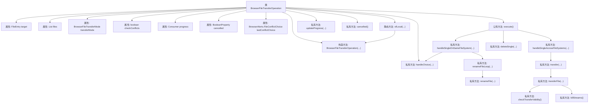

# 基础信息

|      |      |
|------|------|
| 名称 | BrowserFileTransferOperation |
| 编码语言 | .java |
| 代码路径 | xpipe/app/src/main/java/io/xpipe/app/browser/file/BrowserFileTransferOperation.java |
| 包名 | io.xpipe.app.browser.file |
| 依赖项 | ['io.xpipe.app.issue.ErrorEvent', 'io.xpipe.app.util.ThreadHelper', 'io.xpipe.core.store', 'javafx.beans.property.BooleanProperty', 'java.io', 'java.nio.file.Files', 'java.nio.file.Path', 'java.time.Instant', 'java.util.LinkedHashMap', 'java.util.List', 'java.util.concurrent.atomic.AtomicBoolean', 'java.util.concurrent.atomic.AtomicLong', 'java.util.concurrent.atomic.AtomicReference', 'java.util.function.Consumer', 'java.util.regex.Pattern'] |
| 概述说明 | 浏览器文件传输操作类，处理文件移动、复制及冲突检测。 |

# 说明

BrowserFileTransferOperation类实现了浏览器文件传输功能，支持本地和跨文件系统的文件移动、复制及冲突处理。核心功能包括：通过transferMode控制传输类型（移动/复制），checkConflicts参数启用冲突检测，progress回调实时更新传输进度，cancelled属性支持取消操作。关键处理逻辑涵盖：同名文件自动重命名循环（最多10次）、目录防递归保护、跨系统传输时的路径兼容性转换、大文件分块传输及进度跟踪。冲突解决提供跳过/覆盖/重命名等选项，支持批量操作记忆选择。异常处理包含传输中断的流关闭和错误上报机制，确保资源释放。

# 类列表 Class Summary

| 名称   | 类型  | 说明 |
|-------|------|-------------|
| BrowserFileTransferOperation | class | 浏览器文件传输操作类，处理本地和跨文件系统的文件移动、复制及冲突管理。 |


## 类 BrowserFileTransferOperation

|      |      |
|------|------|
| 访问范围 | public |
| 类型 | class |
| 名称 | BrowserFileTransferOperation |
| 说明 | 浏览器文件传输操作类，处理本地和跨文件系统的文件移动、复制及冲突管理。 |


### UML类图

```mermaid
classDiagram
    class BrowserFileTransferOperation {
        -FileEntry target
        -List~FileEntry~ files
        -BrowserFileTransferMode transferMode
        -boolean checkConflicts
        -Consumer~BrowserTransferProgress~ progress
        -BooleanProperty cancelled
        -BrowserAlerts$FileConflictChoice lastConflictChoice
        +BrowserFileTransferOperation(FileEntry, List~FileEntry~, BrowserFileTransferMode, boolean, Consumer~BrowserTransferProgress~, BooleanProperty)
        +static BrowserFileTransferOperation ofLocal(FileEntry, List~Path~, BrowserFileTransferMode, boolean, Consumer~BrowserTransferProgress~, BooleanProperty) BrowserFileTransferOperation
        +void execute()
        -void updateProgress(BrowserTransferProgress)
        -BrowserAlerts$FileConflictChoice handleChoice(FileSystem, FilePath, boolean)
        -boolean cancelled()
        -void handleSingleOnSameFileSystem(FileEntry)
        -FilePath renameFileLoop(FileSystem, FilePath, boolean)
        -FilePath renameFile(FilePath)
        -void handleSingleAcrossFileSystems(FileEntry)
        -void transfer(FileEntry, FilePath, AtomicLong, AtomicLong, Instant)
        -void deleteSingle(FileEntry)
        -void transferFile(FileEntry, InputStream, OutputStream, AtomicLong, AtomicLong, Instant, long)
        -boolean checkTransferValidity()
        -void killStreams()
    }

    class FileEntry {
        <<Interface>>
        +FilePath getPath()
        +FileSystem getFileSystem()
        +FileKind getKind()
        +Optional~Long~ getFileSizeLong()
        +String getName()
    }

    class BrowserTransferProgress {
        +String name
        +long transferred
        +long total
        +Instant start
        +static BrowserTransferProgress finished(String, long) BrowserTransferProgress
    }

    class BrowserAlerts {
        <<Interface>>
        +static FileConflictChoice showFileConflictAlert(FilePath, boolean) FileConflictChoice
        +static boolean showMoveAlert(List~FileEntry~, FileEntry) boolean
    }

    enum BrowserFileTransferMode {
        NORMAL
        MOVE
    }

    enum FileConflictChoice {
        CANCEL
        REPLACE
        REPLACE_ALL
        RENAME
        RENAME_ALL
        SKIP
        SKIP_ALL
    }

    class FileSystem {
        <<Interface>>
        +boolean fileExists(FilePath)
        +boolean directoryExists(FilePath)
        +void move(FilePath, FilePath)
        +void copy(FilePath, FilePath)
        +void delete(FilePath)
        +OutputStream openOutput(FilePath, long)
        +InputStream openInput(FilePath)
        +long getFileSize(FilePath)
        +Optional~Shell~ getShell()
        +List~FileEntry~ listFilesRecursively(FilePath)
        +void mkdirs(FilePath)
    }

    class FilePath {
        +String getFileName()
        +String getExtension()
        +String getBaseName()
        +FilePath getParent()
        +FilePath join(String)
        +boolean startsWith(FilePath)
        +FilePath relativize(FilePath) FilePath
        +String toUnix()
        +FilePath fileSystemCompatible(OsType)
        +static FilePath of(String)
    }

    BrowserFileTransferOperation --> FileEntry : 包含
    BrowserFileTransferOperation --> BrowserTransferProgress : 使用
    BrowserFileTransferOperation --> BrowserAlerts : 调用
    BrowserFileTransferOperation --> FileSystem : 依赖
    BrowserFileTransferOperation --> FilePath : 使用
    FileEntry --> FileSystem : 关联
    FileEntry --> FilePath : 关联
    BrowserAlerts --> FileConflictChoice : 使用
    FileSystem --> FilePath : 参数/返回值
    FileSystem --> Shell : 关联
```

这段代码实现了一个浏览器文件传输操作类，主要功能包括处理本地和跨文件系统的文件传输、冲突检测与解决、进度跟踪和取消操作。核心类BrowserFileTransferOperation通过组合FileEntry、FileSystem等组件，实现了完整的文件传输流程，支持移动/复制模式，并提供了完善的错误处理和进度反馈机制。类图中清晰地展示了各组件间的依赖关系和接口实现。


### 内部方法调用关系图



这段代码实现了一个浏览器文件传输操作类，主要功能包括处理本地和跨文件系统的文件传输、冲突检测、进度更新和取消操作。核心流程从execute()方法开始，根据传输模式(移动/复制)和文件系统类型(相同/不同)分别调用handleSingleOnSameFileSystem()或handleSingleAcrossFileSystems()方法。在传输过程中会实时更新进度，处理文件冲突(跳过/重命名/替换)，并通过多线程实现高效文件传输。代码结构清晰，考虑了各种边界情况如文件不存在、传输中断、冲突处理等，是一个完整的文件传输解决方案。

### 字段列表 Field List

| 名称  | 类型  | 说明 |
|-------|-------|------|
| target | FileEntry | 私有文件条目目标 |
| lastConflictChoice | BrowserAlerts.FileConflictChoice | 浏览器文件冲突选择记录 |
| checkConflicts | boolean | 私有布尔变量checkConflicts |
| progress | Consumer<BrowserTransferProgress> | 私有消费者接口，处理浏览器传输进度。 |
| transferMode | BrowserFileTransferMode | 私有浏览器文件传输模式变量transferMode。 |
| cancelled | BooleanProperty | 私有布尔属性cancelled |
| files | List<FileEntry> | 私有文件条目列表 |
| DEFAULT_BUFFER_SIZE = 1024 | int | 定义默认缓冲区大小为1024。 |

### 方法列表 Method List

| 名称  | 类型  | 说明 |
|-------|-------|------|
| deleteSingle | void | 删除指定文件系统中的单个文件条目。 |
| updateProgress | void | 更新进度方法，接收浏览器传输进度并处理。 |
| cancelled | boolean | 检查任务是否已取消。 |
| execute | void | 检查文件列表，若空则返回。根据条件移动或处理文件，跨系统时删除原文件，最后更新进度。 |
| handleChoice | BrowserAlerts.FileConflictChoice | 处理文件冲突选择逻辑，根据上次选择或弹窗决定操作。 |
| renameFile | FilePath | 重命名文件，若含数字则递增，否则添加(1)。 |
| transfer | void | 文件传输方法，处理异常和进度更新。 |
| ofLocal | BrowserFileTransferOperation | 静态方法创建本地文件传输操作，检查冲突并支持进度监控和取消。 |
| handleSingleAcrossFileSystems | void | 处理跨文件系统的文件传输，检查目录有效性，防止自嵌套，计算总大小，处理冲突并更新进度。 |
| renameFileLoop | FilePath | 重命名文件循环，最多10次，检查存在后返回目标路径。 |
| transferFile | void | 文件传输方法，含进度更新、异常处理和取消检测。 |
| handleSingleOnSameFileSystem | void | 处理同文件系统下的文件移动或复制，检查冲突并重命名重复文件。 |
| checkTransferValidity | boolean | 检查文件传输有效性：同系统直接通过，跨系统需验证Shell通道状态。 |
| killStreams | void | 关闭不同文件系统的流：检查源和目标文件系统是否相同，若不同则分别关闭源的标准输出流和目标的标准输入流。 |


