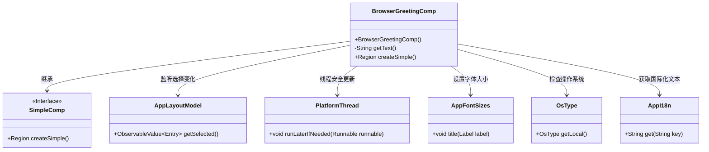
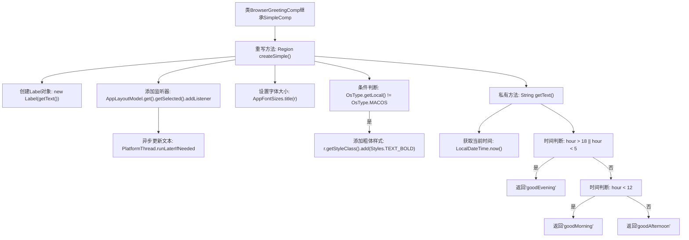

# 基础信息

|      |      |
|------|------|
| 名称 | BrowserGreetingComp |
| 编码语言 | .java |
| 代码路径 | xpipe/app/src/main/java/io/xpipe/app/browser/file/BrowserGreetingComp.java |
| 包名 | io.xpipe.app.browser.file |
| 依赖项 | ['io.xpipe.app.comp.SimpleComp', 'io.xpipe.app.core.AppFontSizes', 'io.xpipe.app.core.AppI18n', 'io.xpipe.app.core.AppLayoutModel', 'io.xpipe.app.util.PlatformThread', 'io.xpipe.core.process.OsType', 'javafx.scene.control.Label', 'javafx.scene.layout.Region', 'atlantafx.base.theme.Styles', 'java.time.LocalDateTime'] |
| 概述说明 | 浏览器问候组件，根据时间显示不同问候语，非MacOS加粗字体。 |

# 说明

该代码定义了一个名为BrowserGreetingComp的组件类，继承自SimpleComp。它创建了一个显示问候语的标签，内容根据当前时间动态变化：18点至次日5点显示晚安，5点至12点显示早安，其余时间显示午安。标签文本会随AppLayoutModel的选中项变化而更新，并自动应用标题字体大小。在非MacOS系统上会加粗显示文本。组件通过监听器实现UI线程安全更新，确保界面响应及时。

# 类列表 Class Summary

| 名称   | 类型  | 说明 |
|-------|------|-------------|
| BrowserGreetingComp | class | 浏览器问候组件，根据时间显示不同问候语，支持动态更新和样式调整。 |

## 类 BrowserGreetingComp

|      |      |
|------|------|
| 访问范围 | public |
| 类型 | class |
| 名称 | BrowserGreetingComp |
| 说明 | 浏览器问候组件，根据时间显示不同问候语，支持动态更新和样式调整。 |

### UML类图

这段代码展示了一个浏览器问候组件(BrowserGreetingComp)，它继承自SimpleComp接口。该组件根据当前时间生成不同的问候语，并监听布局模型的选择变化来动态更新显示。代码中涉及多线程安全更新、国际化文本获取、字体样式设置等功能，通过多个工具类协作实现。组件会根据当前系统时间(小时数)显示"早上好"、"下午好"或"晚上好"，并在非Mac系统上加粗显示文本。整个设计体现了观察者模式和依赖注入的思想。

### 内部方法调用关系图

该流程图展示了BrowserGreetingComp类的核心逻辑。createSimple()方法创建动态问候标签，通过监听布局模型变化实时更新文本，并根据操作系统类型设置样式。getText()方法根据当前时间返回不同问候语：18:00-5:00显示"goodEvening"，5:00-12:00显示"goodMorning"，其余时间显示"goodAfternoon"。整个流程体现了GUI组件的动态响应和时间敏感的业务逻辑。

### 字段列表 Field List

| 名称  | 类型  | 说明 |
|-------|-------|------|

### 方法列表 Method List

| 名称  | 类型  | 说明 |
|-------|-------|------|
| getText | String | 根据当前时间返回问候语：早5-12点"早安"，12-18点"午安"，其他时间"晚安"。 |
| createSimple | Region | 重写方法创建标签，监听选中项更新文本，设置字体样式。 |

