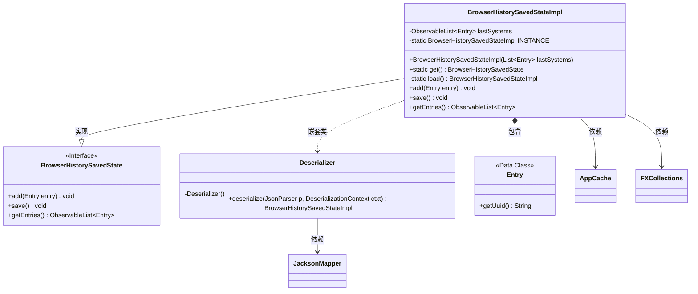
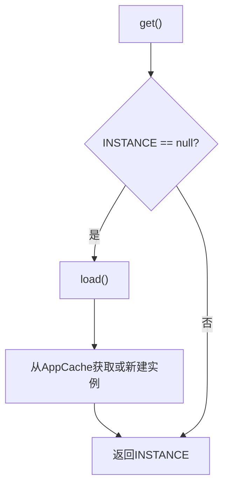
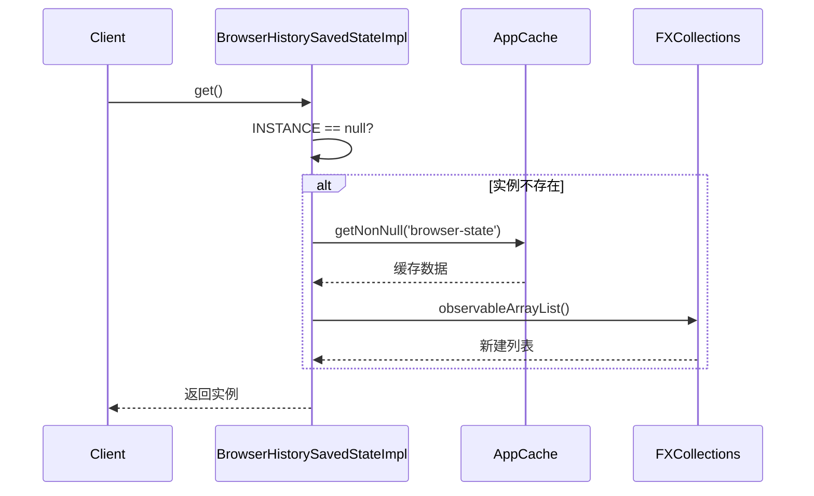
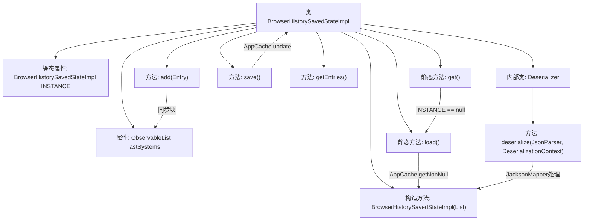

# 基础信息

|      |      |
|------|------|
| 名称 | BrowserHistorySavedStateImpl |
| 编码语言 | .java |
| 代码路径 | xpipe/app/src/main/java/io/xpipe/app/browser/file/BrowserHistorySavedStateImpl.java |
| 包名 | io.xpipe.app.browser.file |
| 依赖项 | ['io.xpipe.app.core.AppCache', 'io.xpipe.core.util.JacksonMapper', 'javafx.collections.FXCollections', 'javafx.collections.ObservableList', 'com.fasterxml.jackson.core.JsonParser', 'com.fasterxml.jackson.databind.DeserializationContext', 'com.fasterxml.jackson.databind.JavaType', 'com.fasterxml.jackson.databind.annotation.JsonDeserialize', 'com.fasterxml.jackson.databind.annotation.JsonSerialize', 'com.fasterxml.jackson.databind.deser.std.StdDeserializer', 'com.fasterxml.jackson.databind.node.ObjectNode', 'lombok.SneakyThrows', 'lombok.Value', 'java.util.List'] |
| 概述说明 | 浏览器历史状态类，单例模式，保存15条记录，支持序列化。 |

# 说明

BrowserHistorySavedStateImpl类实现了BrowserHistorySavedState接口，用于管理浏览器历史记录的保存状态。该类使用单例模式，通过get方法获取实例，首次调用时从缓存加载或创建空列表。内部维护一个同步的ObservableList存储最多15条历史记录条目，提供添加、保存和获取条目功能。添加条目时会去重并保持列表大小限制。使用Jackson库进行JSON序列化和反序列化，通过自定义Deserializer处理数据加载。

# 类列表 Class Summary

| 名称   | 类型  | 说明 |
|-------|------|-------------|
| BrowserHistorySavedStateImpl | class | 浏览器历史状态类，含同步列表、单例加载、增删条目及保存功能。 |

## 类 BrowserHistorySavedStateImpl

|      |      |
|------|------|
| 访问范围 | @Value;@JsonDeserialize(using = BrowserHistorySavedStateImpl.Deserializer.class);public |
| 类型 | class |
| 名称 | BrowserHistorySavedStateImpl |
| 说明 | 浏览器历史状态类，含同步列表、单例加载、增删条目及保存功能。 |

### UML类图

这段代码实现了一个浏览器历史记录状态管理类，采用单例模式并通过AppCache持久化存储。核心功能包括：1) 维护最多15条历史记录的有序列表；2) 提供线程安全的添加/删除操作；3) 支持JSON序列化/反序列化。类结构包含主实现类、内部反序列化器和Entry数据类，通过FXCollections实现线程安全的可观察列表，依赖Jackson进行JSON处理。流程图展示了单例获取过程，时序图描述了首次初始化时的协作关系。

### 内部方法调用关系图

该流程图展示了BrowserHistorySavedStateImpl类的核心结构和调用关系。类包含一个ObservableList类型的lastSystems属性用于存储历史记录条目，以及单例模式相关的INSTANCE静态属性和get()/load()方法。主要功能包括添加条目(add)、保存状态(save)和获取条目列表(getEntries)。内部类Deserializer负责JSON反序列化，通过JacksonMapper将JSON数据转换为对象实例。所有对lastSystems的操作都通过同步机制保证线程安全，且列表大小限制为15个条目。

### 字段列表 Field List

| 名称  | 类型  | 说明 |
|-------|-------|------|
| lastSystems | ObservableList<Entry> | 序列化ObservableList类型的lastSystems列表。 |
| INSTANCE | BrowserHistorySavedStateImpl | 私有静态浏览器历史状态实例。 |

### 方法列表 Method List

| 名称  | 类型  | 说明 |
|-------|-------|------|
| save | void | 同步保存浏览器状态到应用缓存。 |
| getEntries | ObservableList<Entry> | 重写getEntries方法，返回lastSystems列表。 |
| load | BrowserHistorySavedStateImpl | 私有方法加载浏览器历史状态，若无则创建同步列表实例。 |
| get | BrowserHistorySavedState | 静态方法获取单例实例，若为空则加载后返回。 |
| add | void | 同步方法添加历史记录，去重并限制最多15条。 |

