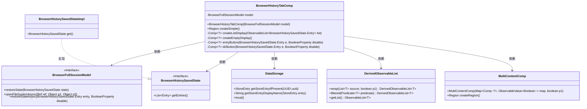
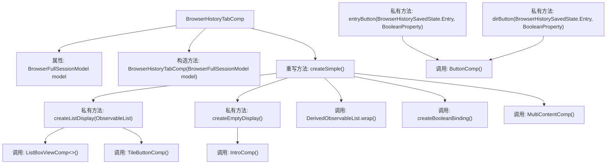

# 基础信息

|      |      |
|------|------|
| 名称 | BrowserHistoryTabComp |
| 编码语言 | .java |
| 代码路径 | xpipe/app/src/main/java/io/xpipe/app/browser/file/BrowserHistoryTabComp.java |
| 包名 | io.xpipe.app.browser.file |
| 依赖项 | ['io.xpipe.app.browser.BrowserFullSessionModel', 'io.xpipe.app.comp.Comp', 'io.xpipe.app.comp.SimpleComp', 'io.xpipe.app.comp.base', 'io.xpipe.app.core.AppI18n', 'io.xpipe.app.prefs.AppPrefs', 'io.xpipe.app.storage.DataStorage', 'io.xpipe.app.util.DerivedObservableList', 'io.xpipe.app.util.DocumentationLink', 'io.xpipe.app.util.LabelGraphic', 'io.xpipe.app.util.ThreadHelper', 'javafx.beans.binding.Bindings', 'javafx.beans.property.BooleanProperty', 'javafx.beans.property.SimpleBooleanProperty', 'javafx.beans.value.ObservableValue', 'javafx.collections.ObservableList', 'javafx.geometry.Insets', 'javafx.geometry.Pos', 'javafx.scene.layout', 'atlantafx.base.theme.Styles', 'java.util.LinkedHashMap', 'java.util.List'] |
| 概述说明 | 浏览器历史标签组件，管理会话恢复与显示。 |

# 说明

BrowserHistoryTabComp是一个用于管理浏览器历史记录的组件，继承自SimpleComp。它通过BrowserFullSessionModel处理会话数据，包含两个主要显示区域：内容列表和空状态提示。内容列表通过过滤有效条目生成，支持条目恢复和目录操作，并集成敏感信息屏蔽功能。空状态显示文档链接和新建会话按钮。组件采用响应式设计，布局包含欢迎信息、列表视图和恢复按钮，最大宽度限制为1000像素。

# 类列表 Class Summary

| 名称   | 类型  | 说明 |
|-------|------|-------------|
| BrowserHistoryTabComp | class | 浏览器历史标签组件，管理会话状态与条目显示，支持恢复和过滤功能。 |

## 类 BrowserHistoryTabComp

|      |      |
|------|------|
| 访问范围 | public |
| 类型 | class |
| 名称 | BrowserHistoryTabComp |
| 说明 | 浏览器历史标签组件，管理会话状态与条目显示，支持恢复和过滤功能。 |

### UML类图

这段代码展示了一个浏览器历史标签组件(BrowserHistoryTabComp)的实现，它继承自SimpleComp类。该组件主要负责管理浏览器历史记录的显示和交互功能，包括创建历史记录列表显示、空状态显示以及处理用户操作。核心功能包括：从BrowserHistorySavedState获取历史记录条目，通过DataStorage验证条目有效性，使用DerivedObservableList进行数据过滤和包装，并通过MultiContentComp管理不同状态的显示切换。组件还实现了条目按钮和目录按钮的创建逻辑，支持异步打开文件系统和恢复历史状态等操作。

### 内部方法调用关系图

流程图描述了BrowserHistoryTabComp类的结构和主要方法调用关系。该类继承自SimpleComp，核心功能是通过createSimple()方法创建浏览器历史记录界面，包含列表显示和空状态显示两种视图。createListDisplay()方法构建历史记录列表视图，包含欢迎头、可过滤的历史条目列表和恢复按钮；createEmptyDisplay()创建无历史记录时的引导界面。entryButton和dirButton方法分别生成条目操作按钮和目录操作按钮，涉及异步操作和UI状态绑定。整体流程展现了从数据过滤到界面构建的完整过程。

### 字段列表 Field List

| 名称  | 类型  | 说明 |
|-------|-------|------|
| model | BrowserFullSessionModel | 私有浏览器会话模型对象。 |

### 方法列表 Method List

| 名称  | 类型  | 说明 |
|-------|-------|------|
| createListDisplay | Comp<?> | 创建浏览器历史列表显示组件，包含欢迎信息、列表和恢复按钮。 |
| createEmptyDisplay | Comp<?> | 创建空显示界面，含文档和打开按钮，垂直布局居中。 |
| entryButton | Comp<?> | 创建按钮组件，显示图标和名称，点击打开文件系统，支持禁用和名称脱敏。 |
| createSimple | Region | 创建浏览器历史记录区域，过滤无效条目并显示列表或空状态。 |
| dirButton | Comp<?> | 创建目录按钮组件，绑定路径显示与隐私模式，点击异步恢复历史状态，支持禁用和样式调整。 |

