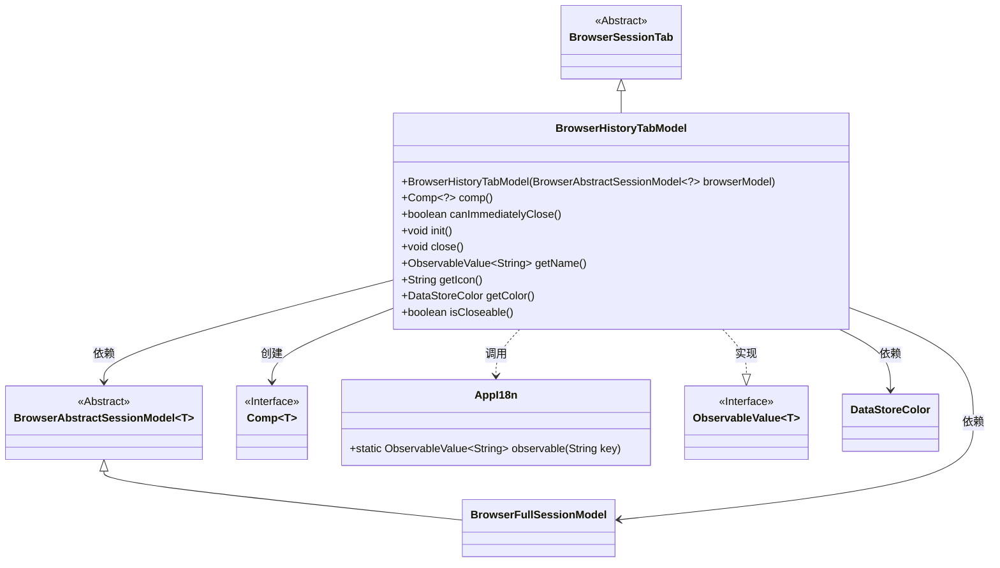

# 基础信息

|      |      |
|------|------|
| 名称 | BrowserHistoryTabModel |
| 编码语言 | .java |
| 代码路径 | xpipe/app/src/main/java/io/xpipe/app/browser/file/BrowserHistoryTabModel.java |
| 包名 | io.xpipe.app.browser.file |
| 依赖项 | ['io.xpipe.app.browser.BrowserAbstractSessionModel', 'io.xpipe.app.browser.BrowserFullSessionModel', 'io.xpipe.app.browser.BrowserSessionTab', 'io.xpipe.app.comp.Comp', 'io.xpipe.app.core.AppI18n', 'io.xpipe.app.storage.DataStoreColor', 'javafx.beans.value.ObservableValue'] |
| 概述说明 | 浏览器历史标签模型，继承会话标签，可立即关闭，不可关闭，名称显示历史。 |

# 说明

BrowserHistoryTabModel是一个继承自BrowserSessionTab的公开最终类，用于表示浏览器历史标签页。它通过构造函数接收BrowserAbstractSessionModel参数并传递给父类。该类重写了多个方法：comp()返回BrowserHistoryTabComp组件；canImmediatelyClose()始终返回true；init()和close()为空实现；getName()返回带空格的历史名称可观察值；getIcon()和getColor()返回null；isCloseable()始终返回false。该类主要处理浏览器历史标签页的展示和基础行为控制。

# 类列表 Class Summary

| 名称   | 类型  | 说明 |
|-------|------|-------------|
| BrowserHistoryTabModel | class | BrowserHistoryTabModel继承BrowserSessionTab，实现历史标签页功能，不可关闭，无图标颜色。 |

## 类 BrowserHistoryTabModel

|      |      |
|------|------|
| 访问范围 | public final |
| 类型 | class |
| 名称 | BrowserHistoryTabModel |
| 说明 | BrowserHistoryTabModel继承BrowserSessionTab，实现历史标签页功能，不可关闭，无图标颜色。 |

### UML类图

类图描述：BrowserHistoryTabModel继承自抽象类BrowserSessionTab，并依赖于BrowserAbstractSessionModel泛型类和其子类BrowserFullSessionModel。该类实现了多个方法，包括创建Comp接口实例、获取名称、图标和颜色等。通过AppI18n类获取国际化名称，返回ObservableValue接口类型。整体设计体现了浏览器历史标签页的核心功能，包括可关闭性判断和UI组件创建等特性。

### 内部方法调用关系图

这段代码展示了一个浏览器历史标签页模型类BrowserHistoryTabModel，继承自BrowserSessionTab。主要功能包括：通过comp()方法创建历史标签页组件，提供标签名称的国际化支持（getName()），以及定义标签页的关闭行为（canImmediatelyClose()和isCloseable()）。其中getName()方法通过AppI18n获取国际化字符串并添加前后空格，而其他方法如getIcon()和getColor()返回空值表示未实现。类结构清晰体现了浏览器标签页的基础功能扩展点。

### 字段列表 Field List

| 名称  | 类型  | 说明 |
|-------|-------|------|

### 方法列表 Method List

| 名称  | 类型  | 说明 |
|-------|-------|------|
| comp | Comp<?> | 重写comp方法，返回浏览器历史标签组件实例。 |
| getName | ObservableValue<String> | 重写getName方法，返回AppI18n的可观察字符串"history"并添加空格。 |
| close | void | 重写close方法，无具体实现。 |
| init | void | 重写父类init方法，无具体实现。 |
| canImmediatelyClose | boolean | 方法canImmediatelyClose直接返回true，表示可立即关闭。 |
| getIcon | String | 重写getIcon方法，返回null。 |
| getColor | DataStoreColor | 重写getColor方法，返回null。 |
| isCloseable | boolean | Java方法重写，返回不可关闭状态。 |

