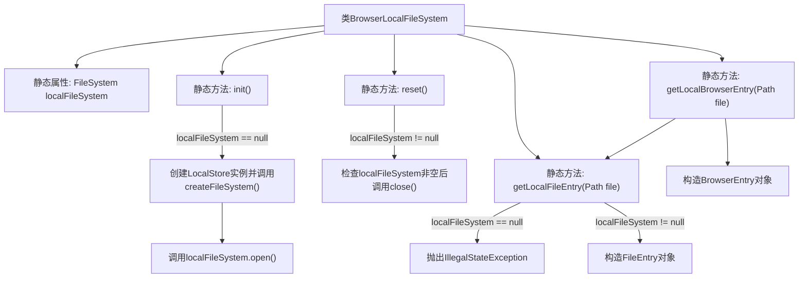

# 基础信息

|      |      |
|------|------|
| 名称 | BrowserLocalFileSystem |
| 编码语言 | .java |
| 代码路径 | xpipe/app/src/main/java/io/xpipe/app/browser/file/BrowserLocalFileSystem.java |
| 包名 | io.xpipe.app.browser.file |
| 依赖项 | ['io.xpipe.app.ext.LocalStore', 'io.xpipe.core.store.FileEntry', 'io.xpipe.core.store.FileKind', 'io.xpipe.core.store.FilePath', 'io.xpipe.core.store.FileSystem', 'java.nio.file.Files', 'java.nio.file.Path'] |
| 概述说明 | BrowserLocalFileSystem类管理本地文件系统，提供初始化、重置及获取文件条目功能。 |

# 说明

BrowserLocalFileSystem类提供了本地文件系统的初始化、重置及文件条目获取功能。通过静态方法init初始化文件系统，reset关闭并清空当前实例。getLocalFileEntry方法根据路径创建包含文件属性（打开状态、路径、修改时间、大小、类型）的FileEntry对象。getLocalBrowserEntry进一步封装为BrowserEntry。所有操作需在初始化后执行，否则抛出异常。

# 类列表 Class Summary

| 名称   | 类型  | 说明 |
|-------|------|-------------|
| BrowserLocalFileSystem | class | BrowserLocalFileSystem类管理本地文件系统，提供初始化、重置及获取文件条目功能。 |


## 类 BrowserLocalFileSystem

|      |      |
|------|------|
| 访问范围 | public |
| 类型 | class |
| 名称 | BrowserLocalFileSystem |
| 说明 | BrowserLocalFileSystem类管理本地文件系统，提供初始化、重置及获取文件条目功能。 |


### UML类图

```mermaid
classDiagram
    class BrowserLocalFileSystem {
        -FileSystem localFileSystem
        +init() void
        +reset() void
        +getLocalFileEntry(Path file) FileEntry
        +getLocalBrowserEntry(Path file) BrowserEntry
    }

    class FileSystem {
        <<Interface>>
        +open() void
        +close() void
        +createFileSystem() FileSystem
    }

    class LocalStore {
        +createFileSystem() FileSystem
    }

    class FileEntry {
        +FilePath path
        +Instant lastModified
        +String size
        +Object content
        +FileKind kind
        +FileEntry(FileSystem fs, FilePath path, Instant lastModified, String size, Object content, FileKind kind)
    }

    class BrowserEntry {
        +FileEntry fileEntry
        +Object metadata
        +BrowserEntry(FileEntry fileEntry, Object metadata)
    }

    class FilePath {
        +of(Path path) FilePath
    }

    class Files {
        <<Utility>>
        +getLastModifiedTime(Path path) FileTime
        +size(Path path) long
        +isDirectory(Path path) boolean
    }

    enum FileKind {
        DIRECTORY
        FILE
    }

    BrowserLocalFileSystem --> FileSystem : 使用
    BrowserLocalFileSystem --> LocalStore : 创建
    BrowserLocalFileSystem --> FileEntry : 生成
    BrowserLocalFileSystem --> BrowserEntry : 生成
    BrowserLocalFileSystem --> Files : 依赖
    LocalStore ..|> FileSystem : 实现
    FileEntry --> FileSystem : 依赖
    FileEntry --> FilePath : 包含
    FileEntry --> FileKind : 使用
    BrowserEntry --> FileEntry : 包含
    FilePath --> Path : 转换
```

这段代码描述了一个浏览器本地文件系统管理类BrowserLocalFileSystem，它通过LocalStore创建并管理FileSystem实例，提供文件系统初始化、重置以及获取文件条目和浏览器条目的功能。FileSystem是一个接口，由LocalStore实现具体功能。FileEntry和BrowserEntry分别封装了文件信息和浏览器条目信息，FilePath用于路径处理，Files提供静态文件操作方法，FileKind枚举表示文件类型。整个设计体现了对本地文件系统的封装和浏览器集成的能力。


### 内部方法调用关系图



这段代码流程图展示了BrowserLocalFileSystem类的核心结构和调用关系。该类通过静态方法管理本地文件系统操作，包含初始化(init)、重置(reset)和文件条目获取功能。关键流程包括：首次初始化时创建LocalStore文件系统并打开连接，重置时关闭现有连接，获取文件条目时验证系统状态并构造包含文件元数据的FileEntry对象。所有方法都围绕静态属性localFileSystem的状态进行条件判断和操作，形成完整的文件系统生命周期管理。

### 字段列表 Field List

| 名称  | 类型  | 说明 |
|-------|-------|------|
| localFileSystem | FileSystem | 私有静态文件系统变量localFileSystem |

### 方法列表 Method List

| 名称  | 类型  | 说明 |
|-------|-------|------|
| reset | void | 静态方法reset关闭并清空本地文件系统对象。 |
| init | void | 初始化本地文件系统，若未创建则新建并打开。 |
| getLocalFileEntry | FileEntry | 获取本地文件条目：检查文件系统状态，返回文件路径、修改时间、大小及类型（目录或文件）。 |
| getLocalBrowserEntry | BrowserEntry | 静态方法getLocalBrowserEntry接收Path参数，返回BrowserEntry对象，可能抛出异常。 |


