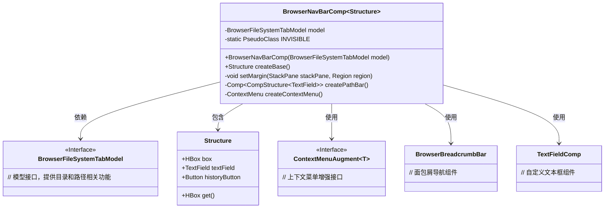
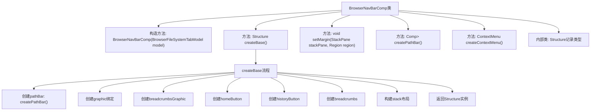
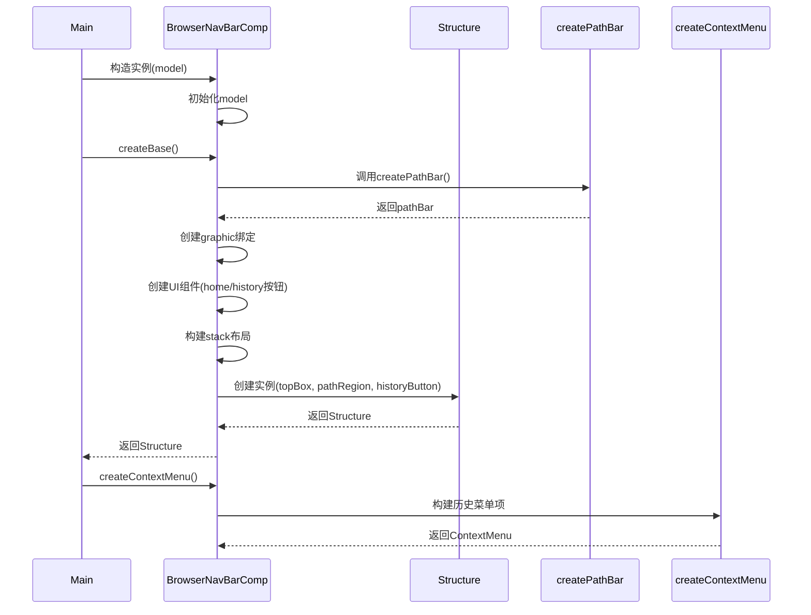

# 基础信息

|      |      |
|------|------|
| 名称 | BrowserNavBarComp |
| 编码语言 | .java |
| 代码路径 | xpipe/app/src/main/java/io/xpipe/app/browser/file/BrowserNavBarComp.java |
| 包名 | io.xpipe.app.browser.file |
| 依赖项 | ['io.xpipe.app.browser.icon.BrowserIconManager', 'io.xpipe.app.comp.Comp', 'io.xpipe.app.comp.CompStructure', 'io.xpipe.app.comp.SimpleCompStructure', 'io.xpipe.app.comp.augment.ContextMenuAugment', 'io.xpipe.app.comp.base.PrettyImageHelper', 'io.xpipe.app.comp.base.TextFieldComp', 'io.xpipe.app.comp.base.TooltipHelper', 'io.xpipe.app.core.AppI18n', 'io.xpipe.app.util.BooleanScope', 'io.xpipe.app.util.ContextMenuHelper', 'io.xpipe.app.util.PlatformThread', 'io.xpipe.app.util.ThreadHelper', 'javafx.application.Platform', 'javafx.beans.binding.Bindings', 'javafx.beans.property.SimpleStringProperty', 'javafx.css.PseudoClass', 'javafx.geometry.Insets', 'javafx.geometry.Pos', 'javafx.scene.Node', 'javafx.scene.control', 'javafx.scene.input.KeyCode', 'javafx.scene.input.KeyCodeCombination', 'javafx.scene.input.KeyCombination', 'javafx.scene.input.MouseButton', 'javafx.scene.layout.HBox', 'javafx.scene.layout.Priority', 'javafx.scene.layout.Region', 'javafx.scene.layout.StackPane', 'javafx.scene.shape.Rectangle', 'atlantafx.base.theme.Styles', 'org.kordamp.ikonli.javafx.FontIcon'] |
| 概述说明 | 浏览器导航栏组件，包含路径栏、历史按钮和目录选项。 |

# 说明

BrowserNavBarComp是一个用于浏览器导航栏的组件，继承自Comp类。它包含路径栏、图形图标、主页按钮和历史按钮。主页按钮显示当前目录图标，点击可打开上下文菜单。历史按钮提供前进和后退功能，并显示历史记录菜单。路径栏支持路径输入和自动补全，根据焦点状态切换显示模式。组件通过绑定和监听器动态调整布局，确保内容不溢出。结构上使用HBox和StackPane进行布局，并处理各种交互逻辑和样式。

# 类列表 Class Summary

| 名称   | 类型  | 说明 |
|-------|------|-------------|
| BrowserNavBarComp | class | 浏览器导航栏组件，包含路径栏、历史按钮和目录选项。 |

## 类 BrowserNavBarComp

|      |      |
|------|------|
| 访问范围 | public |
| 类型 | class |
| 名称 | BrowserNavBarComp |
| 说明 | 浏览器导航栏组件，包含路径栏、历史按钮和目录选项。 |

### UML类图

这段代码实现了一个浏览器导航栏组件，主要包含路径显示、历史记录和目录操作功能。BrowserNavBarComp类继承自泛型Comp类，通过BrowserFileSystemTabModel获取当前目录信息，使用BrowserBreadcrumbBar显示面包屑导航，TextFieldComp实现路径编辑，ContextMenuAugment为按钮添加上下文菜单。Structure内部类定义了UI结构，包含主容器、文本框和历史按钮。组件通过绑定和监听实现动态UI更新，并处理各种用户交互场景。

### 内部方法调用关系图

流程图展示了BrowserNavBarComp类的核心结构和createBase方法的执行流程。该类主要负责浏览器导航栏的UI构建，包含路径栏创建、按钮初始化、布局管理等关键步骤。时序图则详细描述了从类实例化到UI组件创建和菜单生成的完整调用序列，突出了与路径栏创建和上下文菜单构建的交互过程。整个设计采用响应式编程模式，通过数据绑定和事件监听实现动态UI更新。

### 字段列表 Field List

| 名称  | 类型  | 说明 |
|-------|-------|------|
| model | BrowserFileSystemTabModel | 私有浏览器文件系统标签模型 |
| INVISIBLE = PseudoClass.getPseudoClass("invisible") | PseudoClass | 定义私有静态不可见伪类常量。 |

### 方法列表 Method List

| 名称  | 类型  | 说明 |
|-------|-------|------|
| setMargin | void | 调整区域边距，宽度差大于零时设置特定边距。 |
| createPathBar | Comp<CompStructure<TextField>> | 创建路径栏组件，绑定路径属性，监听变更并更新模型，支持焦点和样式控制。 |
| createBase | Structure | 创建路径栏和按钮，绑定图标和事件，管理布局和交互。 |
| createContextMenu | ContextMenu | 创建上下文菜单，包含前进后退历史项，限制高度600。 |

