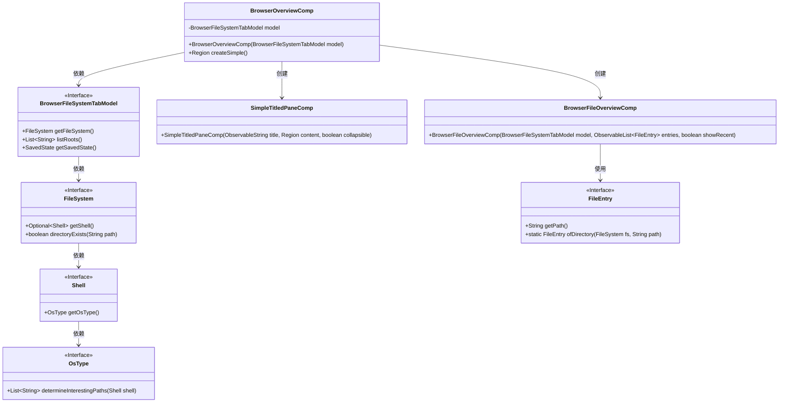
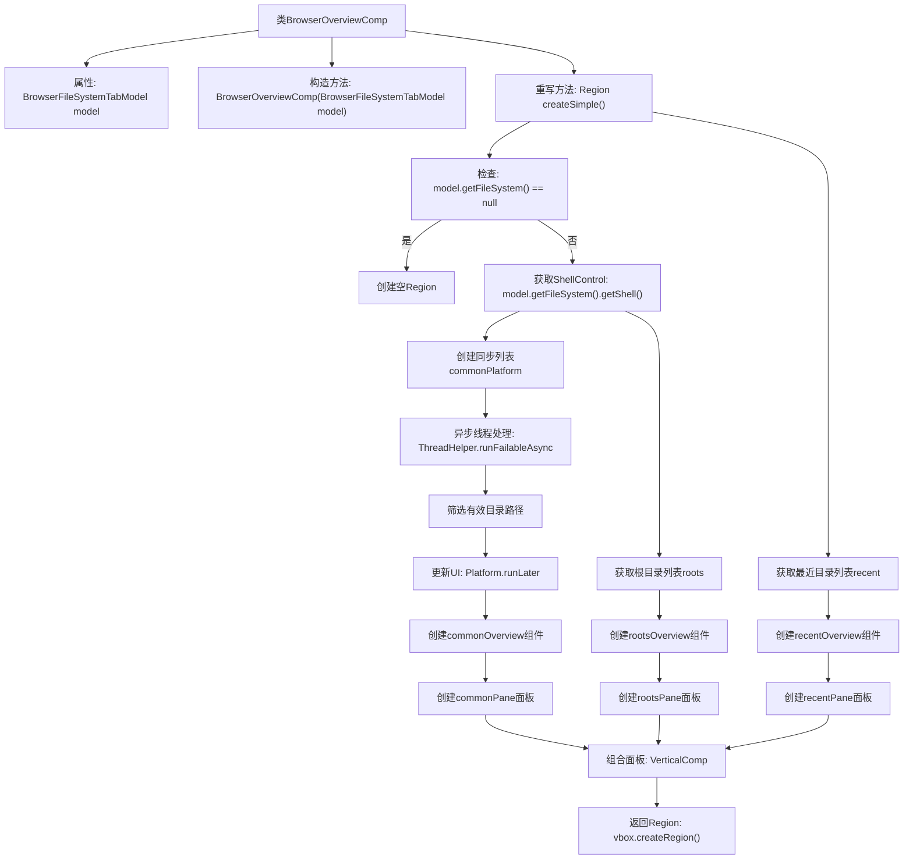

# 基础信息

|      |      |
|------|------|
| 名称 | BrowserOverviewComp |
| 编码语言 | .java |
| 代码路径 | xpipe/app/src/main/java/io/xpipe/app/browser/file/BrowserOverviewComp.java |
| 包名 | io.xpipe.app.browser.file |
| 依赖项 | ['io.xpipe.app.comp.SimpleComp', 'io.xpipe.app.comp.base.SimpleTitledPaneComp', 'io.xpipe.app.comp.base.VerticalComp', 'io.xpipe.app.core.AppI18n', 'io.xpipe.app.issue.ErrorEvent', 'io.xpipe.app.util.DerivedObservableList', 'io.xpipe.app.util.ThreadHelper', 'io.xpipe.core.process.ShellControl', 'io.xpipe.core.store.FileEntry', 'javafx.application.Platform', 'javafx.collections.FXCollections', 'javafx.scene.layout.Priority', 'javafx.scene.layout.Region', 'javafx.scene.layout.VBox', 'lombok.SneakyThrows', 'java.util.List'] |
| 概述说明 | BrowserOverviewComp类继承SimpleComp，管理文件系统视图，包含常用路径、根目录和最近访问目录的显示面板。 |

# 说明

BrowserOverviewComp是一个继承SimpleComp的类，用于展示文件系统概览界面。它接收BrowserFileSystemTabModel作为参数，包含三个主要区域：常用路径、根目录和最近访问目录。常用路径通过异步线程获取并过滤有效目录，根目录直接列出文件系统根路径，最近访问目录从模型状态中获取。这三个区域分别封装为SimpleTitledPaneComp组件，最终组合在垂直布局中返回。组件会检查文件系统是否有效，无效时返回空区域。

# 类列表 Class Summary

| 名称   | 类型  | 说明 |
|-------|------|-------------|
| BrowserOverviewComp | class | 浏览器概览组件，展示常用路径、根目录和最近访问目录。 |

## 类 BrowserOverviewComp

|      |      |
|------|------|
| 访问范围 | public |
| 类型 | class |
| 名称 | BrowserOverviewComp |
| 说明 | 浏览器概览组件，展示常用路径、根目录和最近访问目录。 |

### UML类图

这段代码展示了一个浏览器概览组件(BrowserOverviewComp)的类结构，该组件继承自SimpleComp，主要用于显示文件系统的三个视图：常用路径、根目录和最近访问目录。它通过BrowserFileSystemTabModel获取文件系统信息，使用BrowserFileOverviewComp展示文件条目，并通过SimpleTitledPaneComp组织成可折叠的面板。整个结构体现了清晰的依赖关系，从高层组件到底层文件系统模型的层次结构。

### 内部方法调用关系图

该流程图展示了BrowserOverviewComp类的核心逻辑，主要描述createSimple()方法的执行流程。方法首先检查文件系统是否可用，然后异步获取常用路径并更新UI，同时同步处理根目录和最近访问目录。最后将所有面板组合成垂直布局返回。流程包含异常处理、异步线程操作和UI更新等关键步骤，完整呈现了组件初始化的全过程。

### 字段列表 Field List

| 名称  | 类型  | 说明 |
|-------|-------|------|
| model | BrowserFileSystemTabModel | 私有浏览器文件系统标签模型实例。 |

### 方法列表 Method List

| 名称  | 类型  | 说明 |
|-------|-------|------|
| createSimple | Region | 创建文件系统浏览界面，包含常用路径、根目录和最近访问目录的列表展示。 |

