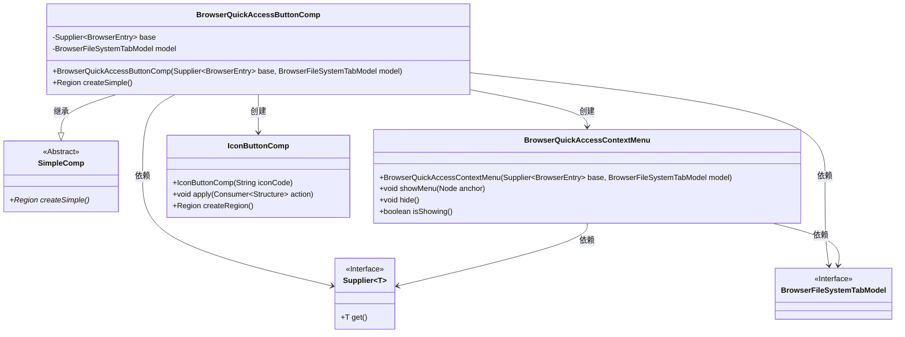
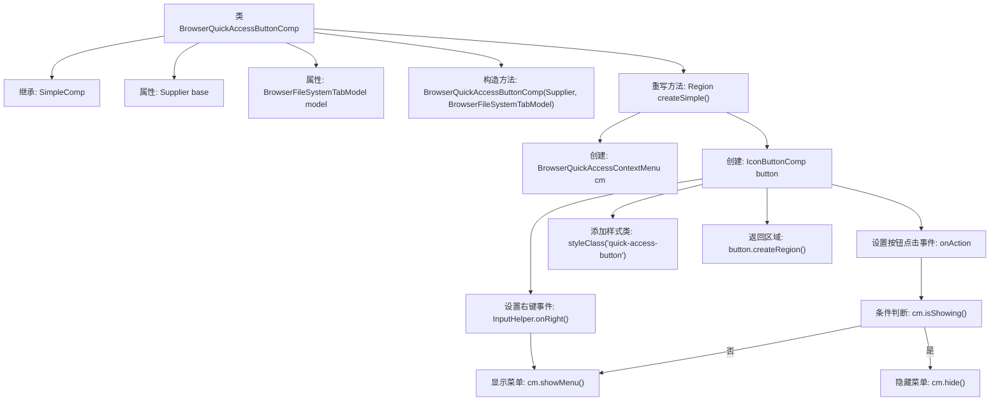

# 基础信息

|      |      |
|------|------|
| 名称 | BrowserQuickAccessButtonComp |
| 编码语言 | .java |
| 代码路径 | xpipe/app/src/main/java/io/xpipe/app/browser/file/BrowserQuickAccessButtonComp.java |
| 包名 | io.xpipe.app.browser.file |
| 依赖项 | ['io.xpipe.app.comp.SimpleComp', 'io.xpipe.app.comp.base.IconButtonComp', 'io.xpipe.app.util.InputHelper', 'javafx.scene.layout.Region', 'java.util.function.Supplier'] |
| 概述说明 | BrowserQuickAccessButtonComp类继承SimpleComp，通过按钮触发上下文菜单，支持左右键操作。 |

# 说明

该代码描述了一个名为BrowserQuickAccessButtonComp的类，继承自SimpleComp。它接收一个BrowserEntry的Supplier和一个BrowserFileSystemTabModel作为构造参数。类中重写了createSimple方法，创建了一个带图标的按钮组件，按钮样式为"mdi2c-chevron-double-right"。按钮点击时切换显示或隐藏BrowserQuickAccessContextMenu菜单，右键操作也会显示该菜单。按钮添加了quick-access-button样式类，最终返回按钮的Region对象。

# 类列表 Class Summary

| 名称   | 类型  | 说明 |
|-------|------|-------------|
| BrowserQuickAccessButtonComp | class | BrowserQuickAccessButtonComp类，继承SimpleComp，含基础入口和模型，创建带菜单的按钮组件。 |

## 类 BrowserQuickAccessButtonComp

|      |      |
|------|------|
| 访问范围 | public |
| 类型 | class |
| 名称 | BrowserQuickAccessButtonComp |
| 说明 | BrowserQuickAccessButtonComp类，继承SimpleComp，含基础入口和模型，创建带菜单的按钮组件。 |

### UML类图

这段代码展示了一个浏览器快速访问按钮组件(BrowserQuickAccessButtonComp)的实现，它继承自SimpleComp抽象类。该组件通过IconButtonComp创建带图标的按钮，并集成了BrowserQuickAccessContextMenu上下文菜单功能。当用户点击按钮时，会切换菜单的显示/隐藏状态；右键点击则直接显示菜单。组件依赖BrowserFileSystemTabModel接口和BrowserEntry供应商来获取基础数据，体现了GUI组件与业务逻辑分离的设计思想。

### 内部方法调用关系图

这段代码流程图描述了BrowserQuickAccessButtonComp类的结构和主要行为。该类继承自SimpleComp，包含两个属性和一个构造方法。核心逻辑在重写的createSimple()方法中，该方法创建了一个带上下文菜单的图标按钮，并设置了左键点击（切换菜单显示/隐藏）和右键点击（强制显示菜单）的事件处理逻辑，最后返回按钮的UI区域。整个流程展示了从组件初始化到事件绑定的完整过程。

### 字段列表 Field List

| 名称  | 类型  | 说明 |
|-------|-------|------|
| base | Supplier<BrowserEntry> | 私有成员，基础浏览器入口的Supplier接口。 |
| model | BrowserFileSystemTabModel | 私有浏览器文件系统标签模型。 |

### 方法列表 Method List

| 名称  | 类型  | 说明 |
|-------|-------|------|
| createSimple | Region | 创建带右键菜单的图标按钮，点击切换菜单显示，右键直接显示菜单。 |

