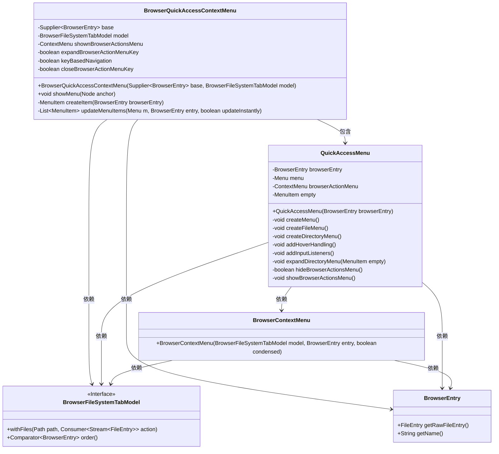
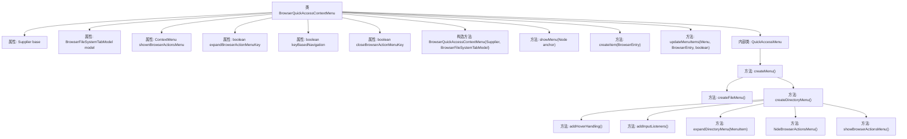
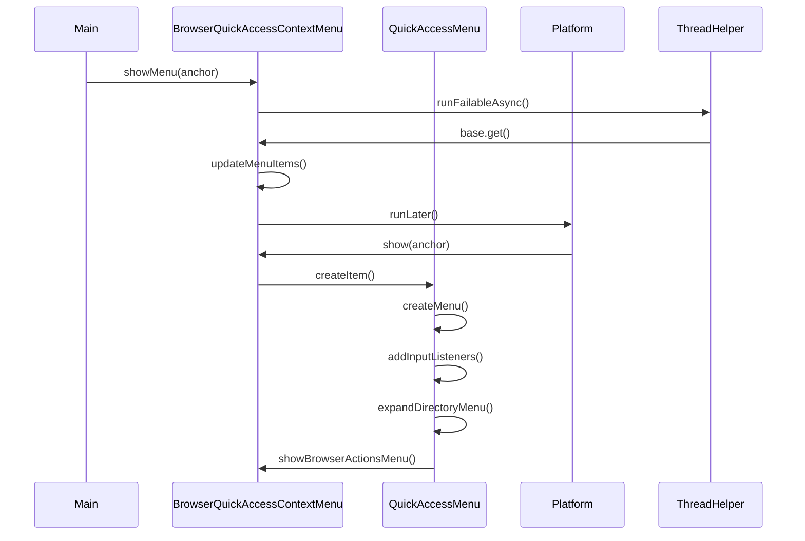

# 基础信息

|      |      |
|------|------|
| 名称 | BrowserQuickAccessContextMenu |
| 编码语言 | .java |
| 代码路径 | xpipe/app/src/main/java/io/xpipe/app/browser/file/BrowserQuickAccessContextMenu.java |
| 包名 | io.xpipe.app.browser.file |
| 依赖项 | ['io.xpipe.app.browser.icon.BrowserIconManager', 'io.xpipe.app.comp.base.PrettyImageHelper', 'io.xpipe.app.core.AppFontSizes', 'io.xpipe.app.util.BooleanAnimationTimer', 'io.xpipe.app.util.InputHelper', 'io.xpipe.app.util.ThreadHelper', 'io.xpipe.core.store.FileEntry', 'io.xpipe.core.store.FileKind', 'javafx.application.Platform', 'javafx.beans.property.SimpleBooleanProperty', 'javafx.geometry.Side', 'javafx.scene.Node', 'javafx.scene.control.ContextMenu', 'javafx.scene.control.Menu', 'javafx.scene.control.MenuItem', 'javafx.scene.input.KeyCode', 'javafx.scene.input.KeyEvent', 'javafx.scene.input.MouseEvent', 'javafx.scene.layout.Region', 'lombok.Getter', 'java.util.ArrayList', 'java.util.LinkedHashMap', 'java.util.List', 'java.util.function.Supplier', 'java.util.stream.Collectors'] |
| 概述说明 | 浏览器快捷访问上下文菜单类，支持文件和目录操作，包含键盘导航和动态菜单项加载。 |

# 说明

BrowserQuickAccessContextMenu是一个上下文菜单类，用于在浏览器文件系统中快速访问文件和目录。它继承自ContextMenu，包含基础条目获取器、文件系统标签模型等关键属性。该类实现了菜单的显示逻辑，支持动态更新菜单项，处理键盘和鼠标事件，并包含嵌套的QuickAccessMenu内部类用于创建具体菜单项。菜单项根据文件类型（文件或目录）有不同的行为，目录菜单支持悬停展开和键盘导航。此外，还包含浏览器操作菜单的显示与隐藏逻辑，确保用户交互流畅。整体设计注重响应性和用户体验，适用于复杂的文件系统导航场景。

# 类列表 Class Summary

| 名称   | 类型  | 说明 |
|-------|------|-------------|
| BrowserQuickAccessContextMenu | class | 浏览器快速访问上下文菜单类，用于显示文件目录操作项，支持键盘导航和子菜单展开。 |

## 类 BrowserQuickAccessContextMenu

|      |      |
|------|------|
| 访问范围 | public |
| 类型 | class |
| 名称 | BrowserQuickAccessContextMenu |
| 说明 | 浏览器快速访问上下文菜单类，用于显示文件目录操作项，支持键盘导航和子菜单展开。 |

### UML类图

这段代码实现了一个浏览器快速访问上下文菜单系统，主要包含BrowserQuickAccessContextMenu和其内部类QuickAccessMenu两个核心类。BrowserQuickAccessContextMenu继承自ContextMenu，负责管理基础菜单结构和显示逻辑；QuickAccessMenu则处理具体菜单项的创建和交互行为。系统通过BrowserFileSystemTabModel接口获取文件数据，支持目录展开、键盘导航、悬停展开等复杂交互功能，并能与BrowserContextMenu联动显示二级菜单。整个设计采用异步加载和事件驱动机制，确保在大目录下的流畅操作体验。

### 内部方法调用关系图

流程图描述：该流程图展示了BrowserQuickAccessContextMenu类的结构和内部调用关系，包含7个主要属性和10个核心方法。构造方法初始化基础属性和事件监听器，showMenu()是主要入口，通过异步线程获取BrowserEntry并更新菜单项。内部类QuickAccessMenu负责具体菜单项的创建和交互逻辑，包含文件/目录菜单的创建、悬停处理、输入监听和菜单展开/隐藏等功能，形成完整的上下文菜单交互体系。

### 字段列表 Field List

| 名称  | 类型  | 说明 |
|-------|-------|------|
| shownBrowserActionsMenu | ContextMenu | 浏览器操作菜单的私有上下文菜单变量 |
| base | Supplier<BrowserEntry> | 私有成员base，类型为Supplier<BrowserEntry>。 |
| closeBrowserActionMenuKey | boolean | 私有布尔变量，控制浏览器操作菜单关闭。 |
| expandBrowserActionMenuKey | boolean | 私有布尔变量expandBrowserActionMenuKey |
| keyBasedNavigation | boolean | 私有布尔变量，控制基于键的导航。 |
| model | BrowserFileSystemTabModel | 私有浏览器文件系统标签模型实例。 |

### 方法列表 Method List

| 名称  | 类型  | 说明 |
|-------|-------|------|
| updateMenuItems | List<MenuItem> | 更新菜单项方法：处理文件列表，生成菜单项，支持即时更新。 |
| showMenu | void | 异步加载目录菜单项并在界面显示。 |
| createItem | MenuItem | 创建菜单项方法：根据浏览器条目生成快速访问菜单项。 |

