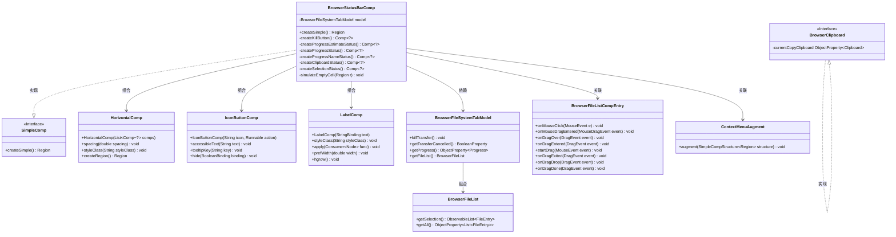
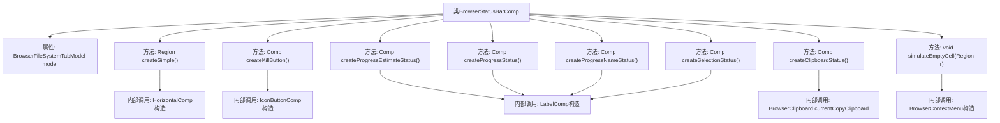

# 基础信息

|      |      |
|------|------|
| 名称 | BrowserStatusBarComp |
| 编码语言 | .java |
| 代码路径 | xpipe/app/src/main/java/io/xpipe/app/browser/file/BrowserStatusBarComp.java |
| 包名 | io.xpipe.app.browser.file |
| 依赖项 | ['io.xpipe.app.comp.Comp', 'io.xpipe.app.comp.SimpleComp', 'io.xpipe.app.comp.SimpleCompStructure', 'io.xpipe.app.comp.augment.ContextMenuAugment', 'io.xpipe.app.comp.base.HorizontalComp', 'io.xpipe.app.comp.base.IconButtonComp', 'io.xpipe.app.comp.base.LabelComp', 'io.xpipe.app.core.AppFontSizes', 'io.xpipe.app.util.BindingsHelper', 'io.xpipe.app.util.HumanReadableFormat', 'io.xpipe.app.util.PlatformThread', 'io.xpipe.app.util.ThreadHelper', 'javafx.beans.binding.Bindings', 'javafx.geometry.Pos', 'javafx.scene.input.MouseButton', 'javafx.scene.layout.Region', 'lombok.EqualsAndHashCode', 'lombok.Value', 'java.time.Duration', 'java.time.temporal.ChronoUnit', 'java.util.List'] |
| 概述说明 | 浏览器状态栏组件，包含进度、选择、剪贴板状态及终止按钮功能。 |

# 说明

BrowserStatusBarComp是一个继承自SimpleComp的类，用于创建浏览器状态栏组件。它包含多个子组件：进度名称状态、进度状态、预计剩余时间状态、剪贴板状态、选择状态和终止按钮。状态栏采用水平布局，间距为15像素，样式类为status-bar。组件支持拖拽操作，并模拟空单元格行为以扩展文件列表功能。终止按钮根据传输状态和取消标志动态显示。进度相关组件显示传输名称、字节数和预计时间。剪贴板状态显示当前复制的文件数量，选择状态显示已选文件数。组件还集成了右键上下文菜单功能。

# 类列表 Class Summary

| 名称   | 类型  | 说明 |
|-------|------|-------------|
| BrowserStatusBarComp | class | 浏览器状态栏组件，包含进度、选择、剪贴板状态及终止按钮功能。 |

## 类 BrowserStatusBarComp

|      |      |
|------|------|
| 访问范围 | @Value;@EqualsAndHashCode(callSuper = true);public |
| 类型 | class |
| 名称 | BrowserStatusBarComp |
| 说明 | 浏览器状态栏组件，包含进度、选择、剪贴板状态及终止按钮功能。 |

### UML类图

这段代码展示了一个浏览器状态栏组件(BrowserStatusBarComp)的实现，它继承自SimpleComp接口。该组件包含多个子组件如水平布局(HorizontalComp)、图标按钮(IconButtonComp)和标签(LabelComp)，用于显示传输进度、剪贴板状态和文件选择信息。核心功能包括：1) 通过BrowserFileSystemTabModel获取传输状态；2) 创建包含7个子组件的状态栏；3) 实现拖拽和右键菜单功能。类图中清晰地展示了组件间的组合/依赖关系，以及关键的数据绑定和事件处理逻辑。

### 内部方法调用关系图

该流程图展示了BrowserStatusBarComp类的完整结构，包含1个核心属性和8个主要方法。createSimple()作为主入口，通过HorizontalComp整合6个子组件创建方法，每个子组件方法涉及不同的UI控件构造和数据处理逻辑。特别值得注意的是createKillButton()的异步线程操作和simulateEmptyCell()的复杂事件处理链，展现了状态栏与文件列表的深度交互。所有LabelComp相关方法都通过BindingsHelper实现动态数据绑定，体现响应式设计思想。

### 字段列表 Field List

| 名称  | 类型  | 说明 |
|-------|-------|------|
| model | BrowserFileSystemTabModel | 浏览器文件系统标签模型 |

### 方法列表 Method List

| 名称  | 类型  | 说明 |
|-------|-------|------|
| createProgressEstimateStatus | Comp<?> | 创建进度预估状态组件，根据进度显示剩余时间，条件满足时格式化显示。 |
| createSimple | Region | 创建水平状态栏，包含进度、剪贴板、选择状态和按钮，设置间距和样式，支持拖拽。 |
| createSelectionStatus | Comp<?> | 创建选择状态组件，显示选中与总数。 |
| simulateEmptyCell | void | 空单元格模拟：设置区域鼠标和拖拽事件处理，关联上下文菜单。 |
| createClipboardStatus | Comp<?> | 创建剪贴板状态标签，显示文件数量。 |
| createKillButton | Comp<?> | 创建终止按钮，点击异步终止传输，根据进度和取消状态隐藏按钮。 |
| createProgressStatus | Comp<?> | 创建进度状态组件，显示传输字节数，支持未知总大小，格式化为可读字符串，宽度150像素。 |
| createProgressNameStatus | Comp<?> | 创建进度标签组件，绑定模型进度名称，左对齐样式。 |

