# 基础信息

|      |      |
|------|------|
| 名称 | BrowserTerminalDockTabModel |
| 编码语言 | .java |
| 代码路径 | xpipe/app/src/main/java/io/xpipe/app/browser/file/BrowserTerminalDockTabModel.java |
| 包名 | io.xpipe.app.browser.file |
| 依赖项 | ['io.xpipe.app.browser.BrowserAbstractSessionModel', 'io.xpipe.app.browser.BrowserFullSessionModel', 'io.xpipe.app.browser.BrowserSessionTab', 'io.xpipe.app.comp.Comp', 'io.xpipe.app.comp.base.ModalOverlay', 'io.xpipe.app.core.AppI18n', 'io.xpipe.app.core.AppLayoutModel', 'io.xpipe.app.core.window.AppDialog', 'io.xpipe.app.prefs.AppPrefs', 'io.xpipe.app.storage.DataStoreColor', 'io.xpipe.app.terminal.TerminalDockComp', 'io.xpipe.app.terminal.TerminalDockModel', 'io.xpipe.app.terminal.TerminalView', 'io.xpipe.app.terminal.WindowsTerminalType', 'io.xpipe.app.util.ThreadHelper', 'javafx.application.Platform', 'javafx.beans.binding.Bindings', 'javafx.beans.property.BooleanProperty', 'javafx.beans.property.SimpleBooleanProperty', 'javafx.beans.value.ObservableBooleanValue', 'javafx.beans.value.ObservableValue', 'javafx.collections.ListChangeListener', 'javafx.collections.ObservableList', 'java.util.Optional', 'java.util.UUID'] |
| 概述说明 | 浏览器终端标签模型，管理终端会话和视图，支持打开关闭跟踪及状态刷新。 |

# 说明

BrowserTerminalDockTabModel 是 BrowserSessionTab 的子类，用于管理浏览器终端标签页。它包含原始标签页引用、终端请求列表和终端停靠模型。通过监听终端会话事件（如打开、关闭）来更新界面状态，并处理多窗口同步问题。支持立即关闭功能，动态跟踪活动终端，并在无活动会话时自动关闭标签页。通过绑定视图状态和模态叠加层事件控制终端显示。关闭时清理监听器和资源。名称固定为“terminal”，无图标和颜色配置。

# 类列表 Class Summary

| 名称   | 类型  | 说明 |
|-------|------|-------------|
| BrowserTerminalDockTabModel | class | 浏览器终端标签模型，管理终端会话请求和视图状态，支持关闭和跟踪终端。 |


## 类 BrowserTerminalDockTabModel

|      |      |
|------|------|
| 访问范围 | public final |
| 类型 | class |
| 名称 | BrowserTerminalDockTabModel |
| 说明 | 浏览器终端标签模型，管理终端会话请求和视图状态，支持关闭和跟踪终端。 |


### UML类图

```mermaid
classDiagram
    class BrowserTerminalDockTabModel {
        -BrowserSessionTab origin
        -ObservableList~UUID~ terminalRequests
        -TerminalDockModel dockModel
        -BooleanProperty opened
        -TerminalView$Listener listener
        -ObservableBooleanValue viewActive
        +BrowserTerminalDockTabModel(BrowserAbstractSessionModel~?~ browserModel, BrowserSessionTab origin, ObservableList~UUID~ terminalRequests)
        +Comp~?~ comp()
        +boolean canImmediatelyClose()
        +void init() throws Exception
        -void refreshShowingState()
        +void close()
        +ObservableValue~String~ getName()
        +String getIcon()
        +DataStoreColor getColor()
    }

    class TerminalDockModel {
        +void trackTerminal(TerminalControllableSession terminal)
        +void closeTerminal(TerminalControllableSession terminal)
        +void toggleView(boolean show)
        +void onClose()
    }

    class TerminalView {
        <<Interface>>
        +interface Listener {
            +void onSessionOpened(ShellSession session)
            +void onSessionClosed(ShellSession session)
            +void onTerminalClosed(TerminalSession instance)
        }
        +static List~ShellSession~ getSessions()
        +void addListener(Listener listener)
        +void removeListener(Listener listener)
    }

    class BrowserSessionTab {
        <<Abstract>>
    }

    class BrowserAbstractSessionModel~T~ {
        <<Abstract>>
        +ObservableValue~BrowserSessionTab~ getSelectedEntry()
    }

    class AppLayoutModel {
        +static AppLayoutModel get()
        +ObservableList~LayoutEntry~ getEntries()
        +ObservableValue~LayoutEntry~ getSelected()
    }

    BrowserTerminalDockTabModel --> TerminalDockModel : 包含
    BrowserTerminalDockTabModel --> TerminalView : 监听事件
    BrowserTerminalDockTabModel --> BrowserSessionTab : 继承
    BrowserTerminalDockTabModel --> BrowserAbstractSessionModel : 依赖
    BrowserTerminalDockTabModel --> AppLayoutModel : 查询布局状态
    TerminalView <|.. BrowserTerminalDockTabModel$1 : 实现监听器
```

这段类图描述了浏览器终端停靠标签页模型的结构及其关联关系。BrowserTerminalDockTabModel继承自BrowserSessionTab，管理终端会话的打开/关闭状态，通过TerminalDockModel控制终端视图，并监听TerminalView的事件。它依赖BrowserAbstractSessionModel获取当前选中的标签页，同时查询AppLayoutModel获取应用布局状态。该模型实现了复杂的终端会话管理逻辑，包括多窗口处理、状态同步和异常处理等。


### 内部方法调用关系图

```mermaid
graph TD
    A["类BrowserTerminalDockTabModel"]
    B["属性: BrowserSessionTab origin"]
    C["属性: ObservableList<UUID> terminalRequests"]
    D["属性: TerminalDockModel dockModel"]
    E["属性: BooleanProperty opened"]
    F["属性: TerminalView.Listener listener"]
    G["属性: ObservableBooleanValue viewActive"]
    H["构造方法: BrowserTerminalDockTabModel"]
    I["方法: Comp<?> comp()"]
    J["方法: boolean canImmediatelyClose()"]
    K["方法: void init()"]
    L["方法: void refreshShowingState()"]
    M["方法: void close()"]
    N["方法: ObservableValue<String> getName()"]
    O["方法: String getIcon()"]
    P["方法: DataStoreColor getColor()"]
    Q["内部逻辑: onSessionOpened处理"]
    R["内部逻辑: onSessionClosed处理"]
    S["内部逻辑: onTerminalClosed处理"]
    T["内部逻辑: 异步检测终端启动"]
    U["内部逻辑: viewActive绑定"]

    A --> B
    A --> C
    A --> D
    A --> E
    A --> F
    A --> G
    A --> H
    A --> I
    A --> J
    A --> K
    K --> Q
    K --> R
    K --> S
    K --> T
    K --> U
    A --> L
    A --> M
    A --> N
    A --> O
    A --> P
```



该流程图展示了BrowserTerminalDockTabModel类的完整结构，包含8个属性和8个主要方法。核心逻辑集中在init()方法中，处理终端会话的打开/关闭事件监听、视图状态刷新和异步检测等复杂交互。特别值得注意的是通过TerminalView.Listener实现的三类回调处理，以及viewActive属性的双向数据绑定机制，这些构成了该终端标签页模型的核心功能。类继承自BrowserSessionTab，主要负责管理浏览器环境中终端标签页的生命周期和状态同步。

### 字段列表 Field List

| 名称  | 类型  | 说明 |
|-------|-------|------|
| viewActive | ObservableBooleanValue | 私有可观察布尔值视图活动状态 |
| opened = new SimpleBooleanProperty() | BooleanProperty | 私有布尔属性opened初始化为SimpleBooleanProperty实例。 |
| listener | TerminalView.Listener | 私有监听器变量listener |
| dockModel = new TerminalDockModel() | TerminalDockModel | 私有终端停靠模型实例化 |
| origin | BrowserSessionTab | 私有浏览器会话标签页源对象 |
| terminalRequests | ObservableList<UUID> | 私有终端的UUID请求列表。 |

### 方法列表 Method List

| 名称  | 类型  | 说明 |
|-------|-------|------|
| getIcon | String | 重写getIcon方法，返回null。 |
| canImmediatelyClose | boolean | 方法canImmediatelyClose直接返回true。 |
| refreshShowingState | void | 刷新终端显示状态，检查运行中的会话，若无则取消拆分标签页。 |
| comp | Comp<?> | 重写comp方法，返回TerminalDockComp实例。 |
| getName | ObservableValue<String> | 重写getName方法，返回AppI18n的可观察字符串"terminal"。 |
| init | void | 初始化终端监听器，处理会话开启、关闭及终端状态更新。 |
| close | void | 重写close方法，移除监听器并关闭dockModel。 |
| getColor | DataStoreColor | 重写getColor方法，返回null。 |


