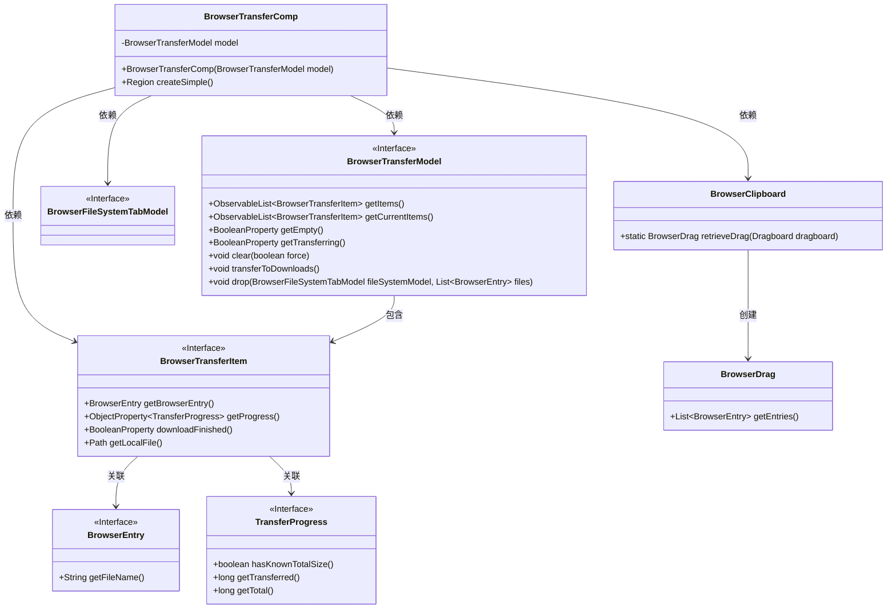
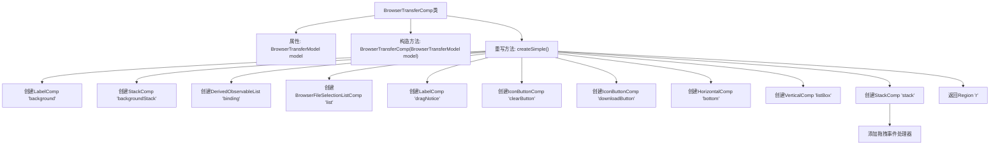

# 基础信息

|      |      |
|------|------|
| 名称 | BrowserTransferComp |
| 编码语言 | .java |
| 代码路径 | xpipe/app/src/main/java/io/xpipe/app/browser/file/BrowserTransferComp.java |
| 包名 | io.xpipe.app.browser.file |
| 依赖项 | ['io.xpipe.app.comp.Comp', 'io.xpipe.app.comp.SimpleComp', 'io.xpipe.app.comp.base', 'io.xpipe.app.core.AppI18n', 'io.xpipe.app.util.DerivedObservableList', 'io.xpipe.app.util.ThreadHelper', 'javafx.beans.binding.Bindings', 'javafx.beans.property.SimpleStringProperty', 'javafx.collections.FXCollections', 'javafx.css.PseudoClass', 'javafx.geometry.Insets', 'javafx.scene.control.ContentDisplay', 'javafx.scene.image.Image', 'javafx.scene.input.ClipboardContent', 'javafx.scene.input.DragEvent', 'javafx.scene.input.Dragboard', 'javafx.scene.input.TransferMode', 'javafx.scene.layout.Region', 'javafx.scene.text.TextAlignment', 'org.kordamp.ikonli.javafx.FontIcon', 'java.io.File', 'java.io.IOException', 'java.nio.file.Files', 'java.util.List', 'java.util.Optional'] |
| 概述说明 | 浏览器传输组件，包含文件列表、拖拽操作和下载功能。 |

# 说明

BrowserTransferComp是一个继承自SimpleComp的组件，用于处理浏览器文件传输功能。它包含一个背景标签（显示下载描述和图标）和一个文件列表区域。列表显示文件名称及传输进度百分比，支持拖拽操作。底部有清除按钮和下载按钮，分别用于清空列表和触发下载。组件还实现了拖拽事件处理，支持从外部拖入文件以及内部拖出文件到系统剪贴板。整体布局采用堆栈结构，根据状态动态切换显示内容。

# 类列表 Class Summary

| 名称   | 类型  | 说明 |
|-------|------|-------------|
| BrowserTransferComp | class | 浏览器传输组件，包含文件列表、拖拽操作和下载功能。 |

## 类 BrowserTransferComp

|      |      |
|------|------|
| 访问范围 | public |
| 类型 | class |
| 名称 | BrowserTransferComp |
| 说明 | 浏览器传输组件，包含文件列表、拖拽操作和下载功能。 |

### UML类图

这段代码展示了一个浏览器文件传输组件(BrowserTransferComp)的类结构，该组件继承自SimpleComp。核心功能包括：1) 显示传输列表和进度；2) 处理拖拽操作；3) 提供下载和清除功能。组件通过BrowserTransferModel管理数据状态，包含BrowserTransferItem列表，每个项目关联BrowserEntry和TransferProgress。系统支持从浏览器拖拽文件到本地，以及从本地拖拽文件到浏览器，通过BrowserClipboard处理拖拽数据交换。整个设计采用了观察者模式来响应状态变化，并提供了丰富的UI交互功能。

### 内部方法调用关系图

该流程图展示了BrowserTransferComp类的核心结构和createSimple()方法的执行流程。该方法首先创建多个UI组件(背景标签、文件列表、按钮等)，然后构建布局层次结构，最后添加拖拽事件处理逻辑并返回最终界面。流程从类定义开始，通过构造方法初始化模型，重点展示了createSimple()方法中UI组件的创建顺序和组装过程，以及拖拽事件处理器的添加，最终生成可显示的Region对象。

### 字段列表 Field List

| 名称  | 类型  | 说明 |
|-------|-------|------|
| model | BrowserTransferModel | 私有浏览器传输模型实例 |

### 方法列表 Method List

| 名称  | 类型  | 说明 |
|-------|-------|------|
| createSimple | Region | 创建文件传输界面，包含下载列表、拖拽功能和操作按钮。 |

