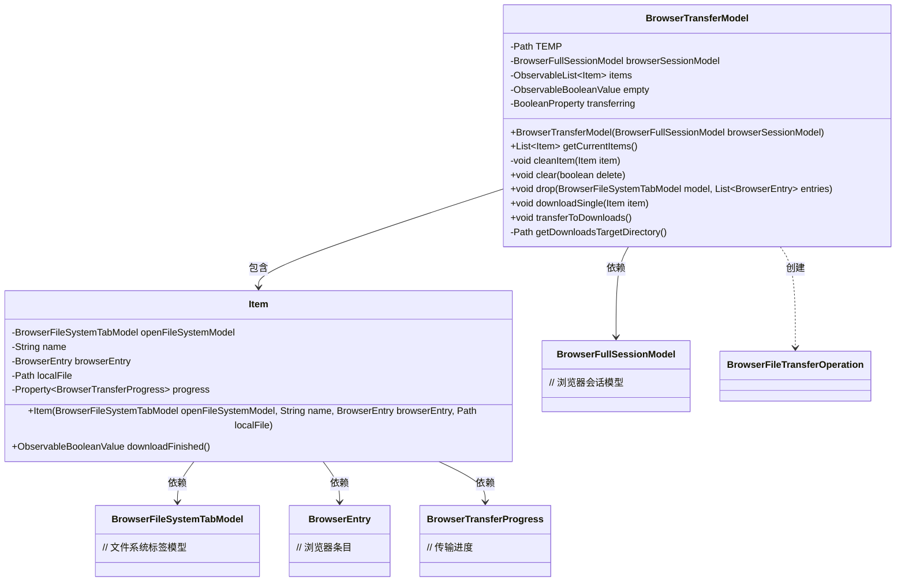

# 基础信息

|      |      |
|------|------|
| 名称 | BrowserTransferModel |
| 编码语言 | .java |
| 代码路径 | xpipe/app/src/main/java/io/xpipe/app/browser/file/BrowserTransferModel.java |
| 包名 | io.xpipe.app.browser.file |
| 依赖项 | ['io.xpipe.app.browser.BrowserFullSessionModel', 'io.xpipe.app.issue.ErrorEvent', 'io.xpipe.app.prefs.AppPrefs', 'io.xpipe.app.util.DesktopHelper', 'io.xpipe.app.util.ShellTemp', 'io.xpipe.app.util.ThreadHelper', 'javafx.beans.binding.Bindings', 'javafx.beans.property.BooleanProperty', 'javafx.beans.property.Property', 'javafx.beans.property.SimpleBooleanProperty', 'javafx.beans.property.SimpleObjectProperty', 'javafx.beans.value.ObservableBooleanValue', 'javafx.collections.FXCollections', 'javafx.collections.ObservableList', 'lombok.Value', 'org.apache.commons.io.FileUtils', 'java.io.IOException', 'java.nio.file.Files', 'java.nio.file.InvalidPathException', 'java.nio.file.Path', 'java.nio.file.StandardCopyOption', 'java.util.ArrayList', 'java.util.List', 'java.util.Optional'] |
| 概述说明 | BrowserTransferModel处理文件下载，管理下载项列表，支持清理和转移至下载目录。 |

# 说明

BrowserTransferModel是一个用于管理浏览器文件下载的类，包含BrowserFullSessionModel和可观察的下载项列表。它通过后台线程持续检查未完成的下载项并执行下载。提供清理、批量删除、添加下载项及单文件下载功能，支持进度跟踪和错误处理。下载完成后可将文件移至指定目录。内部类Item封装下载项信息，包括名称、浏览器条目、本地路径及进度状态。

# 类列表 Class Summary

| 名称   | 类型  | 说明 |
|-------|------|-------------|
| BrowserTransferModel | class | BrowserTransferModel管理文件下载，包含线程下载、清理和转移功能。 |

## 类 BrowserTransferModel

|      |      |
|------|------|
| 访问范围 | @Value;public |
| 类型 | class |
| 名称 | BrowserTransferModel |
| 说明 | BrowserTransferModel管理文件下载，包含线程下载、清理和转移功能。 |

### UML类图

这段代码定义了一个浏览器文件传输模型`BrowserTransferModel`，用于管理文件下载任务。核心功能包括：维护待下载项列表、处理单个文件下载、清理已完成项、批量转移文件到下载目录。通过`Item`内部类封装每个下载任务的状态，使用线程池异步执行下载操作，并支持进度跟踪和错误处理。类间关系清晰，`BrowserTransferModel`作为主控类协调各组件工作，与文件系统模型、进度跟踪等模块形成松耦合结构。

### 内部方法调用关系图

```mermaid
graph TD
    A["类BrowserTransferModel"]
    B["静态属性: Path TEMP"]
    C["属性: BrowserFullSessionModel browserSessionModel"]
    D["属性: ObservableList<Item> items"]
    E["属性: ObservableBooleanValue empty"]
    F["属性: BooleanProperty transferring"]
    G["构造方法: BrowserTransferModel(BrowserFullSessionModel)"]
    H["方法: List<Item> getCurrentItems()"]
    I["方法: void cleanItem(Item)"]
    J["方法: void clear(boolean)"]
    K["方法: void drop(BrowserFileSystemTabModel, List<BrowserEntry>)"]
    L["方法: void downloadSingle(Item)"]
    M["方法: void transferToDownloads()"]
    N["方法: Path getDownloadsTargetDirectory()"]
    O["嵌套类Item"]
    P["属性: BrowserFileSystemTabModel openFileSystemModel"]
    Q["属性: String name"]
    R["属性: BrowserEntry browserEntry"]
    S["属性: Path localFile"]
    T["属性: Property<BrowserTransferProgress> progress"]
    U["构造方法: Item(BrowserFileSystemTabModel, String, BrowserEntry, Path)"]
    V["方法: ObservableBooleanValue downloadFinished()"]

    A --> B
    A --> C
    A --> D
    A --> E
    A --> F
    A --> G
    A --> H
    A --> I
    A --> J
    A --> K
    A --> L
    A --> M
    A --> N
    A --> O
    O --> P
    O --> Q
    O --> R
    O --> S
    O --> T
    O --> U
    O --> V
    G -->|创建线程| L
    J -->|调用| I
    K -->|操作| D
    L -->|使用| B
    M -->|调用| N
```

该流程图展示了BrowserTransferModel类的完整结构，包含静态属性TEMP、多个实例属性、构造方法和主要功能方法。核心功能包括文件下载管理（downloadSingle）、清理操作（cleanItem/clear）、拖放处理（drop）和下载转移（transferToDownloads）。嵌套类Item用于封装下载项元数据，包含文件名、浏览器条目和本地文件路径等属性。特别注意线程安全设计，所有对items集合的操作都通过synchronized块保护。

### 字段列表 Field List

| 名称  | 类型  | 说明 |
|-------|-------|------|
| TEMP = ShellTemp.getLocalTempDataDirectory("download") | Path | 私有静态路径TEMP指向本地临时下载目录 |
| browserSessionModel | BrowserFullSessionModel | 浏览器会话模型对象实例。 |
| transferring = new SimpleBooleanProperty() | BooleanProperty | 创建布尔属性transferring实例。 |
| empty = Bindings.createBooleanBinding(() -> items.isEmpty(), items) | ObservableBooleanValue | 绑定布尔值，检测items是否为空。 |
| items = FXCollections.observableArrayList() | ObservableList<Item> | 创建可观察的Item对象动态数组。 |

### 方法列表 Method List

| 名称  | 类型  | 说明 |
|-------|-------|------|
| drop | void | 同步添加不重复文件项到列表。 |
| clear | void | 同步清理已完成下载项，可选删除文件。 |
| getCurrentItems | List<Item> | 同步获取当前项目列表的副本。 |
| cleanItem | void | 清理项目文件：若非目录或文件不存在则返回，存在则强制删除，异常时处理错误。 |
| downloadSingle | void | 下载单个文件：检查目录、状态和模型后执行传输，处理异常并更新进度。 |
| transferToDownloads | void | 将已完成下载项移至下载目录，处理文件冲突并打开目标目录。 |
| getDownloadsTargetDirectory | Path | 获取下载目录：优先使用自定义路径，无效则返回默认路径。 |

