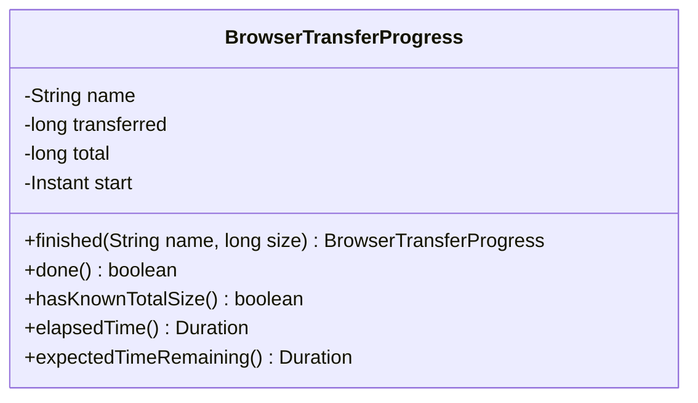
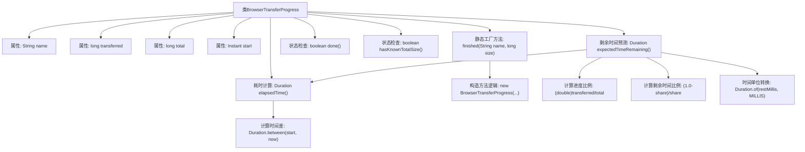

# 基础信息

|      |      |
|------|------|
| 名称 | BrowserTransferProgress |
| 编码语言 | .java |
| 代码路径 | xpipe/app/src/main/java/io/xpipe/app/browser/file/BrowserTransferProgress.java |
| 包名 | io.xpipe.app.browser.file |
| 依赖项 | ['lombok.Value', 'java.time.Duration', 'java.time.Instant', 'java.time.temporal.ChronoUnit'] |
| 概述说明 | 浏览器传输进度类，记录文件名、已传输和总大小，提供完成状态、剩余时间计算等功能。 |

# 说明

BrowserTransferProgress类用于跟踪浏览器传输进度，包含文件名、已传输字节数、总字节数和开始时间四个字段。提供静态方法finished()创建已完成传输的对象。done()方法检查是否完成传输，hasKnownTotalSize()判断总大小是否已知。elapsedTime()计算已耗时，expectedTimeRemaining()通过当前进度和已耗时估算剩余时间，算法考虑了启动阶段的调整。所有时间计算均基于Instant和Duration类实现。

# 类列表 Class Summary

| 名称   | 类型  | 说明 |
|-------|------|-------------|
| BrowserTransferProgress | class | 浏览器传输进度类，记录文件名、传输量、总量和开始时间，提供完成状态、剩余时间估算等功能。 |

## 类 BrowserTransferProgress

|      |      |
|------|------|
| 访问范围 | @Value;public |
| 类型 | class |
| 名称 | BrowserTransferProgress |
| 说明 | 浏览器传输进度类，记录文件名、传输量、总量和开始时间，提供完成状态、剩余时间估算等功能。 |

### UML类图

该类图展示了一个用于浏览器文件传输进度跟踪的`BrowserTransferProgress`类，包含传输名称、已传输字节数、总字节数和开始时间等私有属性。提供5个公有方法：静态工厂方法`finished`用于创建已完成传输的实例，`done`判断传输是否完成，`hasKnownTotalSize`检查是否已知总大小，`elapsedTime`计算已耗时，`expectedTimeRemaining`通过当前进度和耗时预测剩余时间（采用动态调整算法避免启动阶段误差）。所有方法均围绕传输进度监控的核心功能设计，未涉及外部依赖关系。

### 内部方法调用关系图

该流程图展示了BrowserTransferProgress类的完整结构，包含4个成员变量和5个核心方法。其中finished()是创建已完成传输记录的工厂方法，done()和hasKnownTotalSize()提供传输状态检查，elapsedTime()计算已耗时，expectedTimeRemaining()通过复杂算法预测剩余时间。特别值得注意的是剩余时间预测方法内部会调用elapsedTime()，并涉及多步数学运算和单位转换，形成完整的时间预估逻辑链。所有方法都围绕传输进度监控的核心功能展开。

### 字段列表 Field List

| 名称  | 类型  | 说明 |
|-------|-------|------|
| name | String | 声明字符串变量name |
| transferred | long | 长传输 |
| total | long | 总时长 |
| start | Instant | 即时启动 |

### 方法列表 Method List

| 名称  | 类型  | 说明 |
|-------|-------|------|
| expectedTimeRemaining | Duration | 计算剩余传输时间，基于已传输比例和启动调整。 |
| done | boolean | 方法检查是否已完成传输，当已传输量大于等于总量时返回真。 |
| hasKnownTotalSize | boolean | 方法检查总数是否大于0。 |
| finished | BrowserTransferProgress | 静态方法finished创建BrowserTransferProgress对象，参数为名称、大小和当前时间。 |
| elapsedTime | Duration | 方法返回当前时间与start的时间差。 |

