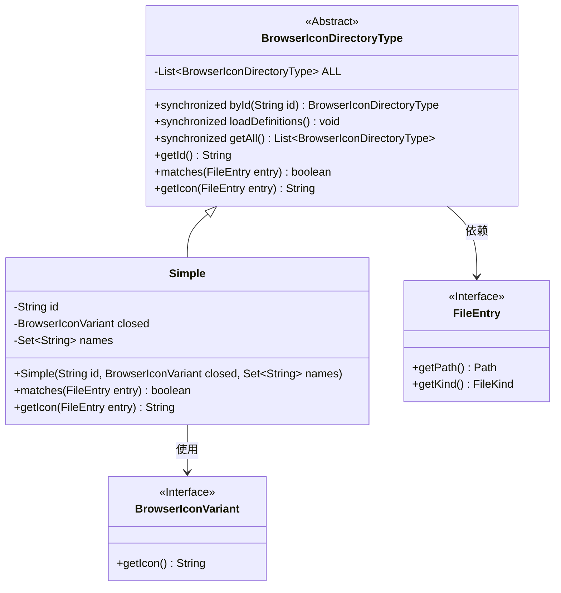
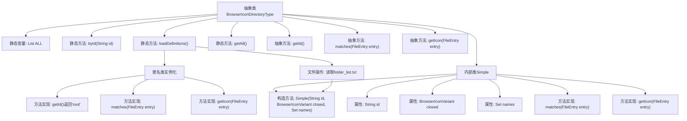

# 基础信息

|      |      |
|------|------|
| 名称 | BrowserIconDirectoryType |
| 编码语言 | .java |
| 代码路径 | xpipe/app/src/main/java/io/xpipe/app/browser/icon/BrowserIconDirectoryType.java |
| 包名 | io.xpipe.app.browser.icon |
| 依赖项 | ['io.xpipe.app.resources.AppResources', 'io.xpipe.core.store.FileEntry', 'io.xpipe.core.store.FileKind', 'lombok.Getter', 'java.io.BufferedReader', 'java.io.InputStreamReader', 'java.nio.charset.StandardCharsets', 'java.nio.file.Files', 'java.util.ArrayList', 'java.util.Arrays', 'java.util.List', 'java.util.Set', 'java.util.stream.Collectors'] |
| 概述说明 | 抽象类定义浏览器图标目录类型，包含ID匹配、图标获取方法，支持动态加载定义。 |

# 说明

该代码定义了一个抽象类BrowserIconDirectoryType，用于管理浏览器图标目录类型。类中包含静态方法byId通过ID查找类型，loadDefinitions加载定义并初始化类型列表，getAll获取所有类型。抽象方法包括获取ID、匹配文件条目和获取图标。内部类Simple实现了这些方法，通过名称匹配目录并返回对应图标。初始化时添加了根目录类型，并从文件读取其他目录类型定义，包括ID、名称过滤器和图标路径。

# 类列表 Class Summary

| 名称   | 类型  | 说明 |
|-------|------|-------------|
| BrowserIconDirectoryType | class | 抽象类定义浏览器图标目录类型，包含ID匹配和图标获取方法，支持动态加载和查询。 |

## 类 BrowserIconDirectoryType

|      |      |
|------|------|
| 访问范围 | public abstract |
| 类型 | class |
| 名称 | BrowserIconDirectoryType |
| 说明 | 抽象类定义浏览器图标目录类型，包含ID匹配和图标获取方法，支持动态加载和查询。 |

### UML类图

这段代码描述了一个浏览器图标目录类型的抽象类体系。BrowserIconDirectoryType作为抽象基类，维护了一个全局的图标类型列表(ALL)，提供了通过ID查找类型(byId)、加载定义(loadDefinitions)和获取所有类型(getAll)的静态方法。Simple作为具体实现类，通过匹配文件名集合(names)来确定目录类型，并使用BrowserIconVariant获取对应图标。该设计支持动态加载目录类型定义，并通过抽象方法强制子类实现类型匹配逻辑。

### 内部方法调用关系图

该流程图展示了BrowserIconDirectoryType抽象类的完整结构，包含静态变量ALL、三个核心静态方法(byId/loadDefinitions/getAll)和三个抽象方法。重点描述了loadDefinitions()方法的两个关键分支：1) 创建匿名类实例并添加到ALL列表；2) 通过文件操作读取配置并创建Simple实例。内部类Simple完整展示了属性结构和重写方法的实现逻辑，体现了文件类型匹配和图标获取的核心业务逻辑。

### 字段列表 Field List

| 名称  | 类型  | 说明 |
|-------|-------|------|
| ALL = new ArrayList<>() | List<BrowserIconDirectoryType> | 私有静态最终列表ALL，存储BrowserIconDirectoryType对象。 |

### 方法列表 Method List

| 名称  | 类型  | 说明 |
|-------|-------|------|
| getId | String | 抽象方法：获取ID字符串。 |
| byId | BrowserIconDirectoryType | 静态同步方法，通过ID查找枚举项，未找到则抛出异常。 |
| loadDefinitions | void | 静态同步方法加载定义，添加根目录类型和读取文件配置图标。 |
| getAll | List<BrowserIconDirectoryType> | 静态同步方法返回浏览器图标目录类型列表。 |
| matches | boolean | 检查文件条目是否匹配。 |
| getIcon | String | 获取文件条目图标的抽象方法。 |

