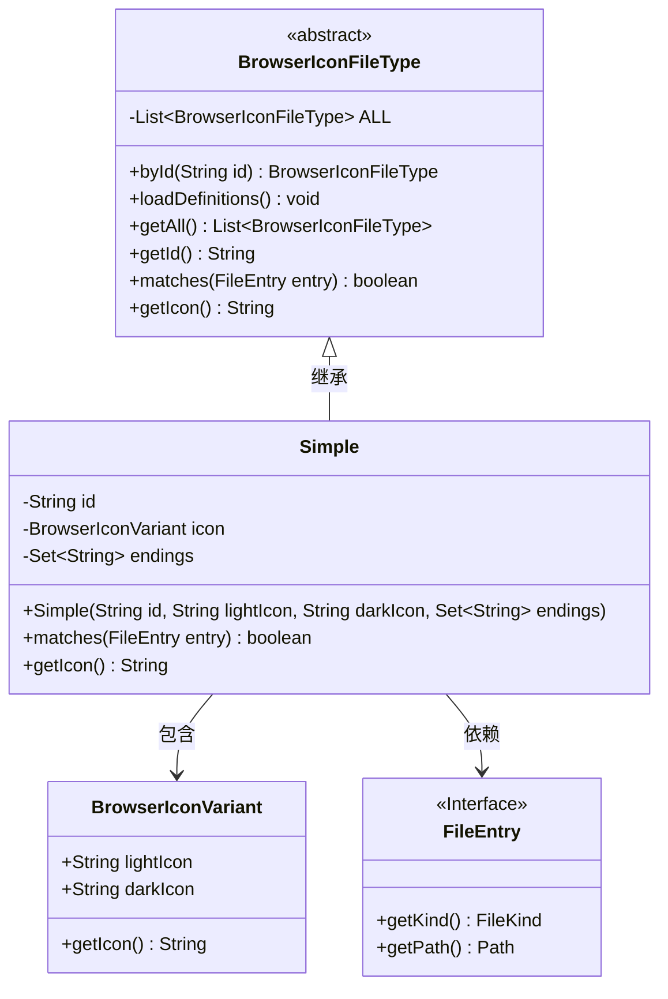
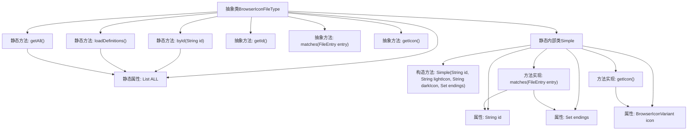

# 基础信息

|      |      |
|------|------|
| 名称 | BrowserIconFileType |
| 编码语言 | .java |
| 代码路径 | xpipe/app/src/main/java/io/xpipe/app/browser/icon/BrowserIconFileType.java |
| 包名 | io.xpipe.app.browser.icon |
| 依赖项 | ['io.xpipe.app.resources.AppResources', 'io.xpipe.core.store.FileEntry', 'io.xpipe.core.store.FileKind', 'lombok.Getter', 'java.io.BufferedReader', 'java.io.InputStreamReader', 'java.nio.charset.StandardCharsets', 'java.nio.file.Files', 'java.util', 'java.util.stream.Collectors'] |
| 概述说明 | 抽象类定义浏览器图标文件类型，包含ID匹配、文件扩展名检查和图标获取功能。通过静态方法加载和管理类型列表。 |

# 说明

该内容描述了一个抽象类BrowserIconFileType，用于管理浏览器图标文件类型。该类包含静态方法byId通过ID获取文件类型，loadDefinitions从资源文件加载定义，getAll获取所有文件类型。抽象方法包括获取ID、匹配文件条目和获取图标。内部类Simple实现了这些方法，包含ID、图标变体和文件后缀集合，通过检查文件扩展名或名称匹配条目。图标变体支持亮暗模式，文件后缀处理确保格式统一。

# 类列表 Class Summary

| 名称   | 类型  | 说明 |
|-------|------|-------------|
| BrowserIconFileType | class | 抽象类BrowserIconFileType管理文件类型图标，提供ID匹配、文件过滤和图标获取功能，支持明暗主题。 |

## 类 BrowserIconFileType

|      |      |
|------|------|
| 访问范围 | public abstract |
| 类型 | class |
| 名称 | BrowserIconFileType |
| 说明 | 抽象类BrowserIconFileType管理文件类型图标，提供ID匹配、文件过滤和图标获取功能，支持明暗主题。 |

### UML类图

这段代码描述了一个浏览器图标文件类型系统，核心是抽象类`BrowserIconFileType`及其实现类`Simple`。系统通过读取配置文件动态加载文件类型定义，支持根据文件扩展名匹配对应的图标。`Simple`类实现了具体的匹配逻辑，使用`BrowserIconVariant`管理不同主题的图标路径，并通过`FileEntry`接口获取文件信息。整体设计采用抽象工厂模式，支持运行时动态扩展文件类型。

### 内部方法调用关系图

流程图描述：该流程图展示了抽象类BrowserIconFileType的结构，包含静态属性ALL用于存储所有文件类型实例，以及byId、loadDefinitions和getAll三个静态方法。内部类Simple实现了抽象方法matches和getIcon，其中matches方法通过文件扩展名或名称匹配预定义的endings集合，getIcon返回当前主题对应的图标路径。loadDefinitions方法从配置文件中加载定义并创建Simple实例存入ALL集合。

### 字段列表 Field List

| 名称  | 类型  | 说明 |
|-------|-------|------|
| ALL = new ArrayList<>() | List<BrowserIconFileType> | 私有静态不可变列表ALL，存储BrowserIconFileType类型元素。 |

### 方法列表 Method List

| 名称  | 类型  | 说明 |
|-------|-------|------|
| byId | BrowserIconFileType | 静态同步方法通过ID查找匹配的BrowserIconFileType实例，未找到则抛出异常。 |
| getId | String | 抽象方法：获取ID字符串。 |
| getAll | List<BrowserIconFileType> | 静态同步方法返回浏览器图标文件类型列表。 |
| loadDefinitions | void | 静态同步方法加载定义，读取文件解析ID、过滤器和图标路径，存入集合。 |
| matches | boolean | 抽象方法：判断文件条目是否匹配。 |
| getIcon | String | 获取图标的抽象方法。 |

