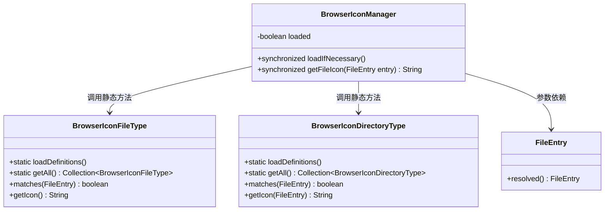
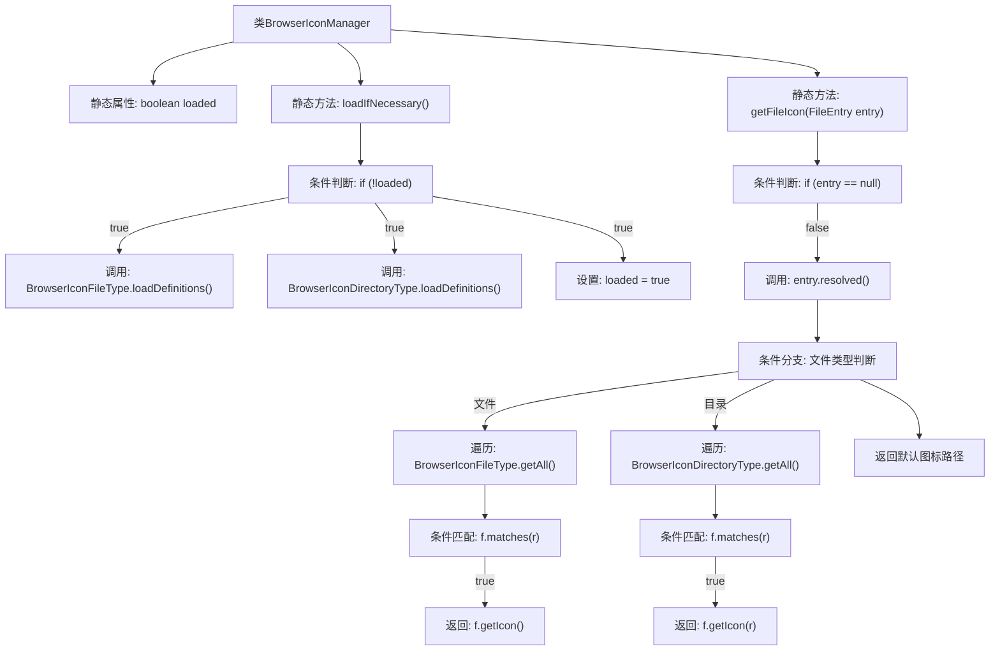

# 基础信息

|      |      |
|------|------|
| 名称 | BrowserIconManager |
| 编码语言 | .java |
| 代码路径 | xpipe/app/src/main/java/io/xpipe/app/browser/icon/BrowserIconManager.java |
| 包名 | io.xpipe.app.browser.icon |
| 依赖项 | ['io.xpipe.core.store.FileEntry', 'io.xpipe.core.store.FileKind'] |
| 概述说明 | BrowserIconManager类管理文件图标加载与获取，支持文件和目录类型匹配。 |

# 说明

BrowserIconManager是一个管理浏览器图标加载与获取的类。它包含一个静态布尔变量loaded标记是否已加载图标定义。loadIfNecessary方法通过同步方式确保只加载一次BrowserIconFileType和BrowserIconDirectoryType的定义。getFileIcon方法根据传入的FileEntry对象类型（文件或目录）匹配对应的图标，若未匹配则返回默认图标路径。整个过程采用线程安全设计。

# 类列表 Class Summary

| 名称   | 类型  | 说明 |
|-------|------|-------------|
| BrowserIconManager | class | BrowserIconManager类管理文件图标，按需加载并返回匹配的图标路径。 |

## 类 BrowserIconManager

|      |      |
|------|------|
| 访问范围 | public |
| 类型 | class |
| 名称 | BrowserIconManager |
| 说明 | BrowserIconManager类管理文件图标，按需加载并返回匹配的图标路径。 |

### UML类图

该代码展示了一个浏览器图标管理系统，BrowserIconManager通过双重检查锁模式延迟加载图标定义文件。当获取文件图标时，会根据文件类型（普通文件/目录）分别匹配BrowserIconFileType或BrowserIconDirectoryType中注册的图标规则，未匹配时返回默认图标。系统通过FileEntry对象获取文件元信息，各组件间通过静态方法调用协作，体现了线程安全的单例初始化模式。

### 内部方法调用关系图

流程图描述了BrowserIconManager类的核心逻辑：通过loadIfNecessary()方法实现懒加载图标定义，getFileIcon()方法根据文件类型（普通文件/目录）匹配对应的图标。流程包含双重检查锁定的加载控制、空值保护、类型分发处理、动态匹配逻辑以及默认图标回退机制，展现了完整的图标管理决策过程。

### 字段列表 Field List

| 名称  | 类型  | 说明 |
|-------|-------|------|
| loaded | boolean | 私有静态布尔变量loaded |

### 方法列表 Method List

| 名称  | 类型  | 说明 |
|-------|-------|------|
| loadIfNecessary | void | 静态同步方法，检查未加载则加载浏览器图标定义并标记已加载。 |
| getFileIcon | String | 静态同步方法，根据文件类型返回对应图标，无则返回默认图标。 |

