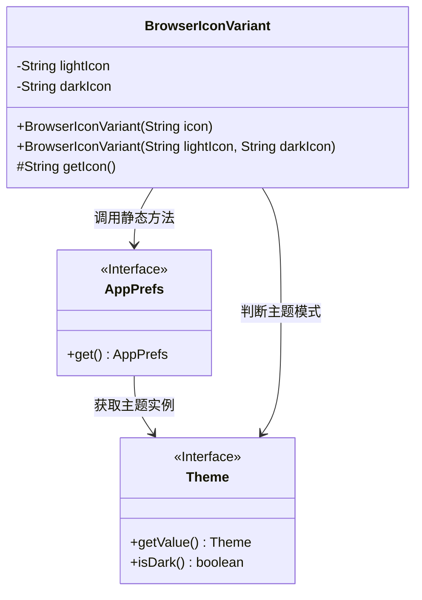
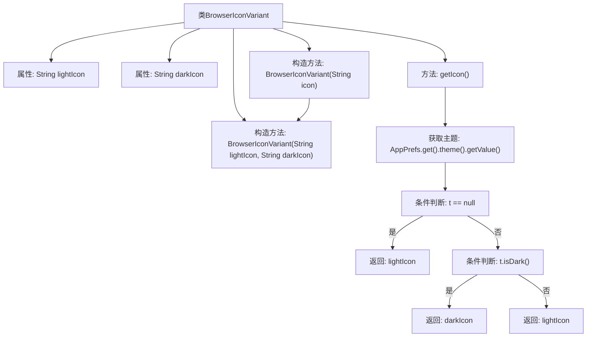

# 基础信息

|      |      |
|------|------|
| 名称 | BrowserIconVariant |
| 编码语言 | .java |
| 代码路径 | xpipe/app/src/main/java/io/xpipe/app/browser/icon/BrowserIconVariant.java |
| 包名 | io.xpipe.app.browser.icon |
| 依赖项 | ['io.xpipe.app.prefs.AppPrefs'] |
| 概述说明 | BrowserIconVariant类存储明暗主题图标，根据当前主题返回对应图标。 |

# 说明

这是一个名为BrowserIconVariant的Java类，用于管理浏览器图标的亮色和暗色变体。类包含两个私有字符串字段lightIcon和darkIcon，分别存储亮色和暗色图标路径。提供两个构造函数：一个接受单一图标路径并同时赋给两个变体，另一个允许分别指定亮色和暗色图标。类还包含一个protected方法getIcon，该方法根据当前应用主题（从AppPrefs获取）自动返回适合当前主题的图标路径。若未设置主题或主题为空，默认返回亮色图标。

# 类列表 Class Summary

| 名称   | 类型  | 说明 |
|-------|------|-------------|
| BrowserIconVariant | class | BrowserIconVariant类存储明暗主题图标，根据当前主题返回对应图标。 |

## 类 BrowserIconVariant

|      |      |
|------|------|
| 访问范围 | public |
| 类型 | class |
| 名称 | BrowserIconVariant |
| 说明 | BrowserIconVariant类存储明暗主题图标，根据当前主题返回对应图标。 |

### UML类图

这段代码描述了一个浏览器图标变体类(BrowserIconVariant)，它根据当前主题模式(亮色/暗色)返回对应的图标路径。类中包含两个私有字段存储不同主题的图标路径，提供两种构造方法(单图标和双图标模式)，以及一个受保护的getIcon方法通过AppPrefs和Theme接口动态获取当前适用的图标。类图中清晰展示了BrowserIconVariant与AppPrefs、Theme接口之间的依赖关系，体现了主题感知的图标选择机制。

### 内部方法调用关系图

该流程图展示了BrowserIconVariant类的结构和核心逻辑。类包含两个私有属性(lightIcon/darkIcon)和两个重载构造方法，其中单参数构造方法会调用双参数版本。核心方法getIcon()通过AppPrefs获取当前主题，根据主题是否为暗色模式返回对应的图标路径。流程完整呈现了主题判断的三层逻辑：空值检查→暗色判断→图标选择，体现了对主题切换场景的健壮性处理。

### 字段列表 Field List

| 名称  | 类型  | 说明 |
|-------|-------|------|
| lightIcon | String | 私有字符串变量lightIcon |
| darkIcon | String | 私有字符串变量darkIcon |

### 方法列表 Method List

| 名称  | 类型  | 说明 |
|-------|-------|------|
| getIcon | String | 方法根据主题设置返回图标：暗主题用darkIcon，否则用lightIcon。 |

