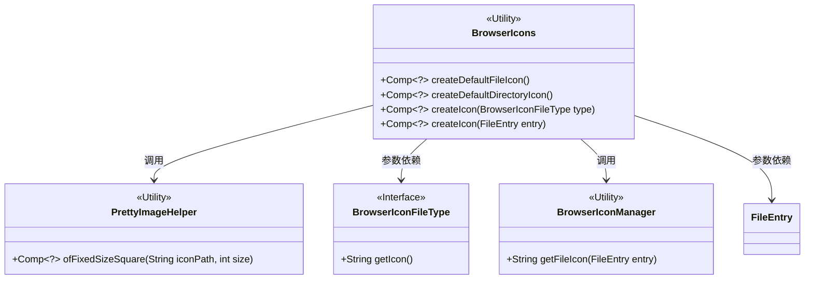
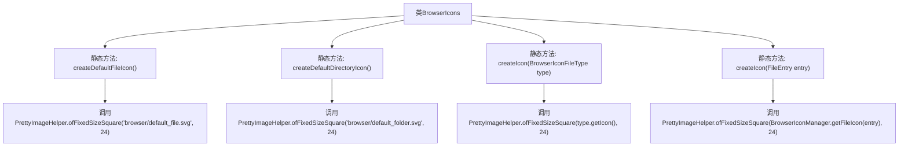

# 基础信息

|      |      |
|------|------|
| 名称 | BrowserIcons |
| 编码语言 | .java |
| 代码路径 | xpipe/app/src/main/java/io/xpipe/app/browser/icon/BrowserIcons.java |
| 包名 | io.xpipe.app.browser.icon |
| 依赖项 | ['io.xpipe.app.comp.Comp', 'io.xpipe.app.comp.base.PrettyImageHelper', 'io.xpipe.core.store.FileEntry'] |
| 概述说明 | BrowserIcons类提供创建文件、目录和自定义图标的静态方法，图标尺寸固定为24像素。 |

# 说明

BrowserIcons类提供了创建文件浏览器图标的静态方法。包含四个方法：createDefaultFileIcon使用默认文件图标路径创建24x24方形组件；createDefaultDirectoryIcon使用默认文件夹图标路径创建相同尺寸组件；createIcon(BrowserIconFileType)根据传入的文件类型获取对应图标路径创建组件；createIcon(FileEntry)通过文件条目从BrowserIconManager获取图标路径创建组件。所有方法均调用PrettyImageHelper.ofFixedSizeSquare实现统一尺寸处理。

# 类列表 Class Summary

| 名称   | 类型  | 说明 |
|-------|------|-------------|
| BrowserIcons | class | BrowserIcons类提供创建文件/目录图标的静态方法，固定尺寸24像素。 |

## 类 BrowserIcons

|      |      |
|------|------|
| 访问范围 | public |
| 类型 | class |
| 名称 | BrowserIcons |
| 说明 | BrowserIcons类提供创建文件/目录图标的静态方法，固定尺寸24像素。 |

### UML类图

这段代码展示了一个BrowserIcons工具类，它提供四种创建浏览器图标组件的方法。核心功能是通过PrettyImageHelper创建固定大小的方形图标，支持默认文件/目录图标、基于文件类型的图标以及基于文件条目的图标。BrowserIcons与多个辅助类协作，包括处理图标路径的PrettyImageHelper、定义文件类型图标的BrowserIconFileType接口、获取文件图标的BrowserIconManager工具类以及表示文件条目的FileEntry类。所有方法返回泛型Comp组件，图标尺寸固定为24像素。

### 内部方法调用关系图

这段流程图描述了BrowserIcons类的四个静态方法调用关系。该类专门用于生成浏览器文件系统的图标组件，所有方法最终都通过PrettyImageHelper.ofFixedSizeSquare()方法创建固定尺寸的方形图标。其中两个方法使用默认图标路径，另外两个方法分别通过BrowserIconFileType枚举和FileEntry对象动态获取图标路径。所有图标的尺寸统一设置为24x24像素，体现了高度一致的UI设计规范。

### 字段列表 Field List

| 名称  | 类型  | 说明 |
|-------|-------|------|

### 方法列表 Method List

| 名称  | 类型  | 说明 |
|-------|-------|------|
| createDefaultDirectoryIcon | Comp<?> | 创建默认目录图标方法，返回24像素方形SVG图标。 |
| createDefaultFileIcon | Comp<?> | 创建默认文件图标，使用24px方形SVG图片。 |
| createIcon | Comp<?> | 静态方法创建24px方形图标，参数为浏览器图标类型。 |
| createIcon | Comp<?> | 创建固定大小24的方形文件图标方法。 |

