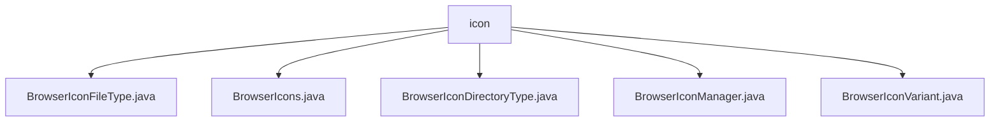

# 基础信息

|      |      |
|------|------|
| 名称 | icon |
| 编码语言 | .java |
| 代码路径 | xpipe/app/src/main/java/io/xpipe/app/browser/icon |
| 包名 | xpipe.app.src.main.java.io.xpipe.app.browser.icon |
| 概述说明 | 浏览器图标管理类：抽象类定义文件/目录类型匹配与图标获取，包含加载、查询方法，支持亮暗主题，线程安全设计。 |

# 说明

## 概述

该代码模块主要实现了一个浏览器图标管理系统，用于管理和加载文件浏览器中的文件和目录图标。系统支持根据文件类型、目录类型以及当前应用主题（亮色/暗色）动态加载对应的图标，并提供统一的图标尺寸处理和默认图标回退机制。核心功能包括图标类型定义、图标变体管理、图标加载与匹配等。

## 主要业务场景

1. **文件类型图标管理**  
   - 通过`BrowserIconFileType`抽象类及其实现类`Simple`定义和管理不同文件类型的图标，支持通过文件扩展名或名称匹配文件条目，并返回对应的图标路径。文件类型定义支持从资源文件加载，确保灵活性和可扩展性。

2. **目录类型图标管理**  
   - 通过`BrowserIconDirectoryType`抽象类及其实现类`Simple`定义和管理不同目录类型的图标，支持通过名称匹配目录并返回对应图标。初始化时加载根目录类型和其他目录类型定义，支持动态扩展。

3. **图标变体支持**  
   - `BrowserIconVariant`类管理图标的亮色和暗色变体，根据当前应用主题自动返回适合的图标路径。支持单一图标路径或分别指定亮色/暗色图标路径的构造方式，确保主题切换时图标适配。

4. **图标加载与匹配**  
   - `BrowserIconManager`类负责统一管理图标加载与获取，确保线程安全地加载文件类型和目录类型的定义。根据`FileEntry`对象类型（文件或目录）匹配对应的图标，未匹配时返回默认图标路径。

5. **图标组件创建**  
   - `BrowserIcons`类提供静态方法创建文件浏览器图标组件，支持默认文件图标、默认目录图标以及根据文件类型或文件条目动态获取图标路径。所有图标组件统一处理为24x24方形尺寸，确保界面一致性。

该模块适用于需要动态展示文件和目录图标的文件浏览器场景，支持主题适配、灵活的类型定义和高效的图标加载机制。

### 包内部结构视图

该流程图展示了xpipe项目中浏览器图标模块的文件结构。根节点"icon"包含5个直接子文件，分别处理不同类型的图标功能：文件类型图标、通用图标、目录类型图标、图标管理器以及图标变体管理。所有文件均位于同一层级，没有嵌套子目录结构，表明这是一个功能集中、扁平化设计的模块。

# 文件列表 File List

| 名称   | 类型  | 说明 |
|-------|------|-------------|
| [BrowserIconManager.java](BrowserIconManager.md) | file | BrowserIconManager类管理文件图标加载与获取，支持文件和目录类型匹配。 |
| [BrowserIconDirectoryType.java](BrowserIconDirectoryType.md) | file | 抽象类定义浏览器图标目录类型，包含ID匹配、图标获取方法，支持动态加载定义。 |
| [BrowserIcons.java](BrowserIcons.md) | file | BrowserIcons类提供创建文件、目录和自定义图标的静态方法，图标尺寸固定为24像素。 |
| [BrowserIconFileType.java](BrowserIconFileType.md) | file | 抽象类定义浏览器图标文件类型，包含ID匹配、文件扩展名检查和图标获取功能。通过静态方法加载和管理类型列表。 |
| [BrowserIconVariant.java](BrowserIconVariant.md) | file | BrowserIconVariant类存储明暗主题图标，根据当前主题返回对应图标。 |

