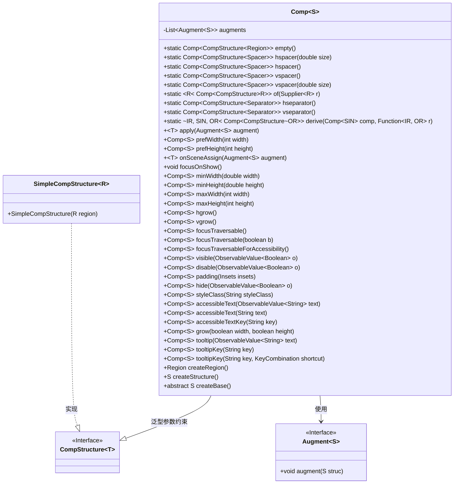

# 基础信息

|      |      |
|------|------|
| 名称 | Comp |
| 编码语言 | .java |
| 代码路径 | xpipe/app/src/main/java/io/xpipe/app/comp/Comp.java |
| 包名 | io.xpipe.app.comp |
| 依赖项 | ['io.xpipe.app.comp.augment.Augment', 'io.xpipe.app.comp.augment.GrowAugment', 'io.xpipe.app.comp.base.TooltipHelper', 'io.xpipe.app.core.AppI18n', 'io.xpipe.app.util.BindingsHelper', 'io.xpipe.app.util.PlatformThread', 'javafx.application.Platform', 'javafx.beans.value.ObservableValue', 'javafx.geometry.Insets', 'javafx.geometry.Orientation', 'javafx.scene.control.Separator', 'javafx.scene.control.Tooltip', 'javafx.scene.input.KeyCombination', 'javafx.scene.layout.HBox', 'javafx.scene.layout.Priority', 'javafx.scene.layout.Region', 'javafx.scene.layout.VBox', 'atlantafx.base.controls.Spacer', 'java.util.ArrayList', 'java.util.List', 'java.util.function.Function', 'java.util.function.Supplier'] |
| 概述说明 | 抽象组件类，提供UI元素创建与布局控制功能。 |

# 说明

这是一个抽象类Comp，用于构建和配置JavaFX UI组件。它提供了多种静态工厂方法创建不同类型的组件实例，如空区域、水平/垂直间隔条、分隔线等。类支持通过apply方法链式调用各种配置操作，包括尺寸约束、布局扩展、焦点控制、可见性绑定、样式设置、辅助功能等。内部通过Augment接口实现功能扩展，并维护一个增强操作列表在创建组件时统一应用。核心抽象方法createBase需由子类实现以提供基础组件结构。

# 类列表 Class Summary

| 名称   | 类型  | 说明 |
|-------|------|-------------|
| Comp | class | 抽象类Comp提供UI组件构建与配置功能，支持尺寸、布局、焦点等属性设置。 |

## 类 Comp

|      |      |
|------|------|
| 访问范围 | public abstract |
| 类型 | class |
| 名称 | Comp |
| 说明 | 抽象类Comp提供UI组件构建与配置功能，支持尺寸、布局、焦点等属性设置。 |

### UML类图

这段代码定义了一个抽象泛型类`Comp<S>`，用于构建和配置UI组件。它通过泛型参数`S`约束为`CompStructure<?>`的子类，提供了丰富的静态工厂方法创建各种布局组件（如spacer、separator等），以及链式调用的配置方法（如尺寸、焦点、样式等）。核心功能是通过`Augment`接口实现装饰器模式动态修改组件属性，并通过`createStructure()`方法最终生成UI组件结构。类图中清晰地展示了泛型类与接口之间的关系，以及`SimpleCompStructure`对`CompStructure`接口的实现关系。

### 内部方法调用关系图

```mermaid
graph TD
    A["抽象类Comp<S extends CompStructure<?>>"]
    B["属性: List<Augment<S>> augments"]
    C["静态工厂方法: empty()"]
    D["静态工厂方法: hspacer(double size)"]
    E["静态工厂方法: hspacer()"]
    F["静态工厂方法: vspacer()"]
    G["静态工厂方法: vspacer(double size)"]
    H["核心静态方法: of(Supplier<R> r)"]
    I["静态工厂方法: hseparator()"]
    J["静态工厂方法: vseparator()"]
    K["静态派生方法: derive(Comp<SIN> comp, Function<IR,OR> r)"]
    L["链式配置方法: apply(Augment<S> augment)"]
    M["尺寸控制方法组: prefWidth/prefHeight/minWidth/minHeight/maxWidth/maxHeight"]
    N["布局控制方法: hgrow/vgrow/grow"]
    O["焦点控制方法组: focusOnShow/focusTraversable系列"]
    P["状态绑定方法组: visible/disable/hide"]
    Q["样式控制方法组: styleClass/padding"]
    R["无障碍支持方法组: accessibleText系列"]
    S["工具提示方法组: tooltip系列"]
    T["抽象方法: createBase()"]
    U["实例方法: createStructure()"]
    V["实例方法: createRegion()"]

    A --> B
    A --> C
    A --> D
    A --> E
    A --> F
    A --> G
    A --> H
    A --> I
    A --> J
    A --> K
    A --> L
    L --> M
    L --> N
    L --> O
    L --> P
    L --> Q
    L --> R
    L --> S
    A --> T
    A --> U
    U --> V
    H -->|被其他工厂方法调用| C
    H -->|被其他工厂方法调用| D
    H -->|被其他工厂方法调用| E
    H -->|被其他工厂方法调用| F
    H -->|被其他工厂方法调用| G
    H -->|被其他工厂方法调用| I
    H -->|被其他工厂方法调用| J
    K -->|依赖| H
    U -->|依赖| T
    V -->|依赖| U
```

该流程图展示了抽象类Comp的核心结构和功能关系。作为UI组件构建器，它通过静态工厂方法(如empty/hspacer等)创建不同组件实例，采用链式配置模式(apply方法)提供尺寸控制、布局管理、状态绑定等50+种配置能力。关键设计包括：1) 泛型结构Comp<S>支持任意Region派生类型；2) Augment机制实现可扩展的装饰器模式；3) 所有配置方法通过apply统一路由；4) 创建过程分为createBase抽象方法和createStructure模板方法。这种设计实现了声明式UI构建与命令式配置的完美结合。

### 字段列表 Field List

| 名称  | 类型  | 说明 |
|-------|-------|------|
| augments | List<Augment<S>> | 私有增强列表 |

### 方法列表 Method List

| 名称  | 类型  | 说明 |
|-------|-------|------|
| derive | Comp<CompStructure<OR>> | 从组件派生新组件，应用函数转换区域。 |
| prefWidth | Comp<S> | 设置组件首选宽度为指定值并返回组件实例。 |
| padding | Comp<S> | 设置组件内边距，应用指定Insets值。 |
| hspacer | Comp<CompStructure<Spacer>> | 创建水平间隔组件的方法。 |
| tooltipKey | Comp<S> | Java方法：为控件添加国际化工具提示，参数为键名。 |
| focusTraversable | Comp<S> | 方法使组件可获取焦点。 |
| hspacer | Comp<CompStructure<Spacer>> | 创建水平间距组件，指定间距大小。 |
| prefHeight | Comp<S> | 设置组件首选高度的方法，参数为高度值。 |
| vspacer | Comp<CompStructure<Spacer>> | 创建垂直间距组件的方法。 |
| minWidth | Comp<S> | 设置组件最小宽度为指定值。 |
| styleClass | Comp<S> | 方法styleClass为组件添加CSS类名。 |
| accessibleTextKey | Comp<S> | 绑定可访问文本属性到国际化键值。 |
| tooltip | Comp<S> | JavaFX方法：为控件添加动态提示文本。 |
| accessibleText | Comp<S> | 绑定可访问文本属性到可观察值。 |
| of | Comp<CompStructure<R>> | 静态方法`of`接收`Supplier<R>`参数，返回包含`createBase`方法的`Comp`实例，创建`SimpleCompStructure`对象。 |
| vseparator | Comp<CompStructure<Separator>> | 创建垂直分隔符的静态方法。 |
| focusTraversable | Comp<S> | 设置组件焦点遍历属性为指定布尔值。 |
| hseparator | Comp<CompStructure<Separator>> | 创建水平分隔符的静态方法。 |
| empty | Comp<CompStructure<Region>> | 静态方法empty返回一个带空样式的Region组件。 |
| minHeight | Comp<S> | 设置组件最小高度的方法，参数为高度值。 |
| focusOnShow | void | 方法在场景分配时嵌套调用Platform.runLater，最终请求焦点。 |
| focusTraversableForAccessibility | Comp<S> | 方法绑定可访问性焦点遍历属性。 |
| hide | Comp<S> | 隐藏UI组件方法：根据布尔值控制组件可见性和布局管理。 |
| visible | Comp<S> | Java方法：根据布尔值控制组件可见性，确保UI线程安全。 |
| maxWidth | Comp<S> | 设置组件最大宽度为指定值。 |
| onSceneAssign | T | Java方法：监听场景属性变化并执行增强操作。 |
| apply | T | Java方法：泛型apply，添加augment到列表并返回自身。 |
| vspacer | Comp<CompStructure<Spacer>> | 创建垂直间距组件，指定间距大小。 |
| grow | Comp<S> | 方法grow根据宽高参数调整组件尺寸。 |
| maxHeight | Comp<S> | 设置组件最大高度的方法，参数为高度值。 |
| disable | Comp<S> | Java方法：通过ObservableValue动态禁用组件，保持绑定并跨线程更新。 |
| accessibleText | Comp<S> | Java方法：设置可访问文本，参数为字符串text。 |
| tooltipKey | Comp<S> | Java方法：为控件添加带快捷键提示的悬浮提示，使用国际化文本和快捷键组合。 |
| createRegion | Region | 创建并返回Region结构实例。 |
| createStructure | S | 创建结构体并增强，返回结果。 |
| createBase | S | 抽象方法，创建基础对象S。 |
| hgrow | Comp<S> | JavaFX方法：设置HBox子节点水平扩展优先级为ALWAYS。 |
| vgrow | Comp<S> | JavaFX方法：设置VBox子元素垂直增长优先级为ALWAYS。 |

