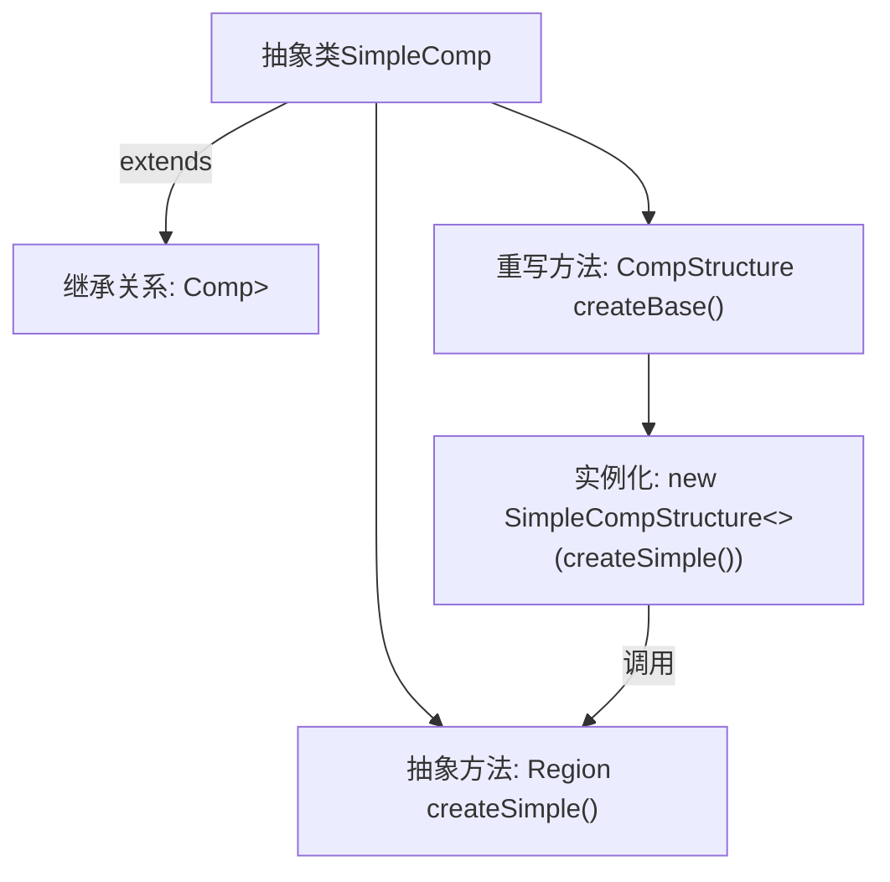

# 基础信息

|      |      |
|------|------|
| 名称 | SimpleComp |
| 编码语言 | .java |
| 代码路径 | xpipe/app/src/main/java/io/xpipe/app/comp/SimpleComp.java |
| 包名 | io.xpipe.app.comp |
| 依赖项 | ['javafx.scene.layout.Region'] |
| 概述说明 | 抽象类SimpleComp继承Comp，实现createBase方法返回SimpleCompStructure实例，需子类实现createSimple方法。 |

# 说明

这段代码定义了一个名为SimpleComp的抽象类，继承自泛型类Comp<CompStructure<Region>>。该类包含两个关键方法：一个是final修饰的createBase方法，返回一个由SimpleCompStructure包装的Region实例；另一个是受保护的抽象方法createSimple，要求子类实现并返回具体的Region对象。整体设计通过模板方法模式，强制子类提供Region创建逻辑，同时固定了组件结构的构建流程。

# 类列表 Class Summary

| 名称   | 类型  | 说明 |
|-------|------|-------------|
| SimpleComp | class | 抽象类SimpleComp继承Comp，实现createBase方法返回SimpleCompStructure实例，需子类实现createSimple方法返回Region对象。 |


## 类 SimpleComp

|      |      |
|------|------|
| 访问范围 | public abstract |
| 类型 | class |
| 名称 | SimpleComp |
| 说明 | 抽象类SimpleComp继承Comp，实现createBase方法返回SimpleCompStructure实例，需子类实现createSimple方法返回Region对象。 |


### UML类图

```mermaid
classDiagram
    class Comp~T~ {
        <<abstract>>
        +createBase() T
    }
    // Comp是泛型抽象类，T为类型参数

    class CompStructure~T~ {
        // 泛型结构类
    }

    class SimpleComp {
        <<abstract>>
        +createBase() CompStructure~Region~
        #createSimple() Region
    }
    // SimpleComp继承Comp并指定泛型为CompStructure<Region>

    class Region {
        // 区域类
    }

    class SimpleCompStructure~T~ {
        // 泛型简单结构类
    }

    Comp <|-- SimpleComp
    SimpleComp --> CompStructure~Region~ : 创建
    SimpleComp --> Region : 依赖
    SimpleComp --> SimpleCompStructure~Region~ : 使用
    CompStructure~Region~ <-- SimpleCompStructure~Region~ : 实现
```

该代码展示了一个抽象类继承体系，其中SimpleComp继承自泛型类Comp<CompStructure<Region>>，并实现了createBase()方法返回CompStructure<Region>实例。核心是通过protected抽象方法createSimple()委托子类实现Region对象的创建，再包装成SimpleCompStructure返回。类图清晰地反映了泛型参数传递、抽象方法委托以及类之间的依赖关系。


### 内部方法调用关系图



这段代码描述了一个抽象类SimpleComp，它继承自泛型类Comp<CompStructure<Region>>。主要包含两个关键方法：一个是重写的createBase()方法，该方法实例化SimpleCompStructure并调用抽象方法createSimple()作为参数；另一个是受保护的抽象方法createSimple()，需要子类实现。流程图清晰地展示了类继承关系、方法调用链和抽象方法的实现要求，体现了模板方法设计模式的特点。

### 字段列表 Field List

| 名称  | 类型  | 说明 |
|-------|-------|------|

### 方法列表 Method List

| 名称  | 类型  | 说明 |
|-------|-------|------|
| createBase | CompStructure<Region> | 重写createBase方法，返回SimpleCompStructure实例。 |
| createSimple | Region | 创建简单区域抽象方法。 |


