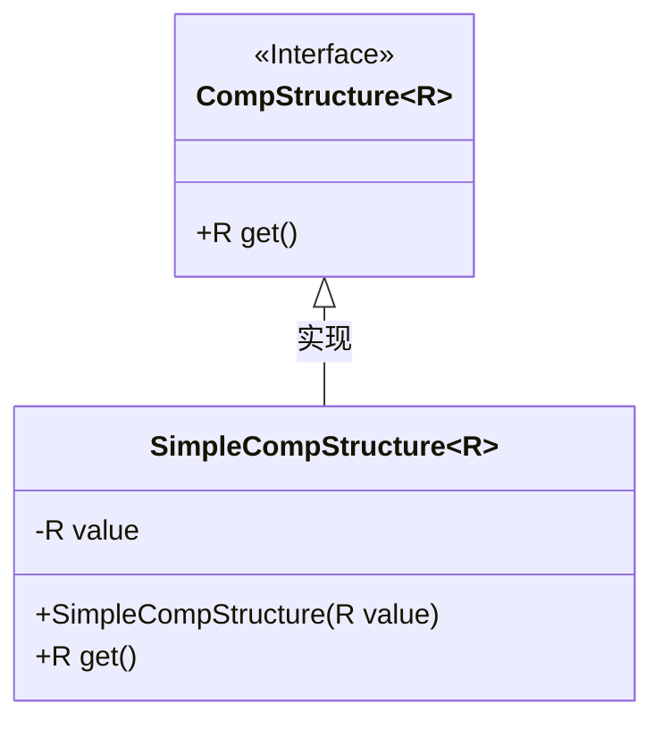
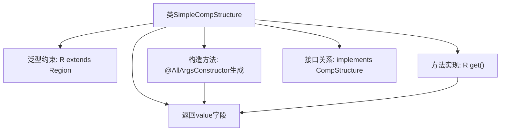

# 基础信息

|      |      |
|------|------|
| 名称 | SimpleCompStructure |
| 编码语言 | .java |
| 代码路径 | xpipe/app/src/main/java/io/xpipe/app/comp/SimpleCompStructure.java |
| 包名 | io.xpipe.app.comp |
| 依赖项 | ['javafx.scene.layout.Region', 'lombok.AllArgsConstructor', 'lombok.Value'] |
| 概述说明 | 简单组件结构类，泛型R继承Region，含值字段和get方法。 |

# 说明

这是一个名为SimpleCompStructure的泛型类，实现了CompStructure接口。该类使用泛型参数R，要求R必须是Region的子类型。类中包含一个value字段，类型为R，通过构造函数初始化。提供了get方法用于返回value值。整体结构简单，主要用于封装一个Region类型的值。

# 类列表 Class Summary

| 名称   | 类型  | 说明 |
|-------|------|-------------|
| SimpleCompStructure | class | 简单组件结构类，泛型R继承Region，含get方法返回R。 |

## 类 SimpleCompStructure

|      |      |
|------|------|
| 访问范围 | @Value;@AllArgsConstructor;public |
| 类型 | class |
| 名称 | SimpleCompStructure |
| 说明 | 简单组件结构类，泛型R继承Region，含get方法返回R。 |

### UML类图

这段代码展示了一个泛型类`SimpleCompStructure`及其接口`CompStructure`的类图关系。`SimpleCompStructure`是一个具体实现类，通过`@AllArgsConstructor`自动生成构造函数，并持有一个泛型类型R的value字段。R被约束为必须继承自Region类，体现了类型安全的设计。接口`CompStructure`定义了核心方法get()，而实现类直接返回存储的value值。该结构常用于需要封装泛型值并确保类型合规性的场景，类图清晰地反映了这种简单的接口-实现关系。

### 内部方法调用关系图

该流程图展示了SimpleCompStructure泛型类的核心结构，该类实现了CompStructure接口并约束泛型参数R必须继承Region。通过Lombok的@AllArgsConstructor自动生成全参构造器初始化value字段，get()方法直接返回该字段值。整体设计符合"简单组件结构"的定位，以单一字段存储和返回泛型值。

### 字段列表 Field List

| 名称  | 类型  | 说明 |
|-------|-------|------|
| value | R | R值表示传染病的传播能力。 |

### 方法列表 Method List

| 名称  | 类型  | 说明 |
|-------|-------|------|
| get | R | 重写get方法，返回value值。 |

