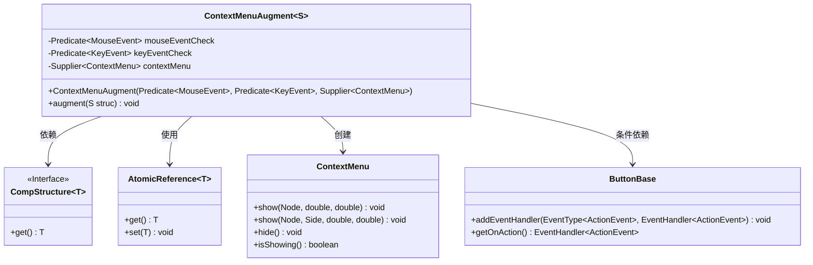
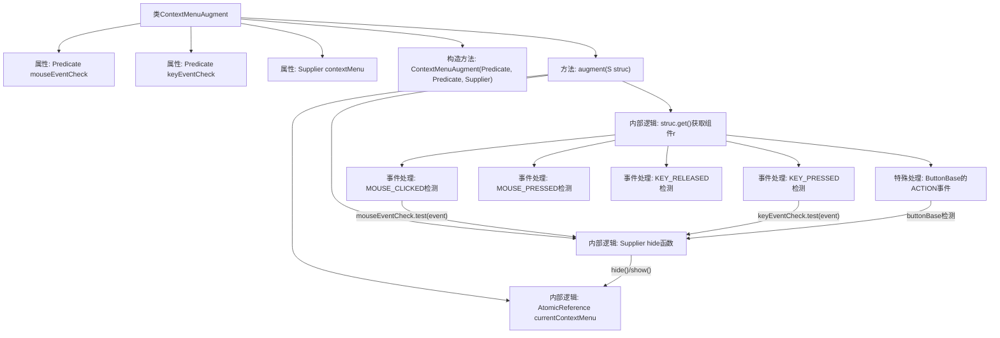

# 基础信息

|      |      |
|------|------|
| 名称 | ContextMenuAugment |
| 编码语言 | .java |
| 代码路径 | xpipe/app/src/main/java/io/xpipe/app/comp/augment/ContextMenuAugment.java |
| 包名 | io.xpipe.app.comp.augment |
| 依赖项 | ['io.xpipe.app.comp.CompStructure', 'javafx.event.ActionEvent', 'javafx.geometry.Side', 'javafx.scene.control.ButtonBase', 'javafx.scene.control.ContextMenu', 'javafx.scene.input.KeyEvent', 'javafx.scene.input.MouseEvent', 'java.util.concurrent.atomic.AtomicReference', 'java.util.function.Predicate', 'java.util.function.Supplier'] |
| 概述说明 | ContextMenuAugment类实现鼠标键盘事件触发上下文菜单显示与隐藏功能。 |

# 说明

该代码定义了一个名为ContextMenuAugment的类，用于增强组件结构的功能。它通过鼠标和键盘事件触发上下文菜单的显示与隐藏。类中包含三个主要参数：鼠标事件检查器、键盘事件检查器和上下文菜单提供器。在鼠标点击或键盘按下时，根据条件判断是否显示或隐藏菜单。对于按钮组件，还处理了动作事件。所有事件处理均包含消费机制，确保事件不会继续传播。

# 类列表 Class Summary

| 名称   | 类型  | 说明 |
|-------|------|-------------|
| ContextMenuAugment | class | 实现右键菜单增强功能，支持鼠标键盘事件触发，可自定义显示位置。 |

## 类 ContextMenuAugment

|      |      |
|------|------|
| 访问范围 | public |
| 类型 | class |
| 名称 | ContextMenuAugment |
| 说明 | 实现右键菜单增强功能，支持鼠标键盘事件触发，可自定义显示位置。 |

### UML类图

该类图展示了`ContextMenuAugment`类的结构及其与其他类的关系。这是一个泛型类，实现了对组件结构(`CompStructure`)的增强功能，主要用于处理鼠标和键盘事件来显示/隐藏上下文菜单。类中包含三个主要私有成员：鼠标事件检查器、键盘事件检查器和上下文菜单供应器。通过`augment`方法，该类会为组件添加多种事件处理器，根据条件触发菜单显示逻辑。当组件是`ButtonBase`类型且无键盘检查器时，还会处理动作事件。整个过程使用`AtomicReference`来安全地管理当前显示的菜单状态。

### 内部方法调用关系图

该流程图展示了ContextMenuAugment类的核心结构和事件处理流程。该类通过构造器注入鼠标/键盘事件谓词和菜单生成器，在augment方法中为GUI组件添加四种事件监听：鼠标点击/按下和键盘释放/按下时检测条件并显示/隐藏上下文菜单，对ButtonBase组件还有特殊处理逻辑。所有事件处理均通过AtomicReference管理菜单状态，并使用统一的hide函数控制菜单显隐。

### 字段列表 Field List

| 名称  | 类型  | 说明 |
|-------|-------|------|
| keyEventCheck | Predicate<KeyEvent> | 私有最终键事件检查谓词 |
| mouseEventCheck | Predicate<MouseEvent> | 私有鼠标事件检查谓词。 |
| contextMenu | Supplier<ContextMenu> | 私有成员，提供上下文菜单的Supplier接口。 |

### 方法列表 Method List

| 名称  | 类型  | 说明 |
|-------|-------|------|
| augment | void | 代码实现上下文菜单显示与隐藏逻辑，处理鼠标点击、按键及按钮事件。 |

