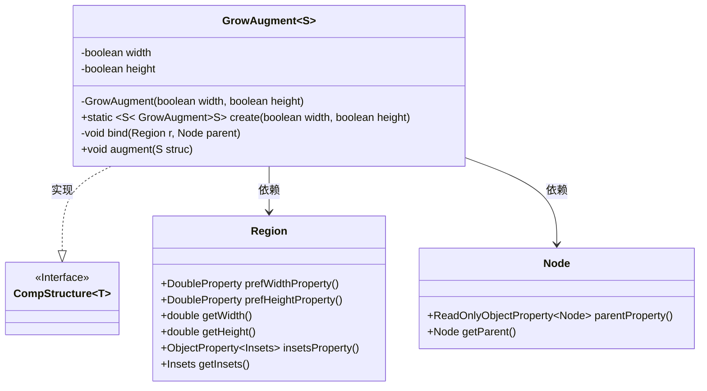

# 基础信息

|      |      |
|------|------|
| 名称 | GrowAugment |
| 编码语言 | .java |
| 代码路径 | xpipe/app/src/main/java/io/xpipe/app/comp/augment/GrowAugment.java |
| 包名 | io.xpipe.app.comp.augment |
| 依赖项 | ['io.xpipe.app.comp.CompStructure', 'javafx.beans.binding.Bindings', 'javafx.scene.Node', 'javafx.scene.layout.Region'] |
| 概述说明 | GrowAugment类实现组件尺寸随父容器调整，支持宽高绑定控制。 |

# 说明

该代码定义了一个名为GrowAugment的泛型类，实现了Augment接口，用于动态调整组件尺寸。类包含两个布尔属性width和height，控制是否调整宽度和高度。通过create方法创建实例，bind方法处理区域绑定逻辑，根据父容器尺寸计算并绑定子组件的首选宽高，同时处理边界和舍入问题。augment方法监听父容器变化，适时解除旧绑定并应用新绑定。整体实现了组件尺寸随父容器动态调整的功能。

# 类列表 Class Summary

| 名称   | 类型  | 说明 |
|-------|------|-------------|
| GrowAugment | class | GrowAugment类通过绑定宽高属性实现区域动态调整。 |


## 类 GrowAugment

|      |      |
|------|------|
| 访问范围 | public |
| 类型 | class |
| 名称 | GrowAugment |
| 说明 | GrowAugment类通过绑定宽高属性实现区域动态调整。 |


### UML类图



这段代码展示了一个JavaFX组件增强类GrowAugment，它通过泛型S扩展了CompStructure接口。主要功能是根据宽度和高度标志动态绑定Region组件的首选尺寸到其父容器，同时处理边界计算和防无限增长逻辑。类图中清晰地展示了GrowAugment与CompStructure接口的继承关系，以及与JavaFX基础组件Region和Node的依赖关系，体现了组件尺寸动态调整的核心机制。


### 内部方法调用关系图

```mermaid
graph TD
    A["类GrowAugment<S extends CompStructure<?>>"]
    B["属性: boolean width"]
    C["属性: boolean height"]
    D["私有构造方法: GrowAugment(boolean, boolean)"]
    E["静态工厂方法: create(boolean, boolean)"]
    F["私有方法: bind(Region, Node)"]
    G["重写方法: augment(S)"]
    H["条件检查: parent instanceof Region"]
    I["绑定宽度逻辑"]
    J["绑定高度逻辑"]
    K["解绑旧父节点属性"]
    L["监听parentProperty变化"]

    A --> B
    A --> C
    A --> D
    A --> E
    A --> F
    A --> G
    G --> L
    L --> K
    L --> F
    F --> H
    H -->|是| I
    H -->|是| J
    I --> "计算prefWidth: p.width-insets"
    J --> "计算prefHeight: p.height-insets"
```

这段代码实现了一个动态调整组件尺寸的增强器，通过Mermaid流程图展示了其核心结构。GrowAugment类通过监听父容器变化，在宽度或高度标志为true时，自动绑定子组件的prefWidth/prefHeight属性到父容器的可用空间（需扣除insets）。流程图清晰呈现了从构造方法到属性绑定的完整调用链，特别突出了对父容器类型检查、新旧父节点切换时的解绑/绑定逻辑，以及防止无限增长的数值处理机制。

### 字段列表 Field List

| 名称  | 类型  | 说明 |
|-------|-------|------|
| height | boolean | 私有布尔类型变量height |
| width | boolean | 私有布尔类型变量width |

### 方法列表 Method List

| 名称  | 类型  | 说明 |
|-------|-------|------|
| augment | void | 重写augment方法，监听父属性变化，解绑宽高绑定后重新绑定新父属性。 |
| create | GrowAugment<S> | 创建可调整宽高的GrowAugment实例。 |
| bind | void | 绑定区域宽高至父节点，考虑内边距和舍入处理。 |


