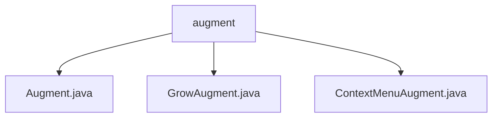

# 基础信息

|      |      |
|------|------|
| 名称 | augment |
| 编码语言 | .java |
| 代码路径 | xpipe/app/src/main/java/io/xpipe/app/comp/augment |
| 包名 | xpipe.app.src.main.java.io.xpipe.app.comp.augment |
| 概述说明 | GrowAugment类动态调整组件尺寸，ContextMenuAugment类处理上下文菜单显示逻辑。 |

# 说明

```markdown
## 概述
该代码模块是一个Java实现的UI组件增强工具集，位于`xpipe/app`项目的`io.xpipe.app.comp.augment`包下。模块包含三个核心类，分别提供动态尺寸调整、上下文菜单管理等功能，通过事件监听和绑定机制实现组件行为的动态扩展。所有增强类均遵循统一的`Augment`接口规范，支持与各类UI组件的无缝集成。

## 主要业务场景
1. **动态尺寸调整（GrowAugment）**
   - 应用场景：需要根据父容器尺寸自动调整子组件宽高的响应式布局
   - 核心功能：
     - 通过`width`/`height`布尔参数控制调整维度
     - 实时计算子组件首选尺寸并处理边界舍入
     - 自动解除旧绑定并建立新的尺寸监听

2. **上下文菜单管理（ContextMenuAugment）**
   - 应用场景：为组件添加右键菜单或快捷键触发的上下文功能
   - 核心功能：
     - 支持鼠标事件/键盘事件双触发模式
     - 内置事件传播阻断机制
     - 特殊处理按钮组件的动作事件集成

3. **通用增强接口（Augment）**
   - 提供标准化的增强生命周期管理：
     - `create()`方法实现实例化
     - `bind()`方法处理组件绑定逻辑
     - `augment()`方法实现动态行为更新
```


### 包内部结构视图



该流程图展示了xpipe项目中augment模块的层级结构，augment作为父目录包含三个Java文件：Augment.java、GrowAugment.java和ContextMenuAugment.java。这三个文件直接隶属于augment目录，没有更深层级的子目录结构，形成了清晰的平级关系。

# 文件列表 File List

| 名称   | 类型  | 说明 |
|-------|------|-------------|
| [ContextMenuAugment.java](ContextMenuAugment.md) | file | ContextMenuAugment类实现鼠标键盘事件触发上下文菜单显示与隐藏功能。 |
| [GrowAugment.java](GrowAugment.md) | file | GrowAugment类实现组件尺寸随父容器调整，支持宽高绑定控制。 |
| [Augment.java](Augment.md) | file | 输入内容为空，无法生成概要描述。 |


