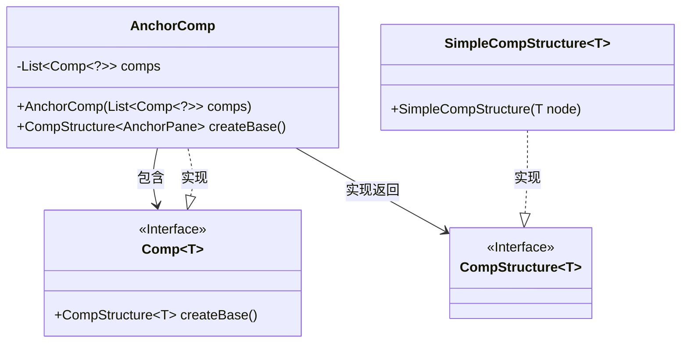
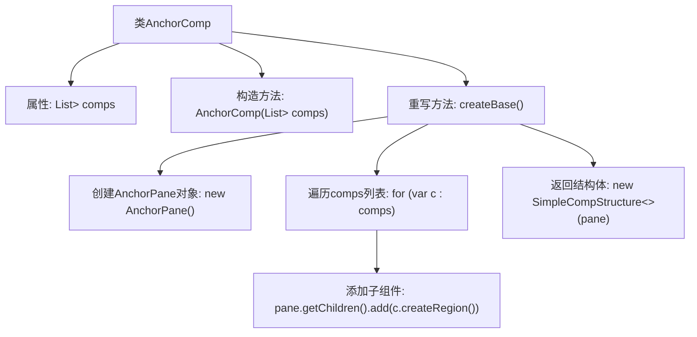

# 基础信息

|      |      |
|------|------|
| 名称 | AnchorComp |
| 编码语言 | .java |
| 代码路径 | xpipe/app/src/main/java/io/xpipe/app/comp/base/AnchorComp.java |
| 包名 | io.xpipe.app.comp.base |
| 依赖项 | ['io.xpipe.app.comp.Comp', 'io.xpipe.app.comp.CompStructure', 'io.xpipe.app.comp.SimpleCompStructure', 'javafx.scene.layout.AnchorPane', 'java.util.List'] |
| 概述说明 | Java类AnchorComp继承Comp，用AnchorPane布局管理子组件列表。 |

# 说明

该代码定义了一个名为AnchorComp的类，继承自Comp泛型类，其泛型类型为CompStructure<AnchorPane>。该类包含一个不可变的comp列表，通过构造函数初始化。重写了createBase方法，创建一个AnchorPane面板，并将列表中每个comp转换为区域后添加到面板中，最后返回一个包含该面板的SimpleCompStructure实例。整个过程实现了将多个组件组合到一个锚点布局面板中的功能。

# 类列表 Class Summary

| 名称   | 类型  | 说明 |
|-------|------|-------------|
| AnchorComp | class | Java类AnchorComp继承Comp，管理子组件列表并创建AnchorPane布局。 |

## 类 AnchorComp

|      |      |
|------|------|
| 访问范围 | public |
| 类型 | class |
| 名称 | AnchorComp |
| 说明 | Java类AnchorComp继承Comp，管理子组件列表并创建AnchorPane布局。 |

### UML类图

这段类图展示了AnchorComp类及其相关接口和实现关系。AnchorComp是一个泛型类，继承自Comp接口并实现了createBase方法，返回一个CompStructure<AnchorPane>类型对象。它内部维护了一个Comp<?>类型的组件列表，通过SimpleCompStructure类实现CompStructure接口。类图清晰地呈现了泛型参数传递、接口实现和组合关系，体现了JavaFX中容器组件的典型设计模式。

### 内部方法调用关系图

这段代码定义了一个名为AnchorComp的类，继承自Comp<CompStructure<AnchorPane>>。该类包含一个不可变的组件列表comps，通过构造方法初始化。重写的createBase()方法创建了一个AnchorPane容器，遍历comps列表中的每个组件，将其转换为Region并添加到容器中，最后返回一个包含该容器的SimpleCompStructure对象。流程图清晰地展示了从类定义到方法实现的完整调用链。

### 字段列表 Field List

| 名称  | 类型  | 说明 |
|-------|-------|------|
| comps | List<Comp<?>> | 私有组件列表变量comps |

### 方法列表 Method List

| 名称  | 类型  | 说明 |
|-------|-------|------|
| createBase | CompStructure<AnchorPane> | 重写方法创建AnchorPane，添加子组件后返回结构对象。 |

