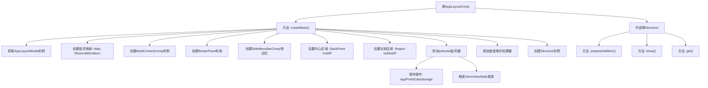
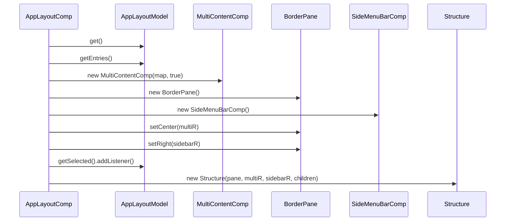

# 基础信息

|      |      |
|------|------|
| 名称 | AppLayoutComp |
| 编码语言 | .java |
| 代码路径 | xpipe/app/src/main/java/io/xpipe/app/comp/base/AppLayoutComp.java |
| 包名 | io.xpipe.app.comp.base |
| 依赖项 | ['io.xpipe.app.comp.Comp', 'io.xpipe.app.comp.CompStructure', 'io.xpipe.app.comp.store.StoreViewState', 'io.xpipe.app.core.AppLayoutModel', 'io.xpipe.app.prefs.AppPrefs', 'io.xpipe.app.storage.DataStorage', 'io.xpipe.app.util.PlatformThread', 'javafx.beans.binding.Bindings', 'javafx.beans.value.ObservableValue', 'javafx.scene.Node', 'javafx.scene.Parent', 'javafx.scene.control.ButtonBase', 'javafx.scene.input.KeyCodeCombination', 'javafx.scene.input.KeyEvent', 'javafx.scene.layout.BorderPane', 'javafx.scene.layout.Region', 'javafx.scene.layout.StackPane', 'java.util.ArrayList', 'java.util.List', 'java.util.Map', 'java.util.stream.Collectors'] |
| 概述说明 | AppLayoutComp类实现布局组件，包含侧边栏和多内容切换功能，处理选中项监听和快捷键事件。 |

# 说明

该代码定义了一个名为AppLayoutComp的Java类，继承自Comp泛型类。主要功能包括：创建应用布局结构，包含侧边栏菜单和多内容区域；处理选中项变化时的数据保存和视图更新逻辑；实现快捷键触发按钮操作；通过BorderPane布局管理器组织界面元素。内部类Structure负责管理布局结构，提供准备添加内容和显示内容的控制方法。整体实现了响应式UI布局和交互逻辑。

# 类列表 Class Summary

| 名称   | 类型  | 说明 |
|-------|------|-------------|
| AppLayoutComp | class | AppLayoutComp类扩展Comp，管理布局结构，包含侧边栏和内容区域，处理事件和状态更新。 |


## 类 AppLayoutComp

|      |      |
|------|------|
| 访问范围 | public |
| 类型 | class |
| 名称 | AppLayoutComp |
| 说明 | AppLayoutComp类扩展Comp，管理布局结构，包含侧边栏和内容区域，处理事件和状态更新。 |


### UML类图

```mermaid
classDiagram
    class AppLayoutComp {
        +createBase() Structure
    }

    class AppLayoutModel {
        <<Interface>>
        +getEntries() List~Entry~
        +getSelected() ObservableValue~Entry~
        +getQueueEntries() List~Entry~
    }

    class MultiContentComp {
        -Map~Comp~?~, ObservableValue~Boolean~~ map
        -boolean flag
        +MultiContentComp(Map~Comp~?~, ObservableValue~Boolean~~, boolean)
        +createRegion() Region
    }

    class SideMenuBarComp {
        -ObservableValue~Entry~ selected
        -List~Entry~ entries
        -List~Entry~ queueEntries
        +SideMenuBarComp(ObservableValue~Entry~, List~Entry~, List~Entry~)
        +createRegion() Region
    }

    class AppLayoutComp$Structure {
        -BorderPane pane
        -StackPane stack
        -Region sidebar
        -List~Node~ children
        +prepareAddition()
        +show()
        +get() BorderPane
    }

    class BorderPane {
        +setCenter(Region)
        +setRight(Region)
        +addEventHandler(EventType~KeyEvent~, EventHandler~KeyEvent~)
        +getStyleClass() ObservableList~String~
    }

    AppLayoutComp --> AppLayoutModel : 依赖
    AppLayoutComp --> MultiContentComp : 创建
    AppLayoutComp --> SideMenuBarComp : 创建
    AppLayoutComp --> AppLayoutComp$Structure : 返回
    AppLayoutComp$Structure --> BorderPane : 包含
    MultiContentComp --> BorderPane : 添加组件
    SideMenuBarComp --> BorderPane : 添加组件
```

类图描述：
该图展示了AppLayoutComp及其关联类的结构关系。AppLayoutComp继承自泛型Comp类，通过createBase()方法构建界面布局，依赖AppLayoutModel获取数据，创建MultiContentComp和SideMenuBarComp组件，最终返回包含BorderPane的Structure记录类。Structure类管理布局容器的显示逻辑，BorderPane作为主容器协调各组件位置。整个设计采用观察者模式处理数据变化，体现了JavaFX典型的UI组件组合方式。


### 内部方法调用关系图





这段代码实现了一个应用布局组件(AppLayoutComp)，主要功能包括：1) 创建基于BorderPane的界面布局；2) 管理多个内容组件的显示切换；3) 实现侧边栏菜单功能；4) 处理用户交互事件和状态变更。流程图展示了类结构和方法调用关系，时序图则详细描述了createBase()方法的执行过程。该组件通过监听模型变化实现自动保存和状态更新功能，同时支持键盘快捷键操作，整体设计体现了MVVM架构思想。

### 字段列表 Field List

| 名称  | 类型  | 说明 |
|-------|-------|------|

### 方法列表 Method List

| 名称  | 类型  | 说明 |
|-------|-------|------|
| createBase | Structure | 创建布局结构，包含侧边栏和多内容组件，处理选中事件和快捷键。 |


