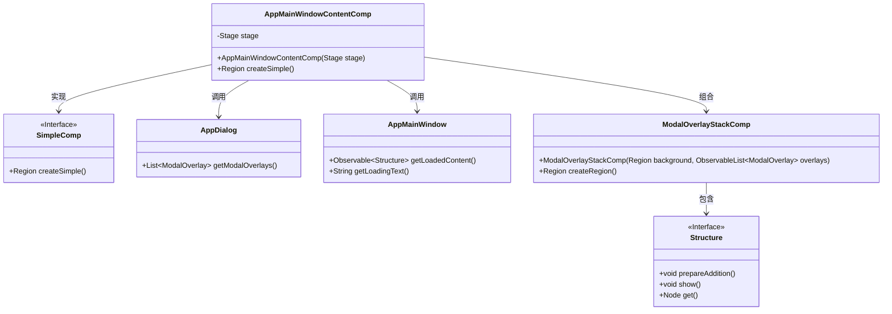
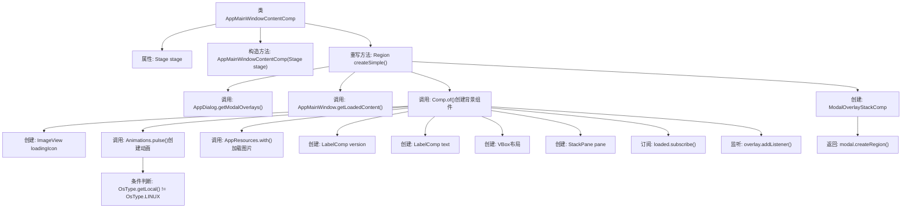

# 基础信息

|      |      |
|------|------|
| 名称 | AppMainWindowContentComp |
| 编码语言 | .java |
| 代码路径 | xpipe/app/src/main/java/io/xpipe/app/comp/base/AppMainWindowContentComp.java |
| 包名 | io.xpipe.app.comp.base |
| 依赖项 | ['io.xpipe.app.comp.Comp', 'io.xpipe.app.comp.SimpleComp', 'io.xpipe.app.core.AppFontSizes', 'io.xpipe.app.core.AppProperties', 'io.xpipe.app.core.window.AppDialog', 'io.xpipe.app.core.window.AppMainWindow', 'io.xpipe.app.issue.TrackEvent', 'io.xpipe.app.resources.AppImages', 'io.xpipe.app.resources.AppResources', 'io.xpipe.app.util.PlatformThread', 'io.xpipe.core.process.OsType', 'javafx.animation.Animation', 'javafx.collections.ListChangeListener', 'javafx.geometry.Pos', 'javafx.scene.image.ImageView', 'javafx.scene.layout.Region', 'javafx.scene.layout.StackPane', 'javafx.scene.layout.VBox', 'javafx.stage.Stage', 'javafx.stage.Window', 'atlantafx.base.util.Animations'] |
| 概述说明 | 应用主窗口内容组件，含加载动画、版本显示和模态叠加层处理。 |

# 说明

该代码描述了一个名为AppMainWindowContentComp的类，继承自SimpleComp，用于创建应用程序主窗口内容组件。类接收一个Stage参数，通过createSimple方法构建界面。界面包含加载动画图标、版本信息和加载文本，垂直居中排列。加载完成后显示实际内容，移除加载元素。同时监听模态叠加层变化，触发时关闭子窗口并请求焦点。整体封装在模态叠加层容器中返回。

# 类列表 Class Summary

| 名称   | 类型  | 说明 |
|-------|------|-------------|
| AppMainWindowContentComp | class | 应用主窗口内容组件，包含加载动画、版本信息和模态叠加层处理。 |

## 类 AppMainWindowContentComp

|      |      |
|------|------|
| 访问范围 | public |
| 类型 | class |
| 名称 | AppMainWindowContentComp |
| 说明 | 应用主窗口内容组件，包含加载动画、版本信息和模态叠加层处理。 |

### UML类图

这段代码描述了一个JavaFX应用程序主窗口内容组件`AppMainWindowContentComp`，它继承自`SimpleComp`接口。该组件负责创建包含加载动画、版本信息和动态内容的复合界面，并处理模态叠加层的变化。当内容加载完成后，会替换加载界面并显示实际内容。代码中涉及多个辅助类如`AppDialog`、`AppMainWindow`和`ModalOverlayStackComp`，共同完成主窗口内容的动态管理和显示功能。组件还包含对模态窗口的特殊处理逻辑，确保正确的窗口焦点行为。

### 内部方法调用关系图

这段代码流程图展示了AppMainWindowContentComp类的核心结构和工作流程。该类继承自SimpleComp，主要功能是创建应用程序主窗口的内容组件。流程从构造方法开始，重点展示了createSimple()方法的实现细节，包括创建加载动画、版本标签、文本标签、布局容器，以及处理内容加载和模态窗口的监听逻辑。最终通过ModalOverlayStackComp创建并返回完整的界面区域。整个过程体现了对异步加载、动画控制和事件监听等复杂交互的精细处理。

### 字段列表 Field List

| 名称  | 类型  | 说明 |
|-------|-------|------|
| stage | Stage | 私有舞台对象 |

### 方法列表 Method List

| 名称  | 类型  | 说明 |
|-------|-------|------|
| createSimple | Region | 创建加载界面，含动画图标、版本号和文本，监听内容加载和模态窗口变化。 |

