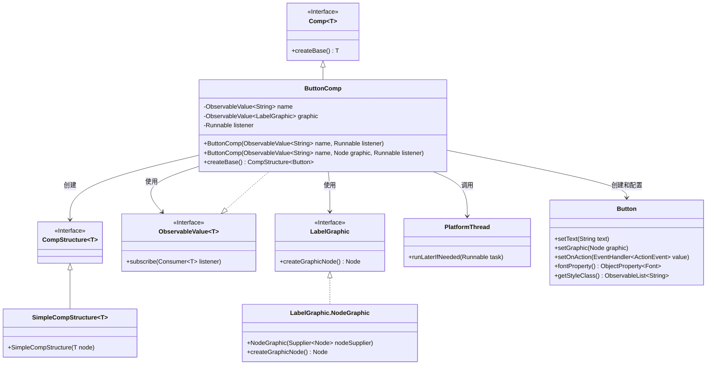
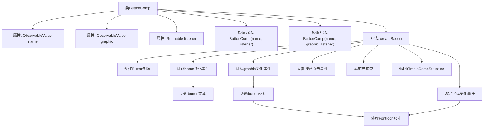

# 基础信息

|      |      |
|------|------|
| 名称 | ButtonComp |
| 编码语言 | .java |
| 代码路径 | xpipe/app/src/main/java/io/xpipe/app/comp/base/ButtonComp.java |
| 包名 | io.xpipe.app.comp.base |
| 依赖项 | ['io.xpipe.app.comp.Comp', 'io.xpipe.app.comp.CompStructure', 'io.xpipe.app.comp.SimpleCompStructure', 'io.xpipe.app.util.LabelGraphic', 'io.xpipe.app.util.PlatformThread', 'javafx.beans.property.SimpleObjectProperty', 'javafx.beans.value.ObservableValue', 'javafx.css.Size', 'javafx.css.SizeUnits', 'javafx.scene.Node', 'javafx.scene.control.Button', 'lombok.AllArgsConstructor', 'lombok.Getter', 'org.kordamp.ikonli.javafx.FontIcon'] |
| 概述说明 | 按钮组件类，含名称、图标和监听器，动态更新UI。 |

# 说明

这是一个名为ButtonComp的Java类，继承自Comp类，用于创建按钮组件。类中包含三个主要属性：name（按钮文本的可观察值）、graphic（按钮图形的可观察值）和listener（按钮点击事件处理器）。提供了三个构造函数，分别支持不同参数组合。createBase方法负责创建按钮基础结构，包括动态更新文本和图形、处理字体大小变化以及设置点击事件监听器。按钮样式类为"button-comp"。该类使用了Lombok注解简化代码，并支持跨线程UI更新。

# 类列表 Class Summary

| 名称   | 类型  | 说明 |
|-------|------|-------------|
| ButtonComp | class | ButtonComp类，继承Comp，含名称、图标和监听器属性，创建按钮并动态更新文本和图标。 |

## 类 ButtonComp

|      |      |
|------|------|
| 访问范围 | @Getter;@AllArgsConstructor;public |
| 类型 | class |
| 名称 | ButtonComp |
| 说明 | ButtonComp类，继承Comp，含名称、图标和监听器属性，创建按钮并动态更新文本和图标。 |

### UML类图

这段代码描述了一个按钮组件`ButtonComp`的实现，它继承自泛型组件接口`Comp`，核心功能是通过`createBase()`方法创建并配置JavaFX的`Button`控件。类图展示了`ButtonComp`与多个接口的交互关系，包括可观察值`ObservableValue`、标签图形`LabelGraphic`以及平台线程工具类`PlatformThread`。组件通过订阅机制实现动态更新按钮文本和图标，并处理字体大小同步等细节，最终将按钮包装在`SimpleCompStructure`中返回。整个设计体现了响应式编程思想，支持数据绑定和线程安全的UI更新。

### 内部方法调用关系图

这段代码描述了一个ButtonComp类，继承自Comp<CompStructure<Button>>，用于创建和管理可响应的按钮组件。流程图展示了从类定义到最终创建按钮结构的完整过程，包括属性声明、构造方法、核心createBase()方法的内部逻辑。createBase()方法中实现了按钮文本的动态更新、图标的自适应渲染、字体大小同步以及点击事件绑定等关键功能，最终返回一个包含配置好的Button的SimpleCompStructure对象。整个过程体现了响应式编程思想，通过ObservableValue实现数据与UI的自动同步。

### 字段列表 Field List

| 名称  | 类型  | 说明 |
|-------|-------|------|
| graphic | ObservableValue<LabelGraphic> | 私有可观察标签图形值 |
| name | ObservableValue<String> | 私有不可变字符串观察值name |
| listener | Runnable | 私有Runnable监听器 |

### 方法列表 Method List

| 名称  | 类型  | 说明 |
|-------|-------|------|
| createBase | CompStructure<Button> | 创建按钮组件，设置文本、图标和点击事件，支持动态更新和字体调整。 |

